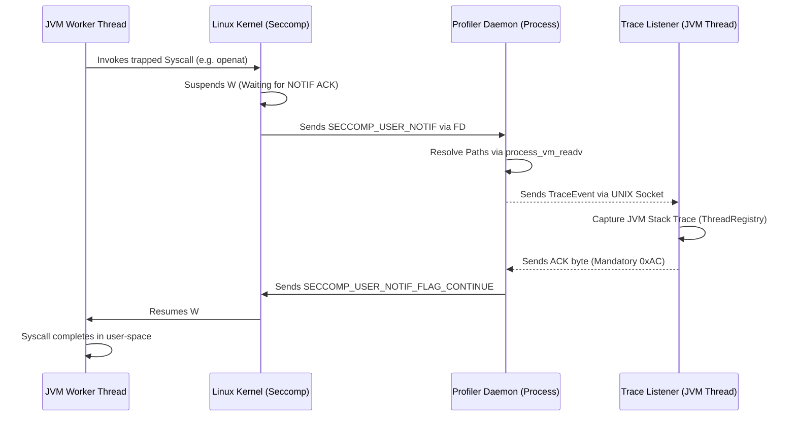
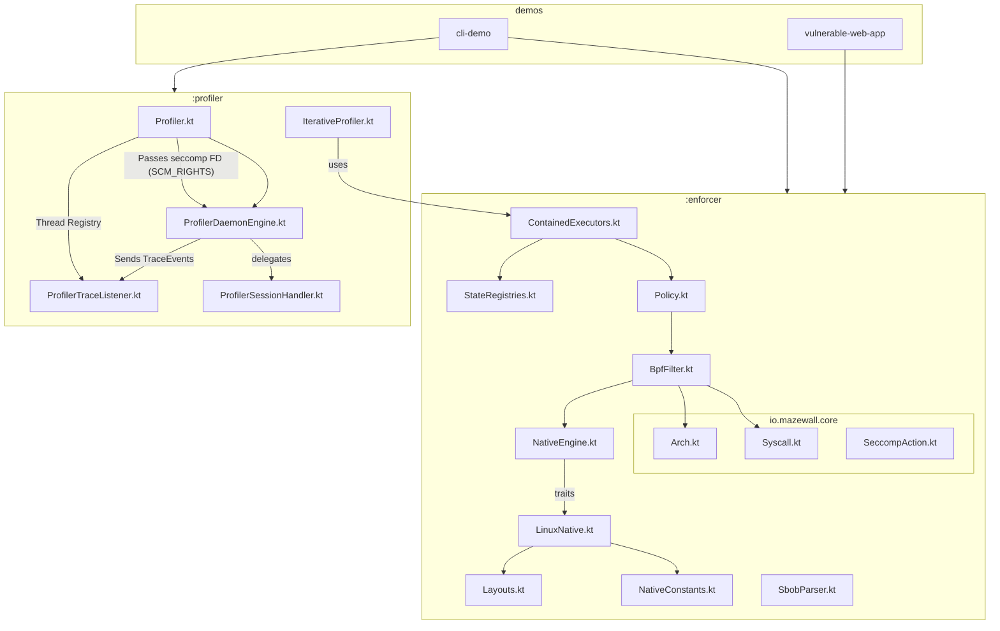

# Architectural Knowledge Graph & System Mapping

This document provides a high-level "Knowledge Graph" of the `mazewall` system. It is designed to help AI agents and developers understand the distributed nature of the profiler, the immutable boundaries of the enforcer, and the critical IPC loops that connect them.

## 1. System Component Overview

| Component | Responsibility | Process/Thread | Lifecycle |
|-----------|----------------|----------------|-----------|
| **Enforcer Engine** | BPF compilation and filter installation. | Target JVM (Worker Thread) | Final / Immutable once applied. |
| **Container Registry** | Tracks thread-scoped seccomp/Landlock state. | Target JVM (ThreadLocal) | Transient JVM state. |
| **Profiler Daemon** | Out-of-process `USER_NOTIF` handling & memory reading. | Child Process (Java/JVM) | Long-lived per session. |
| **Trace Listener** | Bridge between Daemon and JVM Thread Registry. | Target JVM (Dedicated Thread) | Bound to session. |
| **BobCompiler** | Generates `BillOfBehavior` JSON from trace events. | Target JVM (Tooling) | Static/Post-process. |

## 2. The Profiler-Enforcer ACK Loop (The "Deadlock Zone")

This is the most critical interaction in the project. If any step in this loop is missed or fails silently, the **Target JVM Worker Thread will deadlock permanently.**

### ⚠️ Agent Safety Rules for the ACK Loop:
- **No Blocking in Daemon:** The Daemon must never block on a resource that requires the JVM Worker Thread to be active (e.g., a JVM-held lock).
- **Socket Interruption:** The Trace Listener must handle `EINTR` on its socket reads to prevent missing an event.
- **FD Management:** The Daemon must correctly `close()` the seccomp listener FD when the session ends or it will leak in the parent process.

## 3. Security Boundary Stacking (Tiers)

Mazewall operates in Tiers. An agent must know which Tier a change affects.

- **Tier 1 (Process-Wide):** Applied via `installOnProcess`. Uses `TSYNC`. 
    - *Constraint:* Requires `no_new_privs` on all threads.
- **Tier 2 (Thread-Scoped):** Applied via `wrap()` or `installOnCurrentThread`.
    - *Boundary:* Standard Java thread pools (ForkJoin) bypass this if not wrapped.
- **Tier H (Hybrid/Profiler):** Uses `USER_NOTIF`.
    - *Boundary:* Requires `ptrace` capabilities or `PR_SET_PTRACER` authorization.

## 4. Cross-Module Dependency Graph

For detailed class diagrams and relationship maps of the individual modules:
- See the [Enforcer Architecture Document](enforcer_architecture.md) for the `:enforcer` module.
- See the [Profiler Architecture Document](profiler_architecture.md) for the `:profiler` module.

## 5. Critical Memory Layouts (FFM)

If you modify these, you must update both the Kotlin side and the C-side (if applicable).

- **`sock_filter` (BpfFilter.kt):** 8-byte structure.
- **`seccomp_notif` (ProfilerDaemon.kt):** Variable size, requires alignment for `data` field.
- **`msghdr` / `cmsghdr` (LinuxNative.kt):** Used for FD passing. Byte-alignment is architecture-dependent (x86_64 vs aarch64).

## 6. Failure Modes & Recovery

| Symptom | Probable Cause | Investigation Path |
|---------|----------------|--------------------|
| **JVM Hangs on Startup** | Blocked critical syscall (futex, clone). | Check `BpfFilter.jvmCriticalNrs`. |
| **Profiler returns null paths** | Yama `ptrace_scope` or symlink mismatch. | Check `ProfilerDaemon.resolveCanonicalPath`. |
| **"IllegalStateException: Already restricted"** | Redundant Landlock application on pooled thread. | Check `StateRegistries` usage in `wrap()`. |
| **E2BIG on Landlock install** | Exceeded Landlock domain nesting limit (max 16). | Investigate stacked policy logic in `FilterInstallationPlanner`. |

## 7. Core Architectural Paradigms & Patterns

To maintain security and stability at the kernel-JVM boundary, `mazewall` adheres to a **Functional-Core, Imperative-Shell** architecture using the following patterns:

### A. Type-State Machine Pattern (Safety-by-Construction)
Interfacing with kernel APIs and IPC protocols is sequentially fragile. We use Type-States to make invalid operation sequences *unrepresentable* in the type system.
- **Application:** `BpfBuilder<State>` (enforces Arch Check -> Load NR -> Filtering) and `HandshakeSession<State>` (prevents deadlocks by enforcing the 0xAC protocol).

### B. Functional Programming at the Native Boundary
Native calls return `errno` and raw values that are easily lost or misinterpreted.
- **Application:** We use **Monadic Result types** (`SyscallResult<T>`) instead of exceptions for native FFM downcalls. This forces callers to explicitly handle `recover` or `map` logic, preserving the critical `errno` context.

### C. Pragmatic OOP & Strategy Pattern (Platform Abstraction)
The Linux kernel cannot be mocked. We use OOP traits to decouple high-level security logic from low-level FFM implementations.
- **Application:** `NativeEngine` and its sub-traits (`NativeFileSystem`, etc.) allow injecting `MockNativeEngine` for host-side unit testing without a Linux environment.

### D. Domain-Driven Design (DDD) & Value Objects
To avoid "Primitive Obsession" in a codebase full of pointers and integers, we use DDD principles to define a "Ubiquitous Language" for security.
- **Application:** `value class` for `FileDescriptor`, `Pid`, and `SyscallNumber` ensures that type-safety persists even when dealing with raw kernel identifiers.

### E. Architectural Fitness Functions (ArchUnit)
Security is a structural property. We use ArchUnit to ensure that memory-unsafe operations are strictly localized.
- **Application:** Banning direct `java.lang.foreign` or `Unsafe` access outside of the `io.mazewall.ffi` package to prevent structural bypasses of our memory-safety model.
