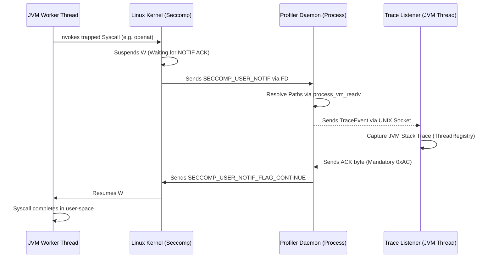
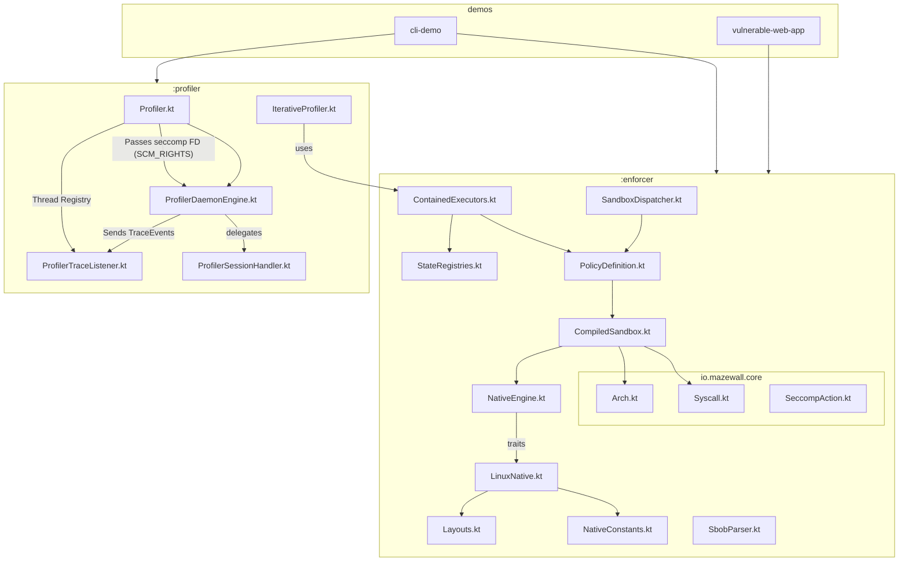

# Architectural Knowledge Graph & System Mapping

This document provides a high-level "Knowledge Graph" of the `mazewall` system. It is designed to help AI agents and developers understand the distributed nature of the profiler, the immutable boundaries of the enforcer, and the critical IPC loops that connect them.

## 1. System Component Overview

| Component | Responsibility | Process/Thread | Lifecycle |
|-----------|----------------|----------------|-----------|
| **Enforcer Engine** | BPF compilation and filter installation. | Target JVM (Worker Thread) | Final / Immutable once applied. |
| **Container Registry** | Tracks thread-scoped seccomp/Landlock state. | Target JVM (ThreadLocal) | Transient JVM state. |
| **Profiler Daemon** | Out-of-process `USER_NOTIF` handling & memory reading. | Child Process (Java/JVM) | Long-lived per session. |
| **Trace Listener** | Bridge between Daemon and JVM Thread Registry. | Target JVM (Dedicated Thread) | Bound to session. |
| **BobCompiler** | Generates `BillOfBehavior` JSON from trace events. | Target JVM (Tooling) | Static/Post-process. |

## 2. The Profiler-Enforcer ACK Loop (The "Deadlock Zone")

This is the most critical interaction in the project. If any step in this loop is missed or fails silently, the **Target JVM Worker Thread will deadlock permanently.**



### ⚠️ Agent Safety Rules for the ACK Loop:
- **No Blocking in Daemon:** The Daemon must never block on a resource that requires the JVM Worker Thread to be active (e.g., a JVM-held lock).
- **Socket Interruption:** The Trace Listener must handle `EINTR` on its socket reads to prevent missing an event.
- **FD Management:** The Daemon must correctly `close()` the seccomp listener FD when the session ends or it will leak in the parent process.

## 3. Security Boundary Stacking (Tiers)

Mazewall operates in Tiers. An agent must know which Tier a change affects.

- **Tier 1 (Process-Wide):** Applied via `installOnProcess`. Uses `TSYNC`. 
    - *Constraint:* Requires `no_new_privs` on all threads.
- **Tier 2 (Thread-Scoped):** Applied via `wrap()` or `installOnCurrentThread`.
    - *Boundary:* Standard Java thread pools (ForkJoin) bypass this if not wrapped.
- **Tier H (Hybrid/Profiler):** Uses `USER_NOTIF`.
    - *Boundary:* Requires `ptrace` capabilities or `PR_SET_PTRACER` authorization.

## 4. Cross-Module Dependency Graph



For detailed class diagrams and relationship maps of the individual modules:
- See the [Enforcer Architecture Document](enforcer_architecture.md) for the `:enforcer` module.
- See the [Profiler Design Document](profiler_design.md) for the `:profiler` module.

## 5. Critical Memory Layouts (FFM)

If you modify these, you must update both the Kotlin side and the C-side (if applicable).

- **`sock_filter` (BpfFilter.kt):** 8-byte structure.
- **`seccomp_notif` (ProfilerDaemon.kt):** Variable size, requires alignment for `data` field.
- **`msghdr` / `cmsghdr` (LinuxNative.kt):** Used for FD passing. Byte-alignment is architecture-dependent (x86_64 vs aarch64).

## 6. Failure Modes & Recovery

| Symptom | Probable Cause | Investigation Path |
|---------|----------------|--------------------|
| **JVM Hangs on Startup** | Blocked critical syscall (futex, clone). | Check `BpfFilter.jvmCriticalNrs`. |
| **Profiler returns null paths** | Yama `ptrace_scope` or symlink mismatch. | Check `ProfilerDaemon.resolveCanonicalPath`. |
| **"IllegalStateException: Already restricted"** | Redundant Landlock application on pooled thread. | Check `StateRegistries` usage in `wrap()`. |
| **E2BIG on Landlock install** | Exceeded Landlock domain nesting limit (max 16). | Investigate stacked policy logic in `FilterInstallationPlanner`. |

## 7. Core Architectural Paradigms & Patterns

To maintain security and stability at the kernel-JVM boundary, `mazewall` adheres to a **Functional-Core, Imperative-Shell** architecture using the following patterns:

### A. Type-State Machine Pattern (Safety-by-Construction)
Interfacing with kernel APIs and IPC protocols is sequentially fragile. We use Type-States to make invalid operation sequences *unrepresentable* in the type system.
- **Application:** `BpfBuilder<State>` (enforces Arch Check -> Load NR -> Filtering) and `HandshakeSession<State>` (prevents deadlocks by enforcing the 0xAC protocol).

### B. Functional Programming at the Native Boundary
Native calls return `errno` and raw values that are easily lost or misinterpreted.
- **Application:** We use **Monadic Result types** (`SyscallResult<T>`) instead of exceptions for native FFM downcalls. This forces callers to explicitly handle `recover` or `map` logic, preserving the critical `errno` context.

### C. Pragmatic OOP & Strategy Pattern (Platform Abstraction)
The Linux kernel cannot be mocked. We use OOP traits to decouple high-level security logic from low-level FFM implementations.
- **Application:** `NativeEngine` and its sub-traits (`NativeFileSystem`, etc.) allow injecting `MockNativeEngine` for host-side unit testing without a Linux environment.

### D. Domain-Driven Design (DDD) & Value Objects
To avoid "Primitive Obsession" in a codebase full of pointers and integers, we use DDD principles to define a "Ubiquitous Language" for security.
- **Application:** `value class` for `FileDescriptor`, `Pid`, and `SyscallNumber` ensures that type-safety persists even when dealing with raw kernel identifiers.

### E. Architectural Fitness Functions (ArchUnit)
Security is a structural property. We use ArchUnit to ensure that memory-unsafe operations are strictly localized.
- **Application:** Banning direct `java.lang.foreign` or `Unsafe` access outside of the `io.mazewall.ffi` package to prevent structural bypasses of our memory-safety model.


## 8. Dynamic Knowledge Map

<!-- KNOWLEDGE_MAP_START -->

```mermaid
graph TD
    ContainmentDesignSpec_kt["💻 Source: ContainmentDesignSpec.kt"]
    issue_122_incomplete_architecture_verification_in_bpf_compiler["🔴 Issue: Incomplete Architecture Verification in BPF Compiler (Severity: HIGH)"]
    issue_082_ktlint_parser_fails_on_kotlin_2x_named_context_parameters_sy["🔴 Issue: KtLint parser fails on Kotlin 2.x named context parameters syntax (Severity: MEDIUM)"]
    issue_166_architectural_violation_ffm_leaking_outside_iomazewallffi["🔴 Issue: Architectural Violation - FFM Leaking Outside `io.mazewall.ffi` (Severity: HIGH)"]
    issue_140_potential_race_condition_in_async_io_thread_shutdown["🔴 Issue: Potential Race Condition in Async IO Thread Shutdown (Severity: HIGH)"]
    io_mazewall_SbobParser["💻 Source: io.mazewall.SbobParser"]
    issue_008_high_frequency_arena_allocation_overhead_mm_optimization["🔴 Issue: High-Frequency Arena Allocation Overhead (MM Optimization) (Severity: MEDIUM)"]
    issue_037_seccompaction_violates_openclosed_principle_ocp["🔴 Issue: `SeccompAction` Violates Open/Closed Principle (OCP) (Severity: ENHANCEMENT)"]
    supervisor_proxy_design_md["💻 Source: supervisor_proxy_design.md"]
    issue_083_unhandled_ioctl_fallbacks_during_legacy_jvm_syscall_tracing["🔴 Issue: Unhandled `IOCTL` fallbacks during legacy JVM syscall tracing (Severity: HIGH)"]
    issue_115_cascading_failure_in_verifyinstallation_when_stacking_over_a["🔴 Issue: Cascading Failure in `verifyInstallation` when stacking over a restrictive `prctl` filter (Severity: HIGH)"]
    issue_128_missing_extensibility_in_exception_message_parsing["🔴 Issue: 🔴 [Severity: DX-FRICTION]: Missing Extensibility in Exception Message Parsing (Severity: HIGH)"]
    io_mazewall_ffi["💻 Source: io.mazewall.ffi"]
    issue_031_redundant_state_in_threadstateregistry_vs_policy["🔴 Issue: Redundant State in `ThreadStateRegistry` vs `Policy` (Severity: HIGH)"]
    SbobParser_kt["💻 Source: SbobParser.kt"]
    issue_099_toctou_in_usernotif_argument_dereferencing["🔴 Issue: TOCTOU in `USER_NOTIF` Argument Dereferencing (Severity: HIGH)"]
    issue_177_missing_archunit_test_for_ffm_architecture_boundary_violatio["🔴 Issue: Missing ArchUnit test for FFM architecture boundary violations (Severity: HIGH)"]
    ContainedExecutors_kt["💻 Source: ContainedExecutors.kt"]
    IterativeProfiler_kt["💻 Source: IterativeProfiler.kt"]
    issue_132_missing_bpf_instruction_limit_validation_in_newsockfprog["🔴 Issue: Missing BPF Instruction Limit Validation in `newSockFProg` (Severity: HIGH)"]
    issue_056_iterativeprofiler_infinite_retry_loop_and_failure_on_disjoin["🔴 Issue: `IterativeProfiler` infinite retry loop and failure on disjoint prefix file paths (Severity: HIGH)"]
    issue_103_containedexecutors_thread_local_state_persistence_and_poison["🔴 Issue: 🟢 [WONTFIX]: `ContainedExecutors` Thread-Local State Persistence and Poisoning (Severity: MEDIUM)"]
    issue_014_bpf_disassemblerdumper_for_policy_verification["🔴 Issue: BPF Disassembler/Dumper for Policy Verification (Severity: ENHANCEMENT)"]
    issue_116_suboptimal_bpf_ret_instruction_placement_in_emitlinearscan["🔴 Issue: Suboptimal BPF `RET` instruction placement in `emitLinearScan` (Severity: HIGH)"]
    issue_164_toctou_vulnerability_in_supervisor_syscall_emulation_via_pro["🔴 Issue: TOCTOU Vulnerability in Supervisor Syscall Emulation via `process_vm_readv` (Severity: HIGH)"]
    issue_072_contract_based_invariant_validation["🔴 Issue: Contract-Based Invariant Validation (Severity: ENHANCEMENT)"]
    issue_029_proof_of_progress_state_machine_for_landlock_discovery_disco["🔴 Issue: Proof-of-Progress State Machine for Landlock Discovery (`DiscoveryTask<Status>`) (Severity: ENHANCEMENT)"]
    issue_070_network_isolation_via_namespaces_clonenewnet["🔴 Issue: Network Isolation via Namespaces (`CLONE_NEWNET`) (Severity: ENHANCEMENT)"]
    io_mazewall_NativeTransaction["💻 Source: io.mazewall.NativeTransaction"]
    io_mazewall_Platform_kt["💻 Source: io.mazewall.Platform.kt"]
    issue_126_memory_segment_lifetime_leak_in_async_profiler_events["🔴 Issue: Memory Segment Lifetime Leak in Async Profiler Events (Severity: HIGH)"]
    issue_119_seccompinstallationstate_partial_failure_leaves_thread_unpri["🔴 Issue: `SeccompInstallationState` Partial Failure Leaves Thread Unprivileged but Uncontained (Severity: HIGH)"]
    issue_013_manual_ffm_layout_maintenance_and_abi_drift_risk["🔴 Issue: Manual FFM Layout Maintenance and ABI Drift Risk (Severity: HIGH)"]
    issue_181_toctou_in_path_normalization_pathnormalizerkt["🔴 Issue: TOCTOU in Path Normalization `PathNormalizer.kt` (Severity: HIGH)"]
    io_mazewall_seccomp_BpfProgram_BDL["💻 Source: io.mazewall.seccomp.BpfProgram.BDL"]
    Layouts_kt["💻 Source: Layouts.kt"]
    issue_133_unhandled_ocloexec_omission_on_profiler_unix_sockets["🔴 Issue: Unhandled `O_CLOEXEC` Omission on Profiler Unix Sockets (Severity: HIGH)"]
    issue_076_containmentdesignspec_test_fails_on_systems_without_landlock["🔴 Issue: `ContainmentDesignSpec` test fails on systems without Landlock support (Severity: HIGH)"]
    SupervisorSessionHandler_kt["💻 Source: SupervisorSessionHandler.kt"]
    issue_169_inconsistent_architecture_test_for_javalangforeign["🔴 Issue: Inconsistent Architecture Test for `java.lang.foreign` (Severity: HIGH)"]
    issue_148_asynchronous_supervisor_socket_reads_timeout_failure_handlin["🔴 Issue: Asynchronous Supervisor socket reads timeout failure handling (Severity: HIGH)"]
    issue_158_bitwise_sign_extension_bug_in_sockaddr_domain_parsing["🔴 Issue: Bitwise Sign-Extension Bug in `sockaddr` Domain Parsing (Severity: HIGH)"]
    issue_036_residual_interface_segregation_violation_isp_in_nativeengine["🔴 Issue: Residual Interface Segregation Violation (ISP) in `NativeEngine` (Severity: HIGH)"]
    issue_091_unhandled_opath_omission_on_landlock_fallback_directories["🔴 Issue: Unhandled `O_PATH` Omission on Landlock Fallback Directories (Severity: HIGH)"]
    issue_012_algebraic_policy_composition_semigroupmonoid["🔴 Issue: Algebraic Policy Composition (Semigroup/Monoid) (Severity: ENHANCEMENT)"]
    issue_005_in_process_stacktrace_analysis_classloader_deadlock_in_super["🔴 Issue: In-Process Stacktrace Analysis ClassLoader Deadlock in Supervisor (Severity: HIGH)"]
    io_mazewall_profiler_engine_ProfilerDaemon["💻 Source: io.mazewall.profiler.engine.ProfilerDaemon"]
    issue_061_manual_ffm_layout_maintenance_and_drift_risk["🔴 Issue: Manual FFM Layout Maintenance and Drift Risk (Severity: MEDIUM)"]
    issue_145_toctou_pointer_re_targeting_via_sockaddrbytes_mutation_durin["🔴 Issue: TOCTOU / Pointer Re-targeting via `sockaddrBytes` Mutation during Connect Validation (Severity: CRITICAL)"]
    io_mazewall_ffi_Layouts["💻 Source: io.mazewall.ffi.Layouts"]
    issue_121_missing_thread_safety_in_processstateregistry_updates["🔴 Issue: Missing Thread-Safety in `ProcessStateRegistry` Updates (Severity: HIGH)"]
    issue_125_opaque_exceptions_on_landlock_initialization_failure["🔴 Issue: 🔴 [Severity: DX-FRICTION]: Opaque Exceptions on Landlock Initialization Failure (Severity: HIGH)"]
    issue_123_inefficient_threadlocal_usage_in_threadstateregistry["🔴 Issue: Inefficient ThreadLocal usage in `ThreadStateRegistry` (Severity: HIGH)"]
    Landlock_kt["💻 Source: Landlock.kt"]
    issue_027_archunit_enforce_errno_capture_locality_wrapper["🔴 Issue: ArchUnit: Enforce `Errno` Capture Locality Wrapper (Severity: ENHANCEMENT)"]
    issue_096_missing_bpf_instruction_limit_validation_in_newsockfprog["🔴 Issue: Missing BPF Instruction Limit Validation in `newSockFProg` (Severity: HIGH)"]
    issue_147_unhandled_signal_interruptions_eintr_during_supervisor_initi["🔴 Issue: Unhandled Signal Interruptions (`EINTR`) during Supervisor Initialization (Severity: HIGH)"]
    issue_117_seccompinstallationstate_partial_failure_leaves_thread_unpri["🔴 Issue: `SeccompInstallationState` Partial Failure Leaves Thread Unprivileged but Uncontained (Severity: HIGH)"]
    ProfilerDaemon_kt["💻 Source: ProfilerDaemon.kt"]
    issue_044_type_state_enforced_bpf_dsl["🔴 Issue: Type-State Enforced BPF DSL (Severity: ENHANCEMENT)"]
    issue_045_standard_java_concurrency_virtual_threads_completablefuture_["🔴 Issue: Standard Java Concurrency (`Virtual Threads`, `CompletableFuture`) trivially bypasses Thread-Scoped (Tier 2) containment without ACE (Severity: CRITICAL)"]
    issue_092_memory_segment_lifetime_leak_in_async_profiler_events["🔴 Issue: Memory Segment Lifetime Leak in Async Profiler Events (Severity: HIGH)"]
    issue_038_type_state_for_filedescriptor_lifecycles_compile_time_use_af["🔴 Issue: Type-State for `FileDescriptor` Lifecycles (Compile-Time Use-After-Close Safety) (Severity: ENHANCEMENT)"]
    issue_175_uncaught_native_exceptions_in_landlock_landlockstatekt["🔴 Issue: Uncaught Native Exceptions in Landlock `LandlockState.kt` (Severity: HIGH)"]
    issue_084_potential_race_condition_in_async_io_thread_shutdown["🔴 Issue: Potential Race Condition in Async IO Thread Shutdown (Severity: HIGH)"]
    ArchitectureTest_kt["💻 Source: ArchitectureTest.kt"]
    issue_009_memory_segment_pooling_for_profiler_usernotif["🔴 Issue: Memory Segment Pooling for Profiler USER_NOTIF (Severity: ENHANCEMENT)"]
    issue_165_silent_fallback_by_default_behavior_evaluation["🔴 Issue: Silent Fallback by default behavior evaluation (Severity: HIGH)"]
    issue_114_landlock_excessive_capability_leak_on_enoent["🔴 Issue: Landlock Excessive Capability Leak on `ENOENT` (Severity: MEDIUM)"]
    LandlockState_kt["💻 Source: LandlockState.kt"]
    io_mazewall_enforcer_ThreadStateRegistry["💻 Source: io.mazewall.enforcer.ThreadStateRegistry"]
    SupervisorSeccompNotifInstaller_kt["💻 Source: SupervisorSeccompNotifInstaller.kt"]
    ProfilerSessionHandler_kt["💻 Source: ProfilerSessionHandler.kt"]
    io_mazewall_enforcer_ContainedExecutors_kt["💻 Source: io.mazewall.enforcer.ContainedExecutors.kt"]
    SupervisorSocketUtils_kt["💻 Source: SupervisorSocketUtils.kt"]
    issue_043_phantom_types_for_context_aware_capability_tokens["🔴 Issue: Phantom Types for Context-Aware Capability Tokens (Severity: ENHANCEMENT)"]
    issue_010_compile_time_feature_proof_tokens_and_scope_safe_policy_buil["🔴 Issue: Compile-Time Feature Proof Tokens and Scope-Safe Policy Builders (Type-State Pattern) (Severity: ENHANCEMENT)"]
    issue_179_uncaught_native_exceptions_escaping_landlock_installation["🔴 Issue: Uncaught Native Exceptions Escaping Landlock Installation (Severity: HIGH)"]
    issue_086_unhandled_signal_interruptions_eintr_during_seccomp_filter_i["🔴 Issue: Unhandled Signal Interruptions (`EINTR`) during `seccomp` Filter Installation (Severity: HIGH)"]
    issue_058_sbobparser_syntactic_pruning_inaccuracy["🔴 Issue: `SbobParser` Syntactic Pruning Inaccuracy (Severity: HIGH)"]
    ContainedExecutorWrapper_kt["💻 Source: ContainedExecutorWrapper.kt"]
    issue_174_uncaught_exceptions_in_containedexecutorwrapperkt_during_fil["🔴 Issue: Uncaught exceptions in `ContainedExecutorWrapper.kt` during filter installation (Severity: HIGH)"]
    issue_094_overly_broad_catch_block_in_profilerdaemonreactorloop["🔴 Issue: Overly Broad Catch Block in `ProfilerDaemon.reactorLoop` (Severity: HIGH)"]
    issue_069_resource_containment_via_cgroups_v2["🔴 Issue: Resource Containment via Cgroups v2 (Severity: ENHANCEMENT)"]
    io_mazewall_profiler_engine_ProfilerSessionHandler["💻 Source: io.mazewall.profiler.engine.ProfilerSessionHandler"]
    issue_068_supervisor_proxy_pattern_fd_injection_stacktrace_scoping["🔴 Issue: Supervisor Proxy Pattern (FD Injection) & Stacktrace Scoping (Severity: ENHANCEMENT)"]
    issue_124_missing_support_for_opath_and_ocloexec_in_landlock_fallback["🔴 Issue: Missing Support for `O_PATH` and `O_CLOEXEC` in `Landlock` fallback (Severity: HIGH)"]
    issue_080_inefficient_regex_compilation_in_containmentviolationdetecto["🔴 Issue: Inefficient Regex Compilation in `ContainmentViolationDetector` (Severity: HIGH)"]
    io_mazewall_profiler_iterative_IterativeProfiler["💻 Source: io.mazewall.profiler.iterative.IterativeProfiler"]
    issue_016_strongly_typed_syscall_flags_and_native_argument_definitions["🔴 Issue: Strongly Typed Syscall Flags and Native Argument Definitions (Severity: ENHANCEMENT)"]
    issue_066_straceprofiler_completely_fails_to_trace_iouring_file_operat["🔴 Issue: StraceProfiler completely fails to trace `io_uring` file operations natively (Severity: CRITICAL)"]
    issue_095_unhandled_endianness_in_processvmreadv_socket_message_tracin["🔴 Issue: Unhandled Endianness in `process_vm_readv` Socket Message Tracing (Severity: HIGH)"]
    issue_002_stacktrace_enforced_process_spawning_safepoint_deadlock_and_["🔴 Issue: Stacktrace-Enforced Process Spawning Safepoint Deadlock and Trace Propagation Gotchas (Severity: HIGH)"]
    issue_150_incomplete_ffm_architecture_isolation["🔴 Issue: Incomplete FFM Architecture Isolation (Severity: HIGH)"]
    io_mazewall_landlock_Landlock["💻 Source: io.mazewall.landlock.Landlock"]
    issue_071_introduce_context_parameters_for_memory_and_engine_scopes["🔴 Issue: Introduce Context Parameters for Memory and Engine Scopes (Severity: ENHANCEMENT)"]
    issue_113_loom_carrier_poisoning_bypass_in_purejavabpfengine["🔴 Issue: Loom Carrier Poisoning Bypass in `PureJavaBpfEngine` (Severity: HIGH)"]
    issue_146_unhandled_signal_interruptions_eintr_during_supervisor_ipc_s["🔴 Issue: Unhandled Signal Interruptions (`EINTR`) during Supervisor IPC socket communication (Severity: HIGH)"]
    issue_017_symbolic_errno_mapping_in_syscallresult["🔴 Issue: Symbolic Errno Mapping in `SyscallResult` (Severity: ENHANCEMENT)"]
    issue_163_memory_segment_scopes_and_lifetimes["🔴 Issue: Memory Segment Scopes and Lifetimes (Severity: HIGH)"]
    issue_085_uncaught_native_exceptions_escaping_bpf_installation["🔴 Issue: Uncaught Native Exceptions Escaping BPF Installation (Severity: HIGH)"]
    issue_136_sbobparser_production_crashes_due_to_syntactic_subpath_pruni["🔴 Issue: `SbobParser` Production Crashes due to Syntactic Subpath Pruning of Unresolved/Symlinked Paths (Severity: HIGH)"]
    issue_063_excessive_container_privileges_and_deprecated_audit_architec["🔴 Issue: Excessive container privileges and deprecated Audit architecture in compose.yml files (Severity: HIGH)"]
    issue_130_unhandled_endianness_in_processvmreadv_socket_message_tracin["🔴 Issue: Unhandled Endianness in `process_vm_readv` Socket Message Tracing (Severity: HIGH)"]
    Platform_kt["💻 Source: Platform.kt"]
    issue_134_toctou_in_path_normalization_under_multi_threaded_io["🔴 Issue: TOCTOU in Path Normalization under Multi-Threaded I/O (Severity: HIGH)"]
    issue_032_compile_time_bpf_termination_safety_type_state_ret_enforceme["🔴 Issue: Compile-Time BPF Termination Safety (Type-State RET Enforcement) (Severity: ENHANCEMENT)"]
    io_mazewall_profiler_BillOfBehavior["💻 Source: io.mazewall.profiler.BillOfBehavior"]
    io_mazewall_NativeEngine["💻 Source: io.mazewall.NativeEngine"]
    issue_077_landlock_getaccessmask_missing_abi_4_support_net_capabilitie["🔴 Issue: `Landlock` getAccessMask missing ABI 4 Support (Net Capabilities) (Severity: HIGH)"]
    issue_131_missing_return_value_check_for_seccompnotifresp_ack["🔴 Issue: Missing Return Value Check for `SECCOMP_NOTIF_RESP` ACK (Severity: HIGH)"]
    issue_173_unhandled_signal_interruptions_eintr_in_socket_io["🔴 Issue: Unhandled Signal Interruptions (`EINTR`) in socket IO (Severity: HIGH)"]
    issue_139_unhandled_ioctl_fallbacks_during_legacy_jvm_syscall_tracing["🔴 Issue: Unhandled `IOCTL` fallbacks during legacy JVM syscall tracing (Severity: HIGH)"]
    issue_030_architectural_dip_dependency_inversion_violations_in_native_["🔴 Issue: Architectural DIP (Dependency Inversion) Violations in Native Scopes (Severity: HIGH)"]
    issue_078_purejavabpfengine_thread_state_synchronization["🔴 Issue: `PureJavaBpfEngine` Thread State Synchronization (Severity: HIGH)"]
    issue_098_unhandled_signal_mask_inheritance_in_containedexecutors["🔴 Issue: Unhandled Signal Mask Inheritance in `ContainedExecutors` (Severity: HIGH)"]
    issue_111_missing_bpfprogramstatus_and_bpflabel_type_safety["🔴 Issue: Missing `BpfProgram<Status>` and `BpfLabel` Type-Safety (Severity: HIGH)"]
    ProcessStateRegistry_kt["💻 Source: ProcessStateRegistry.kt"]
    PathNormalizer_kt["💻 Source: PathNormalizer.kt"]
    issue_042_compile_time_enforced_tier_1_process_baseline_processcontain["🔴 Issue: Compile-Time Enforced Tier 1 Process Baseline (`ProcessContainmentToken`) (Severity: ENHANCEMENT)"]
    issue_159_potential_buffer_overflow_outofboundsexception_on_long_unix_["🔴 Issue: Potential Buffer Overflow / OutOfBoundsException on Long UNIX Socket Paths (Severity: HIGH)"]
    issue_090_unhandled_ocloexec_omission_on_profiler_unix_sockets["🔴 Issue: Unhandled `O_CLOEXEC` Omission on Profiler Unix Sockets (Severity: HIGH)"]
    StraceProfiler_kt["💻 Source: StraceProfiler.kt"]
    run_containerized_tests_sh["💻 Source: run_containerized_tests.sh"]
    issue_120_native_memory_leak_in_containedexecutorswrap_under_high_conc["🔴 Issue: Native Memory Leak in `ContainedExecutors.wrap` under High Concurrency (Severity: HIGH)"]
    issue_081_root_test_task_requires_host_dockerpodman_not_runnable_insid["🔴 Issue: 📝 [NOTE]: Root `:test` task requires host Docker/Podman, not runnable inside dev container (Severity: MEDIUM)"]
    issue_172_memory_segment_scopes_and_lifetimes_re_evaluation["🔴 Issue: Memory Segment Scopes and Lifetimes (Re-evaluation) (Severity: HIGH)"]
    SupervisorInstaller_kt["💻 Source: SupervisorInstaller.kt"]
    issue_178_unreliable_test_teardown_for_mocked_native_engines["🔴 Issue: Unreliable Test Teardown for Mocked Native Engines (Severity: HIGH)"]
    issue_102_permanent_thread_pool_contamination_classloader_leaks_and_st["🔴 Issue: 🟢 [WONTFIX]: Permanent thread pool contamination, classloader leaks, and state pollution via un-cleared `ThreadLocal` variables (Severity: MEDIUM)"]
    issue_040_archunit_ban_javalangthread_for_context_preservation["🔴 Issue: ArchUnit: Ban `java.lang.Thread` for Context Preservation (Severity: HIGH)"]
    SessionHandler_kt["💻 Source: SessionHandler.kt"]
    issue_059_iterativeprofiler_context_loss_via_thread_creation["🔴 Issue: `IterativeProfiler` Context Loss via thread creation (Severity: HIGH)"]
    issue_088_suboptimal_bpf_ret_instruction_placement_in_emitlinearscan["🔴 Issue: Suboptimal BPF `RET` instruction placement in `emitLinearScan` (Severity: HIGH)"]
    BpfProgram_kt["💻 Source: BpfProgram.kt"]
    io_mazewall_profiler_internal_ProfilerSocket["💻 Source: io.mazewall.profiler.internal.ProfilerSocket"]
    io_mazewall_profiler_strace_StraceProfiler["💻 Source: io.mazewall.profiler.strace.StraceProfiler"]
    issue_162_memory_alignment_verification_for_layoutskt_ffm_structures["🔴 Issue: Memory Alignment verification for `Layouts.kt` FFM Structures (Severity: HIGH)"]
    ProfilerTraceListener_kt["💻 Source: ProfilerTraceListener.kt"]
    issue_089_missing_extensibility_in_exception_message_parsing["🔴 Issue: 🔴 [Severity: DX-FRICTION]: Missing Extensibility in Exception Message Parsing (Severity: HIGH)"]
    issue_003_socket_address_family_filtering_for_network_isolation_evasio["🔴 Issue: Socket Address Family Filtering for Network Isolation Evasion Prevention (Severity: ENHANCEMENT)"]
    issue_152_ci_podman_container_caching_missing["🔴 Issue: CI Podman Container Caching Missing (Severity: HIGH)"]
    LandlockCoverageTest_kt["💻 Source: LandlockCoverageTest.kt"]
    issue_112_iterativeprofiler_logic_errors_confirmed["🔴 Issue: `IterativeProfiler` Logic Errors (Confirmed) (Severity: HIGH)"]
    issue_020_asynchronous_trace_event_streaming_via_channel_flow["🔴 Issue: Asynchronous Trace Event Streaming via `Channel` / `Flow` (Severity: ENHANCEMENT)"]
    io_mazewall_core_SeccompAction["💻 Source: io.mazewall.core.SeccompAction"]
    io_mazewall_SbobParser_kt["💻 Source: io.mazewall.SbobParser.kt"]
    issue_025_strongly_typed_generics_for_ioctl_commands_ioctlcommandreq_r["🔴 Issue: Strongly-Typed Generics for `ioctl` Commands (`IoctlCommand<Req, Res>`) (Severity: ENHANCEMENT)"]
    issue_129_toctou_in_usernotif_argument_dereferencing["🔴 Issue: TOCTOU in `USER_NOTIF` Argument Dereferencing (Severity: HIGH)"]
    issue_141_missing_bpfprogramstatus_and_bpflabel_type_safety["🔴 Issue: Missing `BpfProgram<Status>` and `BpfLabel` Type-Safety (Severity: HIGH)"]
    issue_034_high_frequency_arena_allocation_overhead_mm_optimization["🔴 Issue: High-Frequency Arena Allocation Overhead (MM Optimization) (Severity: MEDIUM)"]
    io_mazewall_enforcer_ContainedExecutors["💻 Source: io.mazewall.enforcer.ContainedExecutors"]
    issue_101_sbobparser_production_crashes_due_to_syntactic_subpath_pruni["🔴 Issue: SbobParser Production Crashes due to Syntactic Subpath Pruning of Unresolved/Symlinked Paths (Severity: HIGH)"]
    issue_015_algebraic_policy_composition_semigroupmonoid["🔴 Issue: Algebraic Policy Composition (Semigroup/Monoid) (Severity: ENHANCEMENT)"]
    issue_028_phantom_types_for_thread_pool_containment_constraints_sandbo["🔴 Issue: Phantom Types for Thread Pool Containment Constraints (`SandboxedExecutor`) (Severity: ENHANCEMENT)"]
    issue_018_formal_monoidal_composition_for_billofbehavior["🔴 Issue: Formal Monoidal Composition for `BillOfBehavior` (Severity: ENHANCEMENT)"]
    ContainmentViolationDetector_kt["💻 Source: ContainmentViolationDetector.kt"]
    issue_060_iterativeprofiler_path_truncation_on_spaces["🔴 Issue: `IterativeProfiler` Path Truncation on Spaces (Severity: HIGH)"]
    issue_073_delegated_properties_for_thread_local_sandbox_state["🔴 Issue: Delegated Properties for Thread-Local Sandbox State (Severity: ENHANCEMENT)"]
    issue_001_yama_ptracescope_blocks_daemons_processvmreadv_missing_prset["🔴 Issue: Yama `ptrace_scope` Blocks Daemon's `process_vm_readv` (Missing `PR_SET_PTRACER`) (Severity: HIGH)"]
    BpfFilter_kt["💻 Source: BpfFilter.kt"]
    issue_180_uncaught_exceptions_in_containedexecutorwrapperkt_during_fil["🔴 Issue: Uncaught exceptions in `ContainedExecutorWrapper.kt` during filter installation (Severity: HIGH)"]
    issue_127_unhandled_signal_mask_inheritance_in_containedexecutors["🔴 Issue: Unhandled Signal Mask Inheritance in `ContainedExecutors` (Severity: HIGH)"]
    issue_138_unhandled_signal_interruptions_eintr_during_seccomp_filter_i["🔴 Issue: Unhandled Signal Interruptions (`EINTR`) during `seccomp` Filter Installation (Severity: HIGH)"]
    io_mazewall_enforcer_ContainerStateRegistry_kt["💻 Source: io.mazewall.enforcer.ContainerStateRegistry.kt"]
    io_mazewall_BpfFilter["💻 Source: io.mazewall.BpfFilter"]
    issue_100_missing_return_value_check_for_seccompnotifresp_ack["🔴 Issue: Missing Return Value Check for `SECCOMP_NOTIF_RESP` ACK (Severity: HIGH)"]
    issue_049_sbobparser_lacks_context_aware_working_directory_resolution_["🔴 Issue: `SbobParser` lacks Context-Aware Working Directory resolution for Relative Paths (Severity: HIGH)"]
    io_mazewall_profiler_Profiler["💻 Source: io.mazewall.profiler.Profiler"]
    issue_067_unprivileged_pivot_root_empty_tmpfs["🔴 Issue: Unprivileged Pivot Root (Empty `tmpfs`) (Severity: ENHANCEMENT)"]
    issue_097_toctou_in_path_normalization_under_multi_threaded_io["🔴 Issue: TOCTOU in Path Normalization under Multi-Threaded I/O (Severity: HIGH)"]
    issue_118_native_memory_leak_in_containedexecutorswrap_under_high_conc["🔴 Issue: Native Memory Leak in `ContainedExecutors.wrap` under High Concurrency (Severity: HIGH)"]
    issue_011_verified_by_construction_bpf_bytecode_bpfprogramstatus["🔴 Issue: Verified-by-Construction BPF Bytecode (BpfProgram<Status>) (Severity: ENHANCEMENT)"]
    issue_006_kotlin_inlining_causes_archunit_nogenericexceptioncatching_v["🔴 Issue: Kotlin Inlining Causes ArchUnit noGenericExceptionCatching Violation (Severity: HIGH)"]
    issue_019_refactor_profiler_daemon_to_use_coroutines_structured_concur["🔴 Issue: Refactor Profiler Daemon to use Coroutines (Structured Concurrency) (Severity: ENHANCEMENT)"]
    io_mazewall_profiler_IterativeProfiler["💻 Source: io.mazewall.profiler.IterativeProfiler"]
    Profiler_kt["💻 Source: Profiler.kt"]
    io_mazewall_core_FileDescriptor["💻 Source: io.mazewall.core.FileDescriptor"]
    io_mazewall_seccomp_PureJavaBpfEngine["💻 Source: io.mazewall.seccomp.PureJavaBpfEngine"]
    SockFProg_kt["💻 Source: SockFProg.kt"]
    ProfilerSocket_kt["💻 Source: ProfilerSocket.kt"]
    issue_079_unhandled_tsync_edge_cases_during_jit_classloading["🔴 Issue: Unhandled `TSYNC` edge cases during JIT classloading (Severity: HIGH)"]
    issue_176_toctou_in_path_normalization_pathnormalizerkt["🔴 Issue: TOCTOU in Path Normalization `PathNormalizer.kt` (Severity: HIGH)"]
    issue_035_memory_segment_pooling_for_profiler_usernotif["🔴 Issue: Memory Segment Pooling for Profiler USER_NOTIF (Severity: ENHANCEMENT)"]
    ThreadStateRegistry_kt["💻 Source: ThreadStateRegistry.kt"]
    io_mazewall_profiler_engine_ProfilerDaemonEngine["💻 Source: io.mazewall.profiler.engine.ProfilerDaemonEngine"]
    issue_093_toctou_vulnerability_in_prctl_argument_inspection["🔴 Issue: TOCTOU Vulnerability in `prctl` Argument Inspection (Severity: HIGH)"]
    PureJavaBpfEngine_kt["💻 Source: PureJavaBpfEngine.kt"]
    issue_135_uncaught_native_exceptions_escaping_bpf_installation["🔴 Issue: Uncaught Native Exceptions Escaping BPF Installation (Severity: HIGH)"]
    issue_137_overly_broad_catch_block_in_profilerdaemonreactorloop["🔴 Issue: Overly Broad Catch Block in `ProfilerDaemon.reactorLoop` (Severity: HIGH)"]
    issue_142_race_in_asynchronous_fire_and_forget_profiler_event_delivery["🔴 Issue: Race in Asynchronous / Fire-and-Forget Profiler Event Delivery (Severity: CRITICAL)"]
    issue_075_jvm_invariant_syscall_floor_is_incomplete["🔴 Issue: 🟡 [DEFERRED — Medium]: JVM Invariant Syscall Floor is Incomplete (Severity: MEDIUM)"]
    issue_149_classloader_deadlock_in_jvm_validation_listener["🔴 Issue: Classloader Deadlock in JVM Validation Listener (Severity: CRITICAL)"]
    issue_143_process_wide_classloader_deadlock_on_profiler_result_state_t["🔴 Issue: Process-Wide Classloader Deadlock on Profiler Result / State Types (Severity: HIGH)"]
    issue_144_confused_deputy_time_of_check_to_time_of_use_toctou_via_path["🔴 Issue: Confused Deputy / Time-of-Check to Time-of-Use (TOCTOU) via Path Modification (Severity: CRITICAL)"]
    containment_design["📄 Design: Technical Design: Containment Engine & Incremental Filter Stacking"]
    ContainedExecutors_kt -->|Governed by| containment_design
    PureJavaBpfEngine_kt -->|Governed by| containment_design
    BpfFilter_kt -->|Governed by| containment_design
    Landlock_kt -->|Governed by| containment_design
    issue_018_formal_monoidal_composition_for_billofbehavior -->|Affects| io_mazewall_profiler_BillOfBehavior
    issue_019_refactor_profiler_daemon_to_use_coroutines_structured_concur -->|Affects| io_mazewall_profiler_engine_ProfilerDaemonEngine
    issue_020_asynchronous_trace_event_streaming_via_channel_flow -->|Affects| io_mazewall_profiler_Profiler
    issue_025_strongly_typed_generics_for_ioctl_commands_ioctlcommandreq_r -->|Affects| io_mazewall_NativeEngine
    issue_027_archunit_enforce_errno_capture_locality_wrapper -->|Affects| io_mazewall_ffi
    issue_028_phantom_types_for_thread_pool_containment_constraints_sandbo -->|Affects| io_mazewall_enforcer_ContainedExecutors
    issue_029_proof_of_progress_state_machine_for_landlock_discovery_disco -->|Affects| io_mazewall_profiler_IterativeProfiler
    issue_031_redundant_state_in_threadstateregistry_vs_policy -->|Affects| io_mazewall_enforcer_ThreadStateRegistry
    issue_036_residual_interface_segregation_violation_isp_in_nativeengine -->|Affects| io_mazewall_NativeEngine
    issue_037_seccompaction_violates_openclosed_principle_ocp -->|Affects| io_mazewall_core_SeccompAction
    issue_038_type_state_for_filedescriptor_lifecycles_compile_time_use_af -->|Affects| io_mazewall_core_FileDescriptor
    issue_042_compile_time_enforced_tier_1_process_baseline_processcontain -->|Affects| io_mazewall_enforcer_ContainedExecutors
    issue_043_phantom_types_for_context_aware_capability_tokens -->|Affects| io_mazewall_NativeTransaction
    issue_044_type_state_enforced_bpf_dsl -->|Affects| io_mazewall_seccomp_BpfProgram_BDL
    issue_045_standard_java_concurrency_virtual_threads_completablefuture_ -->|Affects| io_mazewall_enforcer_ContainedExecutors
    issue_049_sbobparser_lacks_context_aware_working_directory_resolution_ -->|Affects| io_mazewall_SbobParser
    issue_056_iterativeprofiler_infinite_retry_loop_and_failure_on_disjoin -->|Affects| IterativeProfiler_kt
    issue_058_sbobparser_syntactic_pruning_inaccuracy -->|Affects| io_mazewall_SbobParser_kt
    issue_059_iterativeprofiler_context_loss_via_thread_creation -->|Affects| IterativeProfiler_kt
    issue_060_iterativeprofiler_path_truncation_on_spaces -->|Affects| IterativeProfiler_kt
    issue_061_manual_ffm_layout_maintenance_and_drift_risk -->|Affects| io_mazewall_ffi_Layouts
    issue_066_straceprofiler_completely_fails_to_trace_iouring_file_operat -->|Affects| io_mazewall_profiler_strace_StraceProfiler
    issue_068_supervisor_proxy_pattern_fd_injection_stacktrace_scoping -->|Affects| supervisor_proxy_design_md
    issue_072_contract_based_invariant_validation -->|Affects| io_mazewall_Platform_kt
    issue_073_delegated_properties_for_thread_local_sandbox_state -->|Affects| io_mazewall_enforcer_ContainerStateRegistry_kt
    issue_076_containmentdesignspec_test_fails_on_systems_without_landlock -->|Affects| ContainmentDesignSpec_kt
    issue_077_landlock_getaccessmask_missing_abi_4_support_net_capabilitie -->|Affects| Landlock_kt
    issue_078_purejavabpfengine_thread_state_synchronization -->|Affects| PureJavaBpfEngine_kt
    issue_079_unhandled_tsync_edge_cases_during_jit_classloading -->|Affects| PureJavaBpfEngine_kt
    issue_080_inefficient_regex_compilation_in_containmentviolationdetecto -->|Affects| ContainmentViolationDetector_kt
    issue_083_unhandled_ioctl_fallbacks_during_legacy_jvm_syscall_tracing -->|Affects| io_mazewall_profiler_engine_ProfilerDaemon
    issue_084_potential_race_condition_in_async_io_thread_shutdown -->|Affects| io_mazewall_enforcer_ContainedExecutors
    issue_085_uncaught_native_exceptions_escaping_bpf_installation -->|Affects| io_mazewall_seccomp_PureJavaBpfEngine
    issue_086_unhandled_signal_interruptions_eintr_during_seccomp_filter_i -->|Affects| io_mazewall_seccomp_PureJavaBpfEngine
    issue_088_suboptimal_bpf_ret_instruction_placement_in_emitlinearscan -->|Affects| io_mazewall_BpfFilter
    issue_089_missing_extensibility_in_exception_message_parsing -->|Affects| io_mazewall_profiler_iterative_IterativeProfiler
    issue_090_unhandled_ocloexec_omission_on_profiler_unix_sockets -->|Affects| io_mazewall_profiler_internal_ProfilerSocket
    issue_091_unhandled_opath_omission_on_landlock_fallback_directories -->|Affects| io_mazewall_landlock_Landlock
    issue_092_memory_segment_lifetime_leak_in_async_profiler_events -->|Affects| io_mazewall_profiler_engine_ProfilerSessionHandler
    issue_093_toctou_vulnerability_in_prctl_argument_inspection -->|Affects| io_mazewall_BpfFilter
    issue_094_overly_broad_catch_block_in_profilerdaemonreactorloop -->|Affects| io_mazewall_profiler_engine_ProfilerDaemon
    issue_095_unhandled_endianness_in_processvmreadv_socket_message_tracin -->|Affects| io_mazewall_profiler_engine_ProfilerDaemon
    issue_096_missing_bpf_instruction_limit_validation_in_newsockfprog -->|Affects| io_mazewall_seccomp_PureJavaBpfEngine
    issue_097_toctou_in_path_normalization_under_multi_threaded_io -->|Affects| io_mazewall_SbobParser
    issue_098_unhandled_signal_mask_inheritance_in_containedexecutors -->|Affects| io_mazewall_enforcer_ContainedExecutors
    issue_099_toctou_in_usernotif_argument_dereferencing -->|Affects| io_mazewall_profiler_engine_ProfilerDaemon
    issue_100_missing_return_value_check_for_seccompnotifresp_ack -->|Affects| io_mazewall_profiler_engine_ProfilerSessionHandler
    issue_101_sbobparser_production_crashes_due_to_syntactic_subpath_pruni -->|Affects| io_mazewall_SbobParser
    issue_102_permanent_thread_pool_contamination_classloader_leaks_and_st -->|Affects| ContainedExecutors_kt
    issue_103_containedexecutors_thread_local_state_persistence_and_poison -->|Affects| io_mazewall_enforcer_ContainedExecutors_kt
    issue_111_missing_bpfprogramstatus_and_bpflabel_type_safety -->|Affects| BpfProgram_kt
    issue_112_iterativeprofiler_logic_errors_confirmed -->|Affects| IterativeProfiler_kt
    issue_113_loom_carrier_poisoning_bypass_in_purejavabpfengine -->|Affects| PureJavaBpfEngine_kt
    issue_114_landlock_excessive_capability_leak_on_enoent -->|Affects| Landlock_kt
    issue_115_cascading_failure_in_verifyinstallation_when_stacking_over_a -->|Affects| PureJavaBpfEngine_kt
    issue_116_suboptimal_bpf_ret_instruction_placement_in_emitlinearscan -->|Affects| BpfFilter_kt
    issue_117_seccompinstallationstate_partial_failure_leaves_thread_unpri -->|Affects| PureJavaBpfEngine_kt
    issue_118_native_memory_leak_in_containedexecutorswrap_under_high_conc -->|Affects| PureJavaBpfEngine_kt
    issue_119_seccompinstallationstate_partial_failure_leaves_thread_unpri -->|Affects| PureJavaBpfEngine_kt
    issue_120_native_memory_leak_in_containedexecutorswrap_under_high_conc -->|Affects| PureJavaBpfEngine_kt
    issue_121_missing_thread_safety_in_processstateregistry_updates -->|Affects| ProcessStateRegistry_kt
    issue_122_incomplete_architecture_verification_in_bpf_compiler -->|Affects| BpfProgram_kt
    issue_123_inefficient_threadlocal_usage_in_threadstateregistry -->|Affects| ThreadStateRegistry_kt
    issue_124_missing_support_for_opath_and_ocloexec_in_landlock_fallback -->|Affects| Landlock_kt
    issue_125_opaque_exceptions_on_landlock_initialization_failure -->|Affects| Landlock_kt
    issue_126_memory_segment_lifetime_leak_in_async_profiler_events -->|Affects| SessionHandler_kt
    issue_127_unhandled_signal_mask_inheritance_in_containedexecutors -->|Affects| ContainedExecutors_kt
    issue_128_missing_extensibility_in_exception_message_parsing -->|Affects| ContainmentViolationDetector_kt
    issue_129_toctou_in_usernotif_argument_dereferencing -->|Affects| StraceProfiler_kt
    issue_130_unhandled_endianness_in_processvmreadv_socket_message_tracin -->|Affects| StraceProfiler_kt
    issue_131_missing_return_value_check_for_seccompnotifresp_ack -->|Affects| StraceProfiler_kt
    issue_132_missing_bpf_instruction_limit_validation_in_newsockfprog -->|Affects| SockFProg_kt
    issue_133_unhandled_ocloexec_omission_on_profiler_unix_sockets -->|Affects| ProfilerSocket_kt
    issue_134_toctou_in_path_normalization_under_multi_threaded_io -->|Affects| SbobParser_kt
    issue_135_uncaught_native_exceptions_escaping_bpf_installation -->|Affects| PureJavaBpfEngine_kt
    issue_136_sbobparser_production_crashes_due_to_syntactic_subpath_pruni -->|Affects| SbobParser_kt
    issue_137_overly_broad_catch_block_in_profilerdaemonreactorloop -->|Affects| ProfilerDaemon_kt
    issue_138_unhandled_signal_interruptions_eintr_during_seccomp_filter_i -->|Affects| PureJavaBpfEngine_kt
    issue_139_unhandled_ioctl_fallbacks_during_legacy_jvm_syscall_tracing -->|Affects| ProfilerDaemon_kt
    issue_140_potential_race_condition_in_async_io_thread_shutdown -->|Affects| ContainedExecutors_kt
    issue_141_missing_bpfprogramstatus_and_bpflabel_type_safety -->|Affects| BpfProgram_kt
    issue_142_race_in_asynchronous_fire_and_forget_profiler_event_delivery -->|Affects| ProfilerSessionHandler_kt
    issue_143_process_wide_classloader_deadlock_on_profiler_result_state_t -->|Affects| Profiler_kt
    issue_144_confused_deputy_time_of_check_to_time_of_use_toctou_via_path -->|Affects| SupervisorSessionHandler_kt
    issue_145_toctou_pointer_re_targeting_via_sockaddrbytes_mutation_durin -->|Affects| SupervisorSessionHandler_kt
    issue_146_unhandled_signal_interruptions_eintr_during_supervisor_ipc_s -->|Affects| SupervisorSessionHandler_kt
    issue_147_unhandled_signal_interruptions_eintr_during_supervisor_initi -->|Affects| SupervisorSeccompNotifInstaller_kt
    issue_148_asynchronous_supervisor_socket_reads_timeout_failure_handlin -->|Affects| SupervisorSessionHandler_kt
    issue_149_classloader_deadlock_in_jvm_validation_listener -->|Affects| SupervisorInstaller_kt
    issue_150_incomplete_ffm_architecture_isolation -->|Affects| SupervisorInstaller_kt
    issue_152_ci_podman_container_caching_missing -->|Affects| run_containerized_tests_sh
    issue_158_bitwise_sign_extension_bug_in_sockaddr_domain_parsing -->|Affects| SupervisorSessionHandler_kt
    issue_159_potential_buffer_overflow_outofboundsexception_on_long_unix_ -->|Affects| SupervisorSocketUtils_kt
    issue_162_memory_alignment_verification_for_layoutskt_ffm_structures -->|Affects| Layouts_kt
    issue_163_memory_segment_scopes_and_lifetimes -->|Affects| SupervisorSessionHandler_kt
    issue_164_toctou_vulnerability_in_supervisor_syscall_emulation_via_pro -->|Affects| SupervisorSessionHandler_kt
    issue_165_silent_fallback_by_default_behavior_evaluation -->|Affects| Platform_kt
    issue_169_inconsistent_architecture_test_for_javalangforeign -->|Affects| ArchitectureTest_kt
    issue_172_memory_segment_scopes_and_lifetimes_re_evaluation -->|Affects| SupervisorSessionHandler_kt
    issue_173_unhandled_signal_interruptions_eintr_in_socket_io -->|Affects| ProfilerTraceListener_kt
    issue_174_uncaught_exceptions_in_containedexecutorwrapperkt_during_fil -->|Affects| ContainedExecutorWrapper_kt
    issue_175_uncaught_native_exceptions_in_landlock_landlockstatekt -->|Affects| LandlockState_kt
    issue_176_toctou_in_path_normalization_pathnormalizerkt -->|Affects| PathNormalizer_kt
    issue_177_missing_archunit_test_for_ffm_architecture_boundary_violatio -->|Affects| ArchitectureTest_kt
    issue_178_unreliable_test_teardown_for_mocked_native_engines -->|Affects| LandlockCoverageTest_kt
    issue_179_uncaught_native_exceptions_escaping_landlock_installation -->|Affects| LandlockState_kt
    issue_180_uncaught_exceptions_in_containedexecutorwrapperkt_during_fil -->|Affects| ContainedExecutorWrapper_kt
    issue_181_toctou_in_path_normalization_pathnormalizerkt -->|Affects| PathNormalizer_kt
    click containment_design "containment_design.md"
    click issue_001_yama_ptracescope_blocks_daemons_processvmreadv_missing_prset "backlog/issue-001-yama-ptracescope-blocks-daemons-processvmreadv-missing-prset.md"
    click issue_002_stacktrace_enforced_process_spawning_safepoint_deadlock_and_ "backlog/issue-002-stacktrace-enforced-process-spawning-safepoint-deadlock-and-.md"
    click issue_003_socket_address_family_filtering_for_network_isolation_evasio "backlog/issue-003-socket-address-family-filtering-for-network-isolation-evasio.md"
    click issue_005_in_process_stacktrace_analysis_classloader_deadlock_in_super "backlog/issue-005-in-process-stacktrace-analysis-classloader-deadlock-in-super.md"
    click issue_006_kotlin_inlining_causes_archunit_nogenericexceptioncatching_v "backlog/issue-006-kotlin-inlining-causes-archunit-nogenericexceptioncatching-v.md"
    click issue_008_high_frequency_arena_allocation_overhead_mm_optimization "backlog/issue-008-high-frequency-arena-allocation-overhead-mm-optimization.md"
    click issue_009_memory_segment_pooling_for_profiler_usernotif "backlog/issue-009-memory-segment-pooling-for-profiler-usernotif.md"
    click issue_010_compile_time_feature_proof_tokens_and_scope_safe_policy_buil "backlog/issue-010-compile-time-feature-proof-tokens-and-scope-safe-policy-buil.md"
    click issue_011_verified_by_construction_bpf_bytecode_bpfprogramstatus "backlog/issue-011-verified-by-construction-bpf-bytecode-bpfprogramstatus.md"
    click issue_012_algebraic_policy_composition_semigroupmonoid "backlog/issue-012-algebraic-policy-composition-semigroupmonoid.md"
    click issue_013_manual_ffm_layout_maintenance_and_abi_drift_risk "backlog/issue-013-manual-ffm-layout-maintenance-and-abi-drift-risk.md"
    click issue_014_bpf_disassemblerdumper_for_policy_verification "backlog/issue-014-bpf-disassemblerdumper-for-policy-verification.md"
    click issue_015_algebraic_policy_composition_semigroupmonoid "backlog/issue-015-algebraic-policy-composition-semigroupmonoid.md"
    click issue_016_strongly_typed_syscall_flags_and_native_argument_definitions "backlog/issue-016-strongly-typed-syscall-flags-and-native-argument-definitions.md"
    click issue_017_symbolic_errno_mapping_in_syscallresult "backlog/issue-017-symbolic-errno-mapping-in-syscallresult.md"
    click issue_018_formal_monoidal_composition_for_billofbehavior "backlog/issue-018-formal-monoidal-composition-for-billofbehavior.md"
    click issue_019_refactor_profiler_daemon_to_use_coroutines_structured_concur "backlog/issue-019-refactor-profiler-daemon-to-use-coroutines-structured-concur.md"
    click issue_020_asynchronous_trace_event_streaming_via_channel_flow "backlog/issue-020-asynchronous-trace-event-streaming-via-channel-flow.md"
    click issue_025_strongly_typed_generics_for_ioctl_commands_ioctlcommandreq_r "backlog/issue-025-strongly-typed-generics-for-ioctl-commands-ioctlcommandreq-r.md"
    click issue_027_archunit_enforce_errno_capture_locality_wrapper "backlog/issue-027-archunit-enforce-errno-capture-locality-wrapper.md"
    click issue_028_phantom_types_for_thread_pool_containment_constraints_sandbo "backlog/issue-028-phantom-types-for-thread-pool-containment-constraints-sandbo.md"
    click issue_029_proof_of_progress_state_machine_for_landlock_discovery_disco "backlog/issue-029-proof-of-progress-state-machine-for-landlock-discovery-disco.md"
    click issue_030_architectural_dip_dependency_inversion_violations_in_native_ "backlog/issue-030-architectural-dip-dependency-inversion-violations-in-native-.md"
    click issue_031_redundant_state_in_threadstateregistry_vs_policy "backlog/issue-031-redundant-state-in-threadstateregistry-vs-policy.md"
    click issue_032_compile_time_bpf_termination_safety_type_state_ret_enforceme "backlog/issue-032-compile-time-bpf-termination-safety-type-state-ret-enforceme.md"
    click issue_034_high_frequency_arena_allocation_overhead_mm_optimization "backlog/issue-034-high-frequency-arena-allocation-overhead-mm-optimization.md"
    click issue_035_memory_segment_pooling_for_profiler_usernotif "backlog/issue-035-memory-segment-pooling-for-profiler-usernotif.md"
    click issue_036_residual_interface_segregation_violation_isp_in_nativeengine "backlog/issue-036-residual-interface-segregation-violation-isp-in-nativeengine.md"
    click issue_037_seccompaction_violates_openclosed_principle_ocp "backlog/issue-037-seccompaction-violates-openclosed-principle-ocp.md"
    click issue_038_type_state_for_filedescriptor_lifecycles_compile_time_use_af "backlog/issue-038-type-state-for-filedescriptor-lifecycles-compile-time-use-af.md"
    click issue_040_archunit_ban_javalangthread_for_context_preservation "backlog/issue-040-archunit-ban-javalangthread-for-context-preservation.md"
    click issue_042_compile_time_enforced_tier_1_process_baseline_processcontain "backlog/issue-042-compile-time-enforced-tier-1-process-baseline-processcontain.md"
    click issue_043_phantom_types_for_context_aware_capability_tokens "backlog/issue-043-phantom-types-for-context-aware-capability-tokens.md"
    click issue_044_type_state_enforced_bpf_dsl "backlog/issue-044-type-state-enforced-bpf-dsl.md"
    click issue_045_standard_java_concurrency_virtual_threads_completablefuture_ "backlog/issue-045-standard-java-concurrency-virtual-threads-completablefuture-.md"
    click issue_049_sbobparser_lacks_context_aware_working_directory_resolution_ "backlog/issue-049-sbobparser-lacks-context-aware-working-directory-resolution-.md"
    click issue_056_iterativeprofiler_infinite_retry_loop_and_failure_on_disjoin "backlog/issue-056-iterativeprofiler-infinite-retry-loop-and-failure-on-disjoin.md"
    click issue_058_sbobparser_syntactic_pruning_inaccuracy "backlog/issue-058-sbobparser-syntactic-pruning-inaccuracy.md"
    click issue_059_iterativeprofiler_context_loss_via_thread_creation "backlog/issue-059-iterativeprofiler-context-loss-via-thread-creation.md"
    click issue_060_iterativeprofiler_path_truncation_on_spaces "backlog/issue-060-iterativeprofiler-path-truncation-on-spaces.md"
    click issue_061_manual_ffm_layout_maintenance_and_drift_risk "backlog/issue-061-manual-ffm-layout-maintenance-and-drift-risk.md"
    click issue_063_excessive_container_privileges_and_deprecated_audit_architec "backlog/issue-063-excessive-container-privileges-and-deprecated-audit-architec.md"
    click issue_066_straceprofiler_completely_fails_to_trace_iouring_file_operat "backlog/issue-066-straceprofiler-completely-fails-to-trace-iouring-file-operat.md"
    click issue_067_unprivileged_pivot_root_empty_tmpfs "backlog/issue-067-unprivileged-pivot-root-empty-tmpfs.md"
    click issue_068_supervisor_proxy_pattern_fd_injection_stacktrace_scoping "backlog/issue-068-supervisor-proxy-pattern-fd-injection-stacktrace-scoping.md"
    click issue_069_resource_containment_via_cgroups_v2 "backlog/issue-069-resource-containment-via-cgroups-v2.md"
    click issue_070_network_isolation_via_namespaces_clonenewnet "backlog/issue-070-network-isolation-via-namespaces-clonenewnet.md"
    click issue_071_introduce_context_parameters_for_memory_and_engine_scopes "backlog/issue-071-introduce-context-parameters-for-memory-and-engine-scopes.md"
    click issue_072_contract_based_invariant_validation "backlog/issue-072-contract-based-invariant-validation.md"
    click issue_073_delegated_properties_for_thread_local_sandbox_state "backlog/issue-073-delegated-properties-for-thread-local-sandbox-state.md"
    click issue_075_jvm_invariant_syscall_floor_is_incomplete "backlog/issue-075-jvm-invariant-syscall-floor-is-incomplete.md"
    click issue_076_containmentdesignspec_test_fails_on_systems_without_landlock "backlog/issue-076-containmentdesignspec-test-fails-on-systems-without-landlock.md"
    click issue_077_landlock_getaccessmask_missing_abi_4_support_net_capabilitie "backlog/issue-077-landlock-getaccessmask-missing-abi-4-support-net-capabilitie.md"
    click issue_078_purejavabpfengine_thread_state_synchronization "backlog/issue-078-purejavabpfengine-thread-state-synchronization.md"
    click issue_079_unhandled_tsync_edge_cases_during_jit_classloading "backlog/issue-079-unhandled-tsync-edge-cases-during-jit-classloading.md"
    click issue_080_inefficient_regex_compilation_in_containmentviolationdetecto "backlog/issue-080-inefficient-regex-compilation-in-containmentviolationdetecto.md"
    click issue_081_root_test_task_requires_host_dockerpodman_not_runnable_insid "backlog/issue-081-root-test-task-requires-host-dockerpodman-not-runnable-insid.md"
    click issue_082_ktlint_parser_fails_on_kotlin_2x_named_context_parameters_sy "backlog/issue-082-ktlint-parser-fails-on-kotlin-2x-named-context-parameters-sy.md"
    click issue_083_unhandled_ioctl_fallbacks_during_legacy_jvm_syscall_tracing "backlog/issue-083-unhandled-ioctl-fallbacks-during-legacy-jvm-syscall-tracing.md"
    click issue_084_potential_race_condition_in_async_io_thread_shutdown "backlog/issue-084-potential-race-condition-in-async-io-thread-shutdown.md"
    click issue_085_uncaught_native_exceptions_escaping_bpf_installation "backlog/issue-085-uncaught-native-exceptions-escaping-bpf-installation.md"
    click issue_086_unhandled_signal_interruptions_eintr_during_seccomp_filter_i "backlog/issue-086-unhandled-signal-interruptions-eintr-during-seccomp-filter-i.md"
    click issue_088_suboptimal_bpf_ret_instruction_placement_in_emitlinearscan "backlog/issue-088-suboptimal-bpf-ret-instruction-placement-in-emitlinearscan.md"
    click issue_089_missing_extensibility_in_exception_message_parsing "backlog/issue-089-missing-extensibility-in-exception-message-parsing.md"
    click issue_090_unhandled_ocloexec_omission_on_profiler_unix_sockets "backlog/issue-090-unhandled-ocloexec-omission-on-profiler-unix-sockets.md"
    click issue_091_unhandled_opath_omission_on_landlock_fallback_directories "backlog/issue-091-unhandled-opath-omission-on-landlock-fallback-directories.md"
    click issue_092_memory_segment_lifetime_leak_in_async_profiler_events "backlog/issue-092-memory-segment-lifetime-leak-in-async-profiler-events.md"
    click issue_093_toctou_vulnerability_in_prctl_argument_inspection "backlog/issue-093-toctou-vulnerability-in-prctl-argument-inspection.md"
    click issue_094_overly_broad_catch_block_in_profilerdaemonreactorloop "backlog/issue-094-overly-broad-catch-block-in-profilerdaemonreactorloop.md"
    click issue_095_unhandled_endianness_in_processvmreadv_socket_message_tracin "backlog/issue-095-unhandled-endianness-in-processvmreadv-socket-message-tracin.md"
    click issue_096_missing_bpf_instruction_limit_validation_in_newsockfprog "backlog/issue-096-missing-bpf-instruction-limit-validation-in-newsockfprog.md"
    click issue_097_toctou_in_path_normalization_under_multi_threaded_io "backlog/issue-097-toctou-in-path-normalization-under-multi-threaded-io.md"
    click issue_098_unhandled_signal_mask_inheritance_in_containedexecutors "backlog/issue-098-unhandled-signal-mask-inheritance-in-containedexecutors.md"
    click issue_099_toctou_in_usernotif_argument_dereferencing "backlog/issue-099-toctou-in-usernotif-argument-dereferencing.md"
    click issue_100_missing_return_value_check_for_seccompnotifresp_ack "backlog/issue-100-missing-return-value-check-for-seccompnotifresp-ack.md"
    click issue_101_sbobparser_production_crashes_due_to_syntactic_subpath_pruni "backlog/issue-101-sbobparser-production-crashes-due-to-syntactic-subpath-pruni.md"
    click issue_102_permanent_thread_pool_contamination_classloader_leaks_and_st "backlog/issue-102-permanent-thread-pool-contamination-classloader-leaks-and-st.md"
    click issue_103_containedexecutors_thread_local_state_persistence_and_poison "backlog/issue-103-containedexecutors-thread-local-state-persistence-and-poison.md"
    click issue_111_missing_bpfprogramstatus_and_bpflabel_type_safety "backlog/issue-111-missing-bpfprogramstatus-and-bpflabel-type-safety.md"
    click issue_112_iterativeprofiler_logic_errors_confirmed "backlog/issue-112-iterativeprofiler-logic-errors-confirmed.md"
    click issue_113_loom_carrier_poisoning_bypass_in_purejavabpfengine "backlog/issue-113-loom-carrier-poisoning-bypass-in-purejavabpfengine.md"
    click issue_114_landlock_excessive_capability_leak_on_enoent "backlog/issue-114-landlock-excessive-capability-leak-on-enoent.md"
    click issue_115_cascading_failure_in_verifyinstallation_when_stacking_over_a "backlog/issue-115-cascading-failure-in-verifyinstallation-when-stacking-over-a.md"
    click issue_116_suboptimal_bpf_ret_instruction_placement_in_emitlinearscan "backlog/issue-116-suboptimal-bpf-ret-instruction-placement-in-emitlinearscan.md"
    click issue_117_seccompinstallationstate_partial_failure_leaves_thread_unpri "backlog/issue-117-seccompinstallationstate-partial-failure-leaves-thread-unpri.md"
    click issue_118_native_memory_leak_in_containedexecutorswrap_under_high_conc "backlog/issue-118-native-memory-leak-in-containedexecutorswrap-under-high-conc.md"
    click issue_119_seccompinstallationstate_partial_failure_leaves_thread_unpri "backlog/issue-119-seccompinstallationstate-partial-failure-leaves-thread-unpri.md"
    click issue_120_native_memory_leak_in_containedexecutorswrap_under_high_conc "backlog/issue-120-native-memory-leak-in-containedexecutorswrap-under-high-conc.md"
    click issue_121_missing_thread_safety_in_processstateregistry_updates "backlog/issue-121-missing-thread-safety-in-processstateregistry-updates.md"
    click issue_122_incomplete_architecture_verification_in_bpf_compiler "backlog/issue-122-incomplete-architecture-verification-in-bpf-compiler.md"
    click issue_123_inefficient_threadlocal_usage_in_threadstateregistry "backlog/issue-123-inefficient-threadlocal-usage-in-threadstateregistry.md"
    click issue_124_missing_support_for_opath_and_ocloexec_in_landlock_fallback "backlog/issue-124-missing-support-for-opath-and-ocloexec-in-landlock-fallback.md"
    click issue_125_opaque_exceptions_on_landlock_initialization_failure "backlog/issue-125-opaque-exceptions-on-landlock-initialization-failure.md"
    click issue_126_memory_segment_lifetime_leak_in_async_profiler_events "backlog/issue-126-memory-segment-lifetime-leak-in-async-profiler-events.md"
    click issue_127_unhandled_signal_mask_inheritance_in_containedexecutors "backlog/issue-127-unhandled-signal-mask-inheritance-in-containedexecutors.md"
    click issue_128_missing_extensibility_in_exception_message_parsing "backlog/issue-128-missing-extensibility-in-exception-message-parsing.md"
    click issue_129_toctou_in_usernotif_argument_dereferencing "backlog/issue-129-toctou-in-usernotif-argument-dereferencing.md"
    click issue_130_unhandled_endianness_in_processvmreadv_socket_message_tracin "backlog/issue-130-unhandled-endianness-in-processvmreadv-socket-message-tracin.md"
    click issue_131_missing_return_value_check_for_seccompnotifresp_ack "backlog/issue-131-missing-return-value-check-for-seccompnotifresp-ack.md"
    click issue_132_missing_bpf_instruction_limit_validation_in_newsockfprog "backlog/issue-132-missing-bpf-instruction-limit-validation-in-newsockfprog.md"
    click issue_133_unhandled_ocloexec_omission_on_profiler_unix_sockets "backlog/issue-133-unhandled-ocloexec-omission-on-profiler-unix-sockets.md"
    click issue_134_toctou_in_path_normalization_under_multi_threaded_io "backlog/issue-134-toctou-in-path-normalization-under-multi-threaded-io.md"
    click issue_135_uncaught_native_exceptions_escaping_bpf_installation "backlog/issue-135-uncaught-native-exceptions-escaping-bpf-installation.md"
    click issue_136_sbobparser_production_crashes_due_to_syntactic_subpath_pruni "backlog/issue-136-sbobparser-production-crashes-due-to-syntactic-subpath-pruni.md"
    click issue_137_overly_broad_catch_block_in_profilerdaemonreactorloop "backlog/issue-137-overly-broad-catch-block-in-profilerdaemonreactorloop.md"
    click issue_138_unhandled_signal_interruptions_eintr_during_seccomp_filter_i "backlog/issue-138-unhandled-signal-interruptions-eintr-during-seccomp-filter-i.md"
    click issue_139_unhandled_ioctl_fallbacks_during_legacy_jvm_syscall_tracing "backlog/issue-139-unhandled-ioctl-fallbacks-during-legacy-jvm-syscall-tracing.md"
    click issue_140_potential_race_condition_in_async_io_thread_shutdown "backlog/issue-140-potential-race-condition-in-async-io-thread-shutdown.md"
    click issue_141_missing_bpfprogramstatus_and_bpflabel_type_safety "backlog/issue-141-missing-bpfprogramstatus-and-bpflabel-type-safety.md"
    click issue_142_race_in_asynchronous_fire_and_forget_profiler_event_delivery "backlog/issue-142-race-in-asynchronous-fire-and-forget-profiler-event-delivery.md"
    click issue_143_process_wide_classloader_deadlock_on_profiler_result_state_t "backlog/issue-143-process-wide-classloader-deadlock-on-profiler-result-state-t.md"
    click issue_144_confused_deputy_time_of_check_to_time_of_use_toctou_via_path "backlog/issue-144-confused-deputy-time-of-check-to-time-of-use-toctou-via-path.md"
    click issue_145_toctou_pointer_re_targeting_via_sockaddrbytes_mutation_durin "backlog/issue-145-toctou-pointer-re-targeting-via-sockaddrbytes-mutation-durin.md"
    click issue_146_unhandled_signal_interruptions_eintr_during_supervisor_ipc_s "backlog/issue-146-unhandled-signal-interruptions-eintr-during-supervisor-ipc-s.md"
    click issue_147_unhandled_signal_interruptions_eintr_during_supervisor_initi "backlog/issue-147-unhandled-signal-interruptions-eintr-during-supervisor-initi.md"
    click issue_148_asynchronous_supervisor_socket_reads_timeout_failure_handlin "backlog/issue-148-asynchronous-supervisor-socket-reads-timeout-failure-handlin.md"
    click issue_149_classloader_deadlock_in_jvm_validation_listener "backlog/issue-149-classloader-deadlock-in-jvm-validation-listener.md"
    click issue_150_incomplete_ffm_architecture_isolation "backlog/issue-150-incomplete-ffm-architecture-isolation.md"
    click issue_152_ci_podman_container_caching_missing "backlog/issue-152-ci-podman-container-caching-missing.md"
    click issue_158_bitwise_sign_extension_bug_in_sockaddr_domain_parsing "backlog/issue-158-bitwise-sign-extension-bug-in-sockaddr-domain-parsing.md"
    click issue_159_potential_buffer_overflow_outofboundsexception_on_long_unix_ "backlog/issue-159-potential-buffer-overflow-outofboundsexception-on-long-unix-.md"
    click issue_162_memory_alignment_verification_for_layoutskt_ffm_structures "backlog/issue-162-memory-alignment-verification-for-layoutskt-ffm-structures.md"
    click issue_163_memory_segment_scopes_and_lifetimes "backlog/issue-163-memory-segment-scopes-and-lifetimes.md"
    click issue_164_toctou_vulnerability_in_supervisor_syscall_emulation_via_pro "backlog/issue-164-toctou-vulnerability-in-supervisor-syscall-emulation-via-pro.md"
    click issue_165_silent_fallback_by_default_behavior_evaluation "backlog/issue-165-silent-fallback-by-default-behavior-evaluation.md"
    click issue_166_architectural_violation_ffm_leaking_outside_iomazewallffi "backlog/issue-166-architectural-violation-ffm-leaking-outside-iomazewallffi.md"
    click issue_169_inconsistent_architecture_test_for_javalangforeign "backlog/issue-169-inconsistent-architecture-test-for-javalangforeign.md"
    click issue_172_memory_segment_scopes_and_lifetimes_re_evaluation "backlog/issue-172-memory-segment-scopes-and-lifetimes-re-evaluation.md"
    click issue_173_unhandled_signal_interruptions_eintr_in_socket_io "backlog/issue-173-unhandled-signal-interruptions-eintr-in-socket-io.md"
    click issue_174_uncaught_exceptions_in_containedexecutorwrapperkt_during_fil "backlog/issue-174-uncaught-exceptions-in-containedexecutorwrapperkt-during-fil.md"
    click issue_175_uncaught_native_exceptions_in_landlock_landlockstatekt "backlog/issue-175-uncaught-native-exceptions-in-landlock-landlockstatekt.md"
    click issue_176_toctou_in_path_normalization_pathnormalizerkt "backlog/issue-176-toctou-in-path-normalization-pathnormalizerkt.md"
    click issue_177_missing_archunit_test_for_ffm_architecture_boundary_violatio "backlog/issue-177-missing-archunit-test-for-ffm-architecture-boundary-violatio.md"
    click issue_178_unreliable_test_teardown_for_mocked_native_engines "backlog/issue-178-unreliable-test-teardown-for-mocked-native-engines.md"
    click issue_179_uncaught_native_exceptions_escaping_landlock_installation "backlog/issue-179-uncaught-native-exceptions-escaping-landlock-installation.md"
    click issue_180_uncaught_exceptions_in_containedexecutorwrapperkt_during_fil "backlog/issue-180-uncaught-exceptions-in-containedexecutorwrapperkt-during-fil.md"
    click issue_181_toctou_in_path_normalization_pathnormalizerkt "backlog/issue-181-toctou-in-path-normalization-pathnormalizerkt.md"
```

<!-- KNOWLEDGE_MAP_END -->
