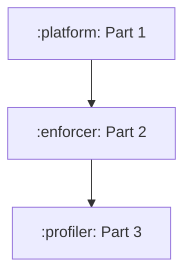

# 🟡 [Severity: MEDIUM]: Extract immutable syscall-number resolver from dispatcher

**Context:**
Architecture-specific syscall mappings are embedded in the `Syscall` dispatcher. They are pure data
selection but coexist with parsing and public dispatch behavior, making it hard to read the mapping
as a specification or cover architecture × syscall combinations without broad integration setup.

**Needed:**
1. Extract an internal immutable resolver; preserve the existing public API and unsupported-syscall
   sentinel exactly.
2. Characterize supported architecture mappings before moving them, including representative
   filesystem, network, process, alias, and unsupported syscalls.
3. Add readable parameterized tables in `:platform`; use a property only for a genuine invariant
   such as alias equivalence, never for line coverage.
4. Run focused `:platform:test`, inspect the platform JaCoCo report, then run `unitCheck`.

## Important details
- ### Work Package DAG

---

**Verification:** `./gradlew :tools:orchestrator:checkBacklog` plus the `verify_cheap` commands above (if any).

<!-- id: issue-20260907-065528  file: issue-20260907-065528-extract-immutable-syscall-number-resolver-from-dispatcher.md -->
<!-- Agent: fill Context and Needed; add files/symbols if the impact walk missed them. Do not rename the file. -->
