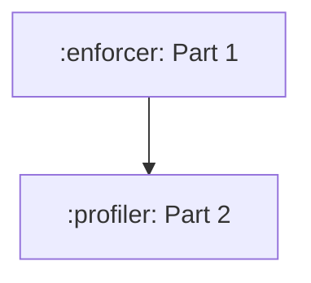

# 🟡 [Severity: MEDIUM]: Add EINTR progressive backoff and EOF validation to SupervisorSocketInputStream

**Context:**
`NativeSocketInputStream` (in `:profiler`) implements a progressive backoff throttling strategy (`handleBackoff`: yielding then sleeping on consecutive `EINTR` retry loops) to prevent high-CPU tight-loop spinning under active signal/interruption storms. In contrast, `SupervisorSocketInputStream` (in `:enforcer`) only does a basic `Thread.yield()` on `EINTR` and immediately closes `socketFd` in its `close()` method, which can cause premature FD closure if the socket lifecycle is externally managed or if EOF handling needs explicit verification. Aligning `SupervisorSocketInputStream` with the hardened `NativeSocketInputStream` pattern hardens the seccomp supervisor IPC reader against CPU starvation under high signal volume.

**Needed:**
1. Port the progressive backoff logic (`handleBackoff` with consecutive `eintrCount`, yielding and sleeping) from `NativeSocketInputStream` into `SupervisorSocketInputStream`.
2. Standardize interrupt exception reporting to preserve thread interrupt state with `Thread.currentThread().interrupt()`.
3. Add unit tests in `SupervisorSocketInputStreamTest` verifying progressive EINTR backoff and interrupt propagation under repeated simulated EINTR syscall responses.
4. Run `./gradlew :enforcer:test --tests io.mazewall.ffi.networking.SupervisorSocketInputStreamTest`.
5. Run `./gradlew :profiler:test --tests io.mazewall.profiler.internal.NativeSocketInputStreamTest`.

## Investigation
- AST identifier scan: 0 hits outside origin files

## Important details
- ### Work Package DAG

---

**Verification:** `./gradlew :tools:orchestrator:checkBacklog` plus the `verify_cheap` commands above (if any).

<!-- id: issue-20260905-114558  file: issue-20260905-114558-add-eintr-progressive-backoff-and-eof-validation-to-supervis.md -->
<!-- Agent: fill Context and Needed; add files/symbols if the impact walk missed them. Do not rename the file. -->
