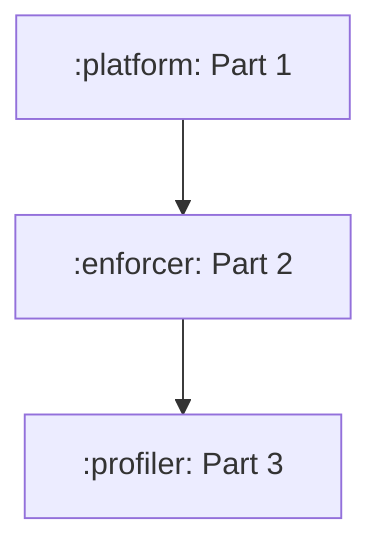

# 🟡 [Severity: MEDIUM]: Move platform-owned unit tests into platform coverage

**Context:**
Platform production classes are tested from `:enforcer`. The tests execute successfully but their
JaCoCo data belongs only to `:enforcer`, understating platform host-unit coverage and preventing the
platform gate from expressing its real confidence level.

**Needed:**
1. Move the existing tests for `ErrnoMapping`, `SupervisorSocketUtils`, and `SeccompDaemonEngine`
   into `:platform:test`, preserving their behavioral assertions and avoiding duplicate copies.
2. Add a shared fixture only when it is used by two or more modules; otherwise keep the fixture
   private to platform.
3. Run each moved class through `:platform:test` and verify the platform JaCoCo XML marks the
   corresponding production class covered; then run `unitCheck`.

## Investigation
- AST identifier scan: 0 hits outside origin files

## Important details
- ### Work Package DAG

## Side effects
- Relocates existing host-unit tests without changing containment behavior

---

**Verification:** `./gradlew :tools:orchestrator:checkBacklog` plus the `verify_cheap` commands above (if any).

<!-- id: issue-20260907-065725  file: issue-20260907-065725-move-platform-owned-unit-tests-into-platform-coverage.md -->
<!-- Agent: fill Context and Needed; add files/symbols if the impact walk missed them. Do not rename the file. -->
