# Enforcer Module Architecture

This document maps the architectural design and class hierarchy of the `:enforcer` module.

## Core Class Diagram

The following diagram illustrates the relationships between the sandbox engine, policy models, native FFM bindings, and the Landlock/Seccomp implementation layers.

```plantuml
@startuml Enforcer Class Diagram
!pragma useIntermediatePackages false
!theme spacelab
set separator none
hide empty members

class "BpfFilter" as io.mazewall.BpfFilter {
  + {static}BpfFilter INSTANCE
  __
  +SockFilter[] build(Arch, Policy<?>, boolean)
  +void emitInspections$io_mazewall_enforcer(Builder, List<SyscallInspection>, boolean, Set<Integer>)
}
class "LinuxNative" as io.mazewall.LinuxNative {
  + {static}LinuxNative INSTANCE
  __
  +void setEngine(NativeEngine)
  +void resetToDefault()
  +NativeFileSystem getFileSystem()
  +NativeNetworking getNetworking()
  +NativeProcess getProcess()
  +NativeMemory getMemory()
  +SyscallResult prctl(int, Object, Object, Object, Object)
  +SyscallResult syscall(long, Object, Object, Object, Object, Object, Object)
  +SyscallResult syscall4(long, Object, Object, Object, Object)
  +SyscallResult open(MemorySegment, int)
  +SyscallResult close(int)
  +SyscallResult socketpair(int, int, int, MemorySegment)
  +SyscallResult socket(int, int, int)
  +SyscallResult bind(int, MemorySegment, int)
  +SyscallResult listen(int, int)
  +SyscallResult accept(int, MemorySegment, MemorySegment)
  +SyscallResult connect(int, MemorySegment, int)
  +SyscallResult sendmsg(int, MemorySegment, int)
  +SyscallResult recvmsg(int, MemorySegment, int)
  +SyscallResult ioctl(int, long, MemorySegment)
  +SyscallResult ioctl(int, long, long)
  +SyscallResult processVmReadv(int, MemorySegment, long, MemorySegment, long, long)
  +SyscallResult readlink(MemorySegment, MemorySegment, long)
  +SyscallResult read(int, MemorySegment, long)
  +SyscallResult write(int, MemorySegment, long)
  +SyscallResult recv(int, MemorySegment, long, int)
  +SyscallResult fcntl(int, int, long)
  +int gettid()
  +SyscallResult poll(MemorySegment, long, int)
  +MemorySegment newSockFProg(Arena, SockFilter[])
}
interface "NativeEngine" as io.mazewall.NativeEngine {
  + {abstract}SyscallResult syscall(long, Object, Object, Object, Object, Object, Object)
  + {abstract}SyscallResult syscall4(long, Object, Object, Object, Object)
  + {abstract}SyscallResult ioctl(int, long, MemorySegment)
  + {abstract}SyscallResult ioctl(int, long, long)
  + {abstract}SyscallResult fcntl(int, int, long)
  + {abstract}SyscallResult poll(MemorySegment, long, int)
}
interface "NativeFileSystem" as io.mazewall.NativeFileSystem {
  + {abstract}SyscallResult open(MemorySegment, int)
  + {abstract}SyscallResult readlink(MemorySegment, MemorySegment, long)
  + {abstract}SyscallResult close(int)
}
interface "NativeMemory" as io.mazewall.NativeMemory {
  + {abstract}SyscallResult processVmReadv(int, MemorySegment, long, MemorySegment, long, long)
  + {abstract}SyscallResult read(int, MemorySegment, long)
  + {abstract}SyscallResult write(int, MemorySegment, long)
  + {abstract}MemorySegment newSockFProg(Arena, SockFilter[])
}
interface "NativeNetworking" as io.mazewall.NativeNetworking {
  + {abstract}SyscallResult socketpair(int, int, int, MemorySegment)
  + {abstract}SyscallResult socket(int, int, int)
  + {abstract}SyscallResult bind(int, MemorySegment, int)
  + {abstract}SyscallResult listen(int, int)
  + {abstract}SyscallResult accept(int, MemorySegment, MemorySegment)
  + {abstract}SyscallResult connect(int, MemorySegment, int)
  + {abstract}SyscallResult sendmsg(int, MemorySegment, int)
  + {abstract}SyscallResult recvmsg(int, MemorySegment, int)
  + {abstract}SyscallResult recv(int, MemorySegment, long, int)
}
interface "NativeProcess" as io.mazewall.NativeProcess {
  + {abstract}int gettid()
  + {abstract}SyscallResult prctl(int, Object, Object, Object, Object)
}
class "Platform" as io.mazewall.Platform {
  + {static}Platform INSTANCE
  __
  +boolean isSupported()
  +boolean isArchitectureSupported$io_mazewall_enforcer()
  +FallbackBehavior configuredFallback()
  +String getYamaPath$io_mazewall_enforcer()
  +void setYamaPath$io_mazewall_enforcer(String)
  +Diagnostics diagnose()
}
class "Policy" as io.mazewall.Policy<S extends PolicyScope> {
  + {static}Companion Companion
  __
  +SeccompAction getDefaultAction()
  +Map<Syscall, SeccompAction> getSyscallActions()
  +boolean getAllowMmapExec()
  +boolean getAllowNonThreadClone()
  +boolean getAllowUnsafePrctl()
  +Set<String> getAllowedFsReadPaths()
  +Set<String> getAllowedFsWritePaths()
  +boolean getEnforceLandlock$io_mazewall_enforcer()
  +boolean isSyscallAllowed(Syscall)
  +Map<Integer, SeccompAction> syscallActionNumbers(Arch)
}
interface "PolicyScope" as io.mazewall.PolicyScope {
}
class "RealNativeEngine" as io.mazewall.RealNativeEngine {
  + {static}RealNativeEngine INSTANCE
  __
  +SyscallResult prctl(int, Object, Object, Object, Object)
  +SyscallResult syscall(long, Object, Object, Object, Object, Object, Object)
  +SyscallResult syscall4(long, Object, Object, Object, Object)
  +SyscallResult open(MemorySegment, int)
  +SyscallResult close(int)
  +SyscallResult socketpair(int, int, int, MemorySegment)
  +SyscallResult socket(int, int, int)
  +SyscallResult bind(int, MemorySegment, int)
  +SyscallResult listen(int, int)
  +SyscallResult accept(int, MemorySegment, MemorySegment)
  +SyscallResult connect(int, MemorySegment, int)
  +SyscallResult sendmsg(int, MemorySegment, int)
  +SyscallResult recvmsg(int, MemorySegment, int)
  +SyscallResult ioctl(int, long, MemorySegment)
  +SyscallResult ioctl(int, long, long)
  +SyscallResult processVmReadv(int, MemorySegment, long, MemorySegment, long, long)
  +SyscallResult readlink(MemorySegment, MemorySegment, long)
  +SyscallResult read(int, MemorySegment, long)
  +SyscallResult write(int, MemorySegment, long)
  +SyscallResult recv(int, MemorySegment, long, int)
  +SyscallResult fcntl(int, int, long)
  +int gettid()
  +SyscallResult poll(MemorySegment, long, int)
  +MemorySegment newSockFProg(Arena, SockFilter[])
}
class "SbobParser" as io.mazewall.SbobParser {
  + {static}SbobParser INSTANCE
  __
  +Policy<?> parseToPolicy(Path, Policy<?>)
  +Policy<?> parseToPolicy(InputStream, Policy<?>)
  +Policy<?> parseJsonToPolicy(String, Policy<?>)
}
interface "SeccompMode" as io.mazewall.SeccompMode {
}
class "SockFilter" as io.mazewall.SockFilter {
  +short getCode()
  +short getJt()
  +short getJf()
  +int getK()
}
interface "YamaPtraceScope" as io.mazewall.YamaPtraceScope {
}
enum "SeccompAction" as io.mazewall.core.SeccompAction {
  ACT_KILL_PROCESS
  ACT_KILL_THREAD
  ACT_TRAP
  ACT_ERRNO
  ACT_NOTIFY
  ACT_LOG
  ACT_ALLOW
  __
  +int getPriority()
}
class "ContainedExecutors" as io.mazewall.enforcer.ContainedExecutors {
  ..
  + {static}ContainedExecutors INSTANCE
  __
  +void installOnCurrentThread(Policy<?>[])
  +void installOnProcess(Policy<? extends ProcessWideSafe>[])
  +ExecutorService wrap(ExecutorService, Policy<?>[])
}
class "ContainerStateRegistry" as io.mazewall.enforcer.ContainerStateRegistry {
  + {static}ContainerStateRegistry INSTANCE
  __
  +ThreadLocal<Map<Syscall, SeccompAction>> getTHREAD_SYSCALL_ACTIONS()
  +ThreadLocal<SeccompAction> getTHREAD_DEFAULT_ACTION()
  +ThreadLocal<Boolean> getTHREAD_ALLOWS_MMAP_EXEC()
  +ThreadLocal<Boolean> getTHREAD_ALLOWS_NON_THREAD_CLONE()
  +ThreadLocal<Boolean> getTHREAD_ALLOWS_UNSAFE_PRCTL()
  +ThreadLocal<Set<Syscall>> getTHREAD_ALLOWED_SYSCALLS()
  +ThreadLocal<Integer> getFILTER_DEPTH()
  +ThreadLocal<Set<String>> getTHREAD_LANDLOCK_APPLIED_READS()
  +ThreadLocal<Set<String>> getTHREAD_LANDLOCK_APPLIED_WRITES()
  +Map<Syscall, SeccompAction> getPROCESS_SYSCALL_ACTIONS()
  +AtomicReference<SeccompAction> getPROCESS_DEFAULT_ACTION()
  +AtomicBoolean getPROCESS_ALLOWS_MMAP_EXEC()
  +AtomicBoolean getPROCESS_ALLOWS_NON_THREAD_CLONE()
  +AtomicBoolean getPROCESS_ALLOWS_UNSAFE_PRCTL()
  +AtomicReference<Set<Syscall>> getPROCESS_ALLOWED_SYSCALLS()
  +AtomicInteger getPROCESS_FILTER_DEPTH()
}
class "ContainmentViolationDetector" as io.mazewall.enforcer.ContainmentViolationDetector {
  + {static}ContainmentViolationDetector INSTANCE
  __
  +String[] getDENIED_PHRASES()
  +boolean isContainmentViolation(Throwable)
  +Throwable findViolationCause(Throwable)
}
class "ContainmentViolationException" as io.mazewall.enforcer.ContainmentViolationException {
}
class "FilterInstallationPlanner" as io.mazewall.enforcer.FilterInstallationPlanner {
  + {static}FilterInstallationPlanner INSTANCE
  __
  +FilterPlan calculateNewFilter(Policy<?>, ContainerState)
  +void verifyFilterDepth(int)
}
class "JvmFloorWorkload" as io.mazewall.enforcer.JvmFloorWorkload {
  + {static}JvmFloorWorkload INSTANCE
  __
  +void run()
  + {static}void main(String[])
}
class "ContainedExecutorWrapper" as io.mazewall.enforcer.internal.ContainedExecutorWrapper {
  +void execute(Runnable)
  +Future<T> submit(Callable<T>)
  +Future<T> submit(Runnable, T)
  +Future<?> submit(Runnable)
  +List<Future<T>> invokeAll(Collection<? extends Callable<T>>)
  +List<Future<T>> invokeAll(Collection<? extends Callable<T>>, long, TimeUnit)
  +T invokeAny(Collection<? extends Callable<T>>)
  +T invokeAny(Collection<? extends Callable<T>>, long, TimeUnit)
  +void close()
  +void shutdown()
  +List<Runnable> shutdownNow()
  +boolean isShutdown()
  +boolean isTerminated()
  +boolean awaitTermination(long, TimeUnit)
}
class "Landlock" as io.mazewall.landlock.Landlock {
  + {static}Landlock INSTANCE
  + {static}long LANDLOCK_ACCESS_FS_EXECUTE
  + {static}long LANDLOCK_ACCESS_FS_WRITE_FILE
  + {static}long LANDLOCK_ACCESS_FS_READ_FILE
  + {static}long LANDLOCK_ACCESS_FS_READ_DIR
  + {static}long LANDLOCK_ACCESS_FS_REMOVE_DIR
  + {static}long LANDLOCK_ACCESS_FS_REMOVE_FILE
  + {static}long LANDLOCK_ACCESS_FS_MAKE_CHAR
  + {static}long LANDLOCK_ACCESS_FS_MAKE_DIR
  + {static}long LANDLOCK_ACCESS_FS_MAKE_REG
  + {static}long LANDLOCK_ACCESS_FS_MAKE_SOCK
  + {static}long LANDLOCK_ACCESS_FS_MAKE_FIFO
  + {static}long LANDLOCK_ACCESS_FS_MAKE_BLOCK
  + {static}long LANDLOCK_ACCESS_FS_MAKE_SYM
  + {static}long LANDLOCK_ACCESS_FS_REFER
  + {static}long LANDLOCK_ACCESS_FS_TRUNCATE
  + {static}long LANDLOCK_ACCESS_FS_IOCTL_DEV
  __
  +void applyRestrictiveBarrier()
  +boolean isSupported()
  +int getAbiVersion()
  +void applyRuleset(Policy<?>)
  +long getFullAccessMask$io_mazewall_enforcer(int)
  +void handleUnsupportedLandlock$io_mazewall_enforcer()
  +void addJvmClasspathRules$io_mazewall_enforcer(int, long, Arena)
  +void enforceRuleset$io_mazewall_enforcer(int)
  +void applyUserRules$io_mazewall_enforcer(int, Policy<?>, int, Arena, long)
  +long getAccessMask$io_mazewall_enforcer(int, Policy<?>)
  +SyscallResult createRuleset$io_mazewall_enforcer(Arena, long, int)
}
class "LandlockSession" as io.mazewall.landlock.LandlockSession {
  +LandlockState getState()
  +void applyRuleset()
}
interface "LandlockState" as io.mazewall.landlock.LandlockState {
}
interface "ArgCheck" as io.mazewall.seccomp.ArgCheck {
}
interface "BpfInstruction" as io.mazewall.seccomp.BpfInstruction {
}
class "BpfProgram" as io.mazewall.seccomp.BpfProgram {
  + {static}Companion Companion
  __
  +SockFilter[] getInstructions()
  + {static}Builder builder()
}
class "PureJavaBpfEngine" as io.mazewall.seccomp.PureJavaBpfEngine {
  + {static}PureJavaBpfEngine INSTANCE
  __
  +SeccompInstallationState getState$io_mazewall_enforcer()
  +boolean isSupported()
  +void install(Policy<?>)
  +void installOnProcess(Policy<?>)
}
interface "SeccompEngine" as io.mazewall.seccomp.SeccompEngine {
  + {abstract}void install(Policy<?>)
  +void installOnProcess(Policy<?>)
  + {abstract}boolean isSupported()
}
interface "SeccompInstallationState" as io.mazewall.seccomp.SeccompInstallationState {
}
class "SyscallInspection" as io.mazewall.seccomp.SyscallInspection {
  +int getSyscallNumber()
  +int getArgIndex()
  +ArgCheck getCheck()
  +SeccompAction getIfMatched()
  +SeccompAction getIfNotMatched()
}
io.mazewall.BpfFilter --> io.mazewall.BpfFilter
io.mazewall.LinuxNative .u.|> io.mazewall.NativeEngine
io.mazewall.LinuxNative .u.|> io.mazewall.NativeFileSystem
io.mazewall.LinuxNative .u.|> io.mazewall.NativeNetworking
io.mazewall.LinuxNative .u.|> io.mazewall.NativeProcess
io.mazewall.LinuxNative .u.|> io.mazewall.NativeMemory
io.mazewall.LinuxNative --> io.mazewall.NativeEngine
io.mazewall.LinuxNative --> io.mazewall.LinuxNative
io.mazewall.NativeEngine .u.|> io.mazewall.NativeFileSystem
io.mazewall.NativeEngine .u.|> io.mazewall.NativeNetworking
io.mazewall.NativeEngine .u.|> io.mazewall.NativeProcess
io.mazewall.NativeEngine .u.|> io.mazewall.NativeMemory
io.mazewall.Platform --> io.mazewall.Platform
io.mazewall.Policy --> io.mazewall.core.SeccompAction
io.mazewall.Policy <--> io.mazewall.Policy
io.mazewall.RealNativeEngine .u.|> io.mazewall.NativeEngine
io.mazewall.RealNativeEngine .u.|> io.mazewall.NativeFileSystem
io.mazewall.RealNativeEngine .u.|> io.mazewall.NativeNetworking
io.mazewall.RealNativeEngine .u.|> io.mazewall.NativeProcess
io.mazewall.RealNativeEngine .u.|> io.mazewall.NativeMemory
io.mazewall.RealNativeEngine --> io.mazewall.RealNativeEngine
io.mazewall.SbobParser --> io.mazewall.SbobParser
io.mazewall.enforcer.ContainedExecutors --> io.mazewall.enforcer.ContainedExecutors
io.mazewall.enforcer.ContainerStateRegistry --> io.mazewall.enforcer.ContainerStateRegistry
io.mazewall.enforcer.ContainerStateRegistry --> io.mazewall.core.SeccompAction
io.mazewall.enforcer.ContainmentViolationDetector --> io.mazewall.enforcer.ContainmentViolationDetector
io.mazewall.enforcer.FilterInstallationPlanner --> io.mazewall.enforcer.FilterInstallationPlanner
io.mazewall.enforcer.JvmFloorWorkload --> io.mazewall.enforcer.JvmFloorWorkload
io.mazewall.enforcer.internal.ContainedExecutorWrapper --> io.mazewall.Policy
io.mazewall.landlock.Landlock --> io.mazewall.landlock.Landlock
io.mazewall.landlock.LandlockSession --> io.mazewall.landlock.LandlockState
io.mazewall.landlock.LandlockSession --> io.mazewall.Policy
io.mazewall.seccomp.BpfProgram --> io.mazewall.SockFilter
io.mazewall.seccomp.PureJavaBpfEngine .u.|> io.mazewall.seccomp.SeccompEngine
io.mazewall.seccomp.PureJavaBpfEngine --> io.mazewall.seccomp.SeccompInstallationState
io.mazewall.seccomp.PureJavaBpfEngine --> io.mazewall.seccomp.PureJavaBpfEngine
io.mazewall.seccomp.SyscallInspection --> io.mazewall.seccomp.ArgCheck
io.mazewall.seccomp.SyscallInspection --> io.mazewall.core.SeccompAction
@enduml
```

