# Profiler Module Architecture

This document maps the architectural design and class hierarchy of the `:profiler` module.

## Core Class Diagram

The following diagram illustrates the relationships between the profiler daemon, the memory reader, trace listener, the IPC transport layer, and the SBoB compiler.

```plantuml
@startuml Profiler Class Diagram
!pragma useIntermediatePackages false
!theme spacelab
set separator none
hide empty members

class "BaselinePathProfile" as io.mazewall.profiler.BaselinePathProfile {
  +Set<String> getExactPaths()
  +Set<String> getPathPrefixes()
  +boolean matches(String)
}
class "BillOfBehavior" as io.mazewall.profiler.BillOfBehavior {
  + {static}Companion Companion
  __
  +Set<String> getOpens()
  +Set<String> getFsWritePaths()
  +Set<Syscall> getSyscalls()
  +Set<String> getExecs()
  +Map<TraceEvent, List<StackTraceElement[]>> getStackProfile()
  +BillOfBehavior plus(BillOfBehavior)
  +BillOfBehavior filterPaths(BaselinePathProfile)
  +String toJson()
  +String toStackTracesJson()
}
class "BillOfBehaviorDto" as io.mazewall.profiler.BillOfBehaviorDto {
  +Set<String> getOpens()
  +Set<String> getFsWritePaths()
  +Set<String> getSyscalls()
  +Set<String> getExecs()
  +List<StackProfileEntryDto> getStackProfile()
}
class "BillOfBehaviorKt" as io.mazewall.profiler.BillOfBehaviorKt {
}
class "JvmBaselineProfiles" as io.mazewall.profiler.JvmBaselineProfiles {
  + {static}JvmBaselineProfiles INSTANCE
  __
  +BaselinePathProfile jvmBootstrapNoise()
}
class "Profiler" as io.mazewall.profiler.Profiler {
  + {static}Profiler INSTANCE
  __
  +ConcurrentHashMap<Integer, Thread> getThreadRegistry()
  +boolean sendDescriptorInternal$io_mazewall_profiler(int, int)
}
class "ProfilingResult" as io.mazewall.profiler.ProfilingResult<T> {
  +T getValue()
  +BillOfBehavior getBehavior()
}
class "StackProfileEntryDto" as io.mazewall.profiler.StackProfileEntryDto {
  +String getSyscall()
  +List<String> getPaths()
  +List<Long> getArgs()
  +List<String> getStackTrace()
}
interface "TraceableWorkload" as io.mazewall.profiler.TraceableWorkload {
}
class "BobCompiler" as io.mazewall.profiler.compiler.BobCompiler {
  + {static}BobCompiler INSTANCE
  __
  +BillOfBehavior compile(List<TraceEvent>)
}
class "DescriptorPassing" as io.mazewall.profiler.engine.DescriptorPassing {
  + {static}DescriptorPassing INSTANCE
  __
  +MemorySegment setupScmRightsMsgHdr(Arena, MemorySegment, MemorySegment)
}
abstract class "LoopAction" as io.mazewall.profiler.engine.LoopAction {
}
class "ProfilerDaemon" as io.mazewall.profiler.engine.ProfilerDaemon {
  + {static}ProfilerDaemon INSTANCE
  __
  + {static}void main(String[])
}
class "ProfilerDaemonEngine" as io.mazewall.profiler.engine.ProfilerDaemonEngine {
  +ProfilerDaemonState getState()
  +void run()
  +void triggerGlobalShutdown(String)
}
interface "ProfilerDaemonState" as io.mazewall.profiler.engine.ProfilerDaemonState {
}
class "ProfilerInstaller" as io.mazewall.profiler.engine.ProfilerInstaller {
  + {static}ProfilerInstaller INSTANCE
  __
  +void installProfilingFilterForThread(String, Policy<?>, List<TraceEvent>, Map<TraceEvent, List<StackTraceElement[]>>, Map<String, Long>, Function0<? extends Thread>, Function1<? super String, Integer>, Function5<? super Integer, ? super List<TraceEvent>, ? super Map<TraceEvent, List<StackTraceElement[]>>, ? super Map<String, Long>, ? super Function0<? extends Thread>, Unit>)
}
class "ProfilerInstallerSession" as io.mazewall.profiler.engine.ProfilerInstallerSession {
  +ProfilerInstallerState getState()
  +void install()
}
interface "ProfilerInstallerState" as io.mazewall.profiler.engine.ProfilerInstallerState {
}
interface "ProfilerMemoryReader" as io.mazewall.profiler.engine.ProfilerMemoryReader {
  + {abstract}String readStringFromProcess(int, long, int)
  + {abstract}String resolveLink(int, String)
}
class "ProfilerSessionHandler" as io.mazewall.profiler.engine.ProfilerSessionHandler {
  +ProfilerState getState()
  +LoopAction handleActiveListener(MemorySegment, MemorySegment, MemorySegment, MemorySegment, MemorySegment)
  +boolean processNotification$io_mazewall_profiler(MemorySegment, MemorySegment, MemorySegment, MemorySegment)
}
interface "ProfilerState" as io.mazewall.profiler.engine.ProfilerState {
}
interface "ProfilerTransport" as io.mazewall.profiler.engine.ProfilerTransport {
  + {abstract}void sendTraceEvent(int, TraceEvent)
  + {abstract}Integer recvDescriptor(int)
  + {abstract}SyscallResult poll(MemorySegment, long, int)
  + {abstract}SyscallResult read(int, MemorySegment, long)
  + {abstract}SyscallResult write(int, MemorySegment, long)
  + {abstract}SyscallResult recv(int, MemorySegment, long, int)
  + {abstract}SyscallResult ioctl(int, long, MemorySegment)
  + {abstract}int createServer(String)
  + {abstract}int accept(int)
  + {abstract}void close(int)
}
class "RealMemoryReader" as io.mazewall.profiler.engine.RealMemoryReader {
  + {static}RealMemoryReader INSTANCE
  __
  +String readStringFromProcess(int, long, int)
  +String resolveLink(int, String)
}
class "RealProfilerTransport" as io.mazewall.profiler.engine.RealProfilerTransport {
  + {static}RealProfilerTransport INSTANCE
  __
  +void sendTraceEvent(int, TraceEvent)
  +Integer recvDescriptor(int)
  +SyscallResult poll(MemorySegment, long, int)
  +SyscallResult read(int, MemorySegment, long)
  +SyscallResult write(int, MemorySegment, long)
  +SyscallResult recv(int, MemorySegment, long, int)
  +SyscallResult ioctl(int, long, MemorySegment)
  +int createServer(String)
  +int accept(int)
  +void close(int)
}
class "SyscallPathResolver" as io.mazewall.profiler.engine.SyscallPathResolver {
  +List<String> getPathArgs(String, long[])
}
class "TraceEvent" as io.mazewall.profiler.engine.TraceEvent {
  +int getPid()
  +String getSyscallName()
  +long[] getArgs()
  +List<String> getPaths()
  +List<String> getStackTrace()
}
class "DaemonContext" as io.mazewall.profiler.internal.DaemonContext {
  +String getSocketPath()
  +Path getSocketDir()
  +Process getDaemonProcess()
  +Thread getShutdownHook()
}
class "NativeSocketInputStream" as io.mazewall.profiler.internal.NativeSocketInputStream {
  + {static}Companion Companion
  __
  +int read()
  +int read(byte[], int, int)
  +void close()
}
class "ProfilerDaemonManager" as io.mazewall.profiler.internal.ProfilerDaemonManager {
  + {static}ProfilerDaemonManager INSTANCE
  __
  +DaemonContext getOrSpawnSharedDaemon()
  +void cleanupDaemon(DaemonContext)
}
class "ProfilerSocket" as io.mazewall.profiler.internal.ProfilerSocket {
  + {static}ProfilerSocket INSTANCE
  + {static}int AF_UNIX
  + {static}int SOCK_STREAM
  + {static}int ADDR_UN_SIZE
  + {static}int SOCKADDR_UN_PATH_SIZE
  __
  +int connectWithRetry(String, int, long)
  +boolean sendDescriptor(int, int)
  +MemorySegment setupSockAddrUn(Arena, String)
}
class "ProfilerTraceListener" as io.mazewall.profiler.internal.ProfilerTraceListener {
  + {static}Companion Companion
  __
  +TraceListenerState getState()
  +Thread start()
}
interface "TraceListenerState" as io.mazewall.profiler.internal.TraceListenerState {
}
class "IterativeProfiler" as io.mazewall.profiler.iterative.IterativeProfiler {
  + {static}IterativeProfiler INSTANCE
}
interface "IterativeProfilerState" as io.mazewall.profiler.iterative.IterativeProfilerState {
}
class "StraceProfiler" as io.mazewall.profiler.strace.StraceProfiler {
  + {static}StraceProfiler INSTANCE
}
class "StraceWorkloadRunner" as io.mazewall.profiler.strace.StraceWorkloadRunner {
  + {static}StraceWorkloadRunner INSTANCE
  __
  + {static}void main(String[])
}
io.mazewall.profiler.BillOfBehavior --> io.mazewall.profiler.engine.TraceEvent
io.mazewall.profiler.BillOfBehaviorDto --> io.mazewall.profiler.StackProfileEntryDto
io.mazewall.profiler.JvmBaselineProfiles --> io.mazewall.profiler.JvmBaselineProfiles
io.mazewall.profiler.Profiler --> io.mazewall.profiler.Profiler
io.mazewall.profiler.ProfilingResult --> io.mazewall.profiler.BillOfBehavior
io.mazewall.profiler.compiler.BobCompiler --> io.mazewall.profiler.compiler.BobCompiler
io.mazewall.profiler.engine.DescriptorPassing --> io.mazewall.profiler.engine.DescriptorPassing
io.mazewall.profiler.engine.ProfilerDaemon --> io.mazewall.profiler.engine.ProfilerDaemon
io.mazewall.profiler.engine.ProfilerDaemonEngine --> io.mazewall.profiler.engine.ProfilerDaemonState
io.mazewall.profiler.engine.ProfilerDaemonEngine --> io.mazewall.profiler.engine.ProfilerTransport
io.mazewall.profiler.engine.ProfilerDaemonEngine --> io.mazewall.profiler.engine.ProfilerMemoryReader
io.mazewall.profiler.engine.ProfilerInstaller --> io.mazewall.profiler.engine.ProfilerInstaller
io.mazewall.profiler.engine.ProfilerInstallerSession --> io.mazewall.profiler.engine.TraceEvent
io.mazewall.profiler.engine.ProfilerInstallerSession --> io.mazewall.profiler.engine.ProfilerInstallerState
io.mazewall.profiler.engine.ProfilerSessionHandler --> io.mazewall.profiler.engine.ProfilerTransport
io.mazewall.profiler.engine.ProfilerSessionHandler --> io.mazewall.profiler.engine.ProfilerState
io.mazewall.profiler.engine.ProfilerSessionHandler --> io.mazewall.profiler.engine.ProfilerMemoryReader
io.mazewall.profiler.engine.RealMemoryReader .u.|> io.mazewall.profiler.engine.ProfilerMemoryReader
io.mazewall.profiler.engine.RealMemoryReader --> io.mazewall.profiler.engine.RealMemoryReader
io.mazewall.profiler.engine.RealProfilerTransport .u.|> io.mazewall.profiler.engine.ProfilerTransport
io.mazewall.profiler.engine.RealProfilerTransport --> io.mazewall.profiler.engine.RealProfilerTransport
io.mazewall.profiler.engine.SyscallPathResolver --> io.mazewall.profiler.engine.ProfilerMemoryReader
io.mazewall.profiler.internal.ProfilerDaemonManager --> io.mazewall.profiler.internal.ProfilerDaemonManager
io.mazewall.profiler.internal.ProfilerDaemonManager --> io.mazewall.profiler.internal.DaemonContext
io.mazewall.profiler.internal.ProfilerSocket --> io.mazewall.profiler.internal.ProfilerSocket
io.mazewall.profiler.internal.ProfilerTraceListener --> io.mazewall.profiler.engine.TraceEvent
io.mazewall.profiler.internal.ProfilerTraceListener --> io.mazewall.profiler.internal.TraceListenerState
io.mazewall.profiler.iterative.IterativeProfiler --> io.mazewall.profiler.iterative.IterativeProfiler
io.mazewall.profiler.strace.StraceProfiler --> io.mazewall.profiler.strace.StraceProfiler
io.mazewall.profiler.strace.StraceWorkloadRunner --> io.mazewall.profiler.strace.StraceWorkloadRunner
@enduml
```

