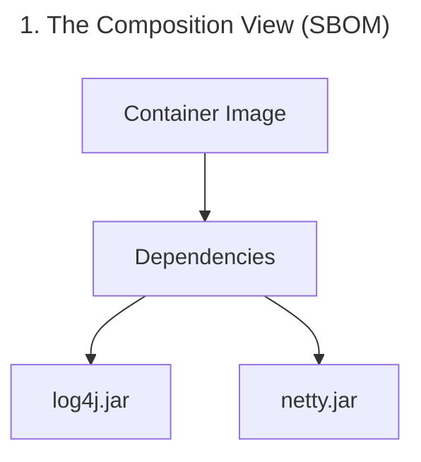
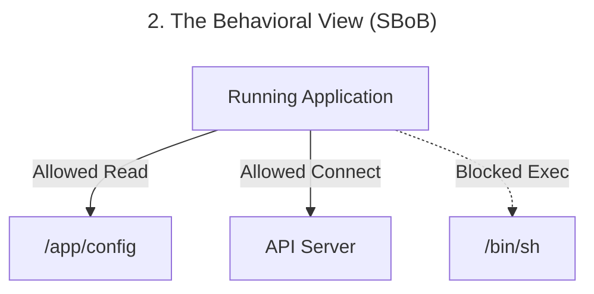
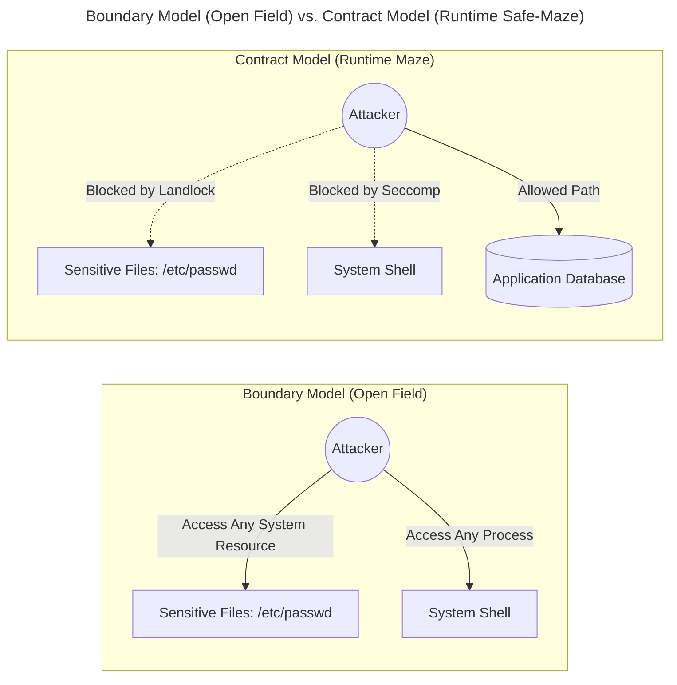
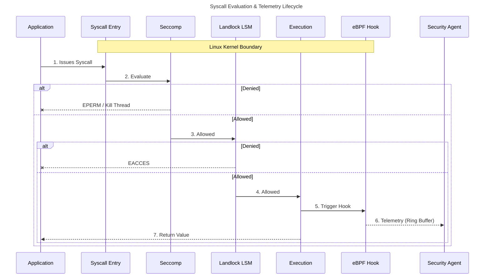
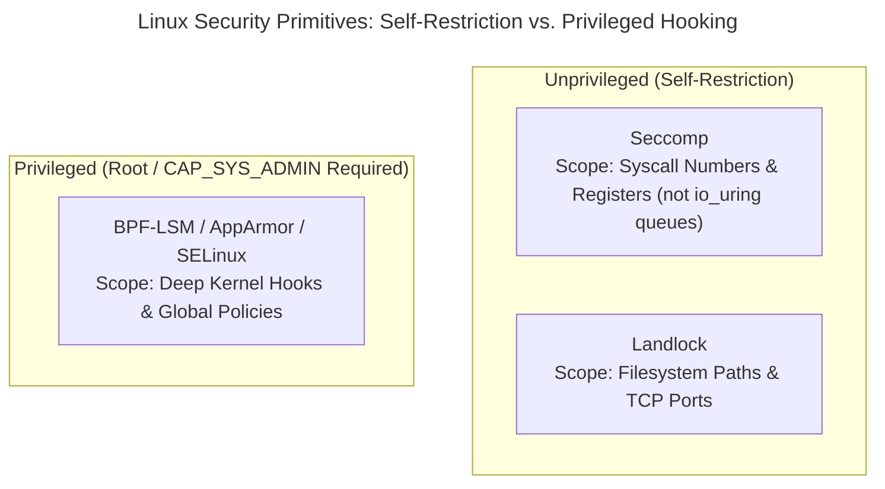
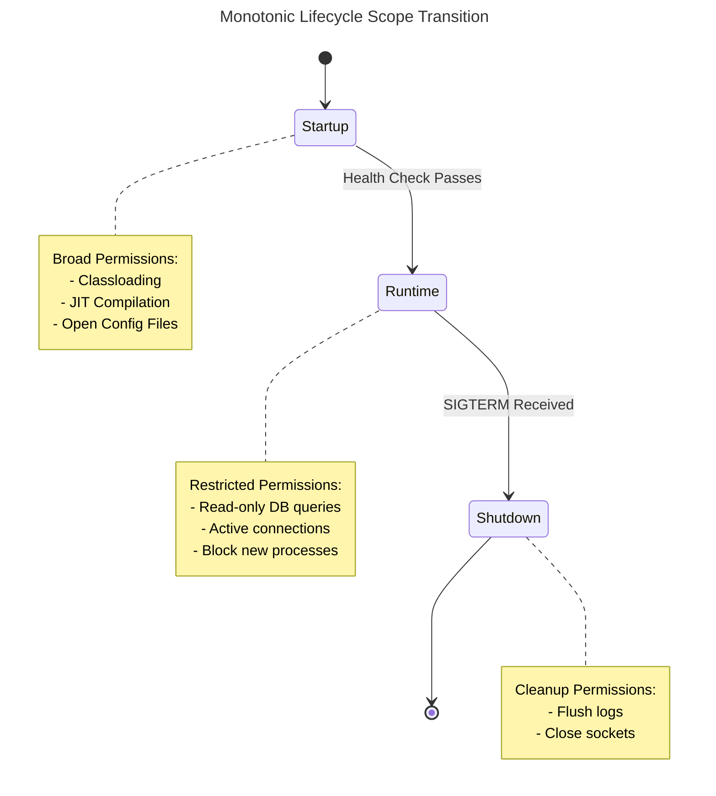

# Do You Really Know What Your App Is Doing at Runtime?

> **Series overview:** This is Part 1 of our series on behavioral security for cloud-native applications. While the implementation examples use the JVM as a concrete laboratory, the kernel concepts apply equally to Go, Node.js, Python, and any server-side runtime hosted on Linux. To explore the codebase and architecture details, visit the main [mazewall README](../../README.md).
 
In modern cloud-native development, we compile our code, build container images, and ship them to Kubernetes clusters with high frequency. To secure this pipeline, the industry has heavily focused on static scans—checking our code for vulnerable dependencies before it deploys. While this static security layer is vital, it only answers half the question. It tells us what is on our disk, but it remains blind to what actually happens when that code starts running.

We have become very good at answering one specific supply-chain question:
 
**What is inside this software?**
 
That is what an [SBOM](https://www.cisa.gov/sbom) (Software Bill of Materials)[^sbom] gives us. It tells us what components, packages, and libraries are packed into an application or container image. That visibility is critical. If a zero-day vulnerability lands in a popular dependency, an SBOM helps us immediately identify our exposure.
 
But the moment software is compromised, composition stops being the most important question. The real question is how the software behaves at the operating system level:
 
**What is this software requesting from the OS kernel right now?**
 
In other words: what system calls (syscalls) is it executing? Which files is it opening? Which external IP addresses is it attempting to connect to? In many cases, the honest answer is uncomfortable: we don’t really know.
 
An SBOM can tell you that a compression library is present. It cannot tell you that this same library has suddenly started interfering with authentication flows. It can tell you that a logging framework is installed. It cannot tell you that the logger is currently opening outbound network sockets. Composition transparency is valuable, but it is not behavioral transparency.

### Visualizing the Twin Perspectives

To understand the difference, we can compare the static composition view of the application with its dynamic behavioral view side-by-side:

That gap is exactly where a new, emerging concept starts to matter: **SBoB—the Software Bill of Behavior.**[^sbob]

### The Linux Security Primitives: A Quick Comparison

To enforce or observe this behavior, modern Linux kernels provide four primary security primitives. If you are new to Linux systems programming, here is a quick cheat sheet comparing their roles, capabilities, and privileges:

| Primitive | Real-world Metaphor | Scope / Focus | Privilege Required | Developer Role |
| :--- | :--- | :--- | :--- | :--- |
| **eBPF** | The *Kernel Camera* | High-performance, event-driven system observation and telemetry hook. | 🔴 High (`CAP_SYS_ADMIN` or `CAP_BPF`) | Used to profile applications and generate SBoBs dynamically. |
| **Seccomp** | The *Syscall Gatekeeper* | Filters system calls by number and registers. | 🟢 Unprivileged (requires `no_new_privs`) | Used in code (like `mazewall`) to self-restrict system permissions. |
| **Landlock** | The *Folder Locker* | Path-aware file and TCP port access control. | 🟢 Unprivileged (requires `no_new_privs`) | Used by developers to sandbox specific paths and local directories. |
| **BPF-LSM** | The *Deep Inspector* | Fine-grained, context-aware policy hooks inside the kernel. | 🔴 High (`CAP_SYS_ADMIN`) | Typically managed by cluster-level agents rather than individual apps. |

## From Boundaries to Contracts

For the last decade, cloud-native security has relied on **boundaries**—wrapping apps in containers and namespaces, applying a global security profile at the outer shell. 

But for developers, this boundary model has a fundamental blind spot: it treats the runtime like an **open field surrounded by a perimeter fence**. The internal "walls" (your code's modules and architecture) are structurally present, but provide zero physical enforcement. If an attacker achieves [Arbitrary Code Execution (ACE)](https://en.wikipedia.org/wiki/Arbitrary_code_execution) inside the application, they can wander freely within the fence, exfiltrate data, or execute payload code. 

The shift to **contracts** (SBoB) turns the OS from a passive boundary fence into an **active runtime maze**.

Every legitimate path through your code becomes a corridor; every system call, filesystem path, or socket access is a locked gate. Under this contract:
1. **The Sandbox is a Maze:** An attacker who compromises a worker [thread](https://www.baeldung.com/cs/process-vs-thread) cannot wander to forbidden system calls or sensitive files—they are physically blocked by the nearest wall (e.g., [Seccomp](https://docs.docker.com/engine/security/seccomp/)[^seccomp] or [Landlock](https://landlock.io/)[^landlock]).
2. **The OS Enforces the Logic:** The kernel actively verifies that execution strictly matches the application's expected topology.

We move from asking *"Is this container allowed to talk to the internet?"* to *"Is this specific library, at this specific millisecond, allowed to perform this specific system call?"*

*(A quick note on scope: SBoB is still emerging, tooling is early, and standards are actively forming. What follows is a picture of where cloud-native security is heading — a direction that is becoming technically feasible and strategically hard to ignore.)*

## The Catalyst: Practical Runtime Observation with eBPF
 
For a long time, precise runtime behavioral security was too expensive, too invasive, or too brittle to apply at scale. That changed with [eBPF](https://ebpf.io/what-is-ebpf/).
 
If the SBoB is the blueprint contract, eBPF is the runtime camera that makes dynamic observation practical.
 
At a high level, eBPF gives modern Linux systems a safe, highly performant way to observe and react to what is happening at runtime. Syscalls, process executions, network behaviors, and file accesses become instantly visible and actionable.

A common mental model for backend developers is this: **eBPF is to the Linux kernel what JavaScript is to the web browser** — a sandboxed, event-driven programmability layer. The critical disanalogy: eBPF programs are **statically verified by the kernel before execution** — non-terminating loops and unsafe memory accesses are rejected at load time. It attaches to kernel events (system calls, file opens, network activity) without requiring custom kernel modules. eBPF turned the OS from a rigid substrate into something security tools can dynamically extend.

But it is important to distinguish between **observation** and **enforcement**. While eBPF provides the visibility needed to generate and enforce a Bill of Behavior, physical enforcement often relies on a different set of core Linux primitives. This distinction is critical because of a fundamental architectural trade-off: **Privilege.** 

While eBPF-based enforcement (like BPF-LSM) is extremely powerful, it requires high system privileges (`CAP_SYS_ADMIN` or `CAP_BPF`). In contrast, Seccomp and Landlock are designed to be **unprivileged**, allowing a standard application to "self-restrict" its own capabilities (once `PR_SET_NO_NEW_PRIVS` is set) without needing root access or cluster-level agents. This makes them the ideal "fast path" for developer-driven security.

## This Isn't New—Server-Side Is Just Late
 
If declaring upfront capabilities sounds like a radical shift, it isn't. In fact, this approach is already the standard in almost every other area of IT.
 
Think about mobile apps. An Android `AndroidManifest.xml` or an iOS Entitlement explicitly declares what the application is allowed to do (access the camera, read contacts, use the network). Web browsers work the same way, explicitly asking for permission before a script can access your location or clipboard. WebAssembly (Wasm) takes this even further, running in a default-deny sandbox where modules cannot touch the network or file system without explicit host capabilities being granted.
 
In this context, server-side Linux containers are the anomaly. SBoB is simply bringing capability-based security to the cloud-native server side.

## The Primitives: How SBoB Is Enforced

If SBoB is the declaration of intent, the Linux kernel provides three primary mechanisms to turn that intent into a hard boundary:

### 1. Seccomp (Secure Computing)
Seccomp is the industry's "fast path" for blocking system calls. It is fast, unprivileged (via `NoNewPrivileges`), and extremely reliable. While Seccomp-BPF uses strictly constrained **Classic BPF (cBPF)** bytecode rather than the full eBPF instruction set, it remains the most widely deployed syscall filter in the world. However, it is "path-blind"—it sees the system call being made, but it cannot easily inspect the file paths or network addresses involved. It is also blind to operations submitted via `io_uring` ring buffers, which bypass the syscall boundary entirely — see Part 4 for how Landlock closes this gap.
*   **Where you use it today:** You are likely using it right now. Modern web browsers like **Chrome** and **Firefox** use Seccomp to sandbox their renderer processes, ensuring that a compromised tab cannot escape to the rest of your system. Podman/Docker also apply a default Seccomp profile to every container to block high-risk operations.

### 2. Landlock
Landlock is a Linux Security Module designed specifically for unprivileged sandboxing. It provides the path-aware filesystem access control that Seccomp lacks. It operates at the inode level — after the kernel has fully resolved the path — which means it avoids the TOCTOU (time-of-check/time-of-use) race that makes pointer-based path inspection in Seccomp unreliable. An application can declare constraints dynamically (e.g., "This thread can only read from `/app/data`").
*  **Kernel & ABI Version Nuances:** Landlock degrades gracefully based on the kernel's supported ABI level (ABI v1-v3 for filesystem rules, ABI v4 for TCP limits). As of Linux Kernel 6.7, Landlock has begun expanding into networking, allowing threads to restrict themselves to specific **TCP ports** for `bind` and `connect` operations. While it currently lacks the deep IP-level or endpoint visibility of BPF-LSM, it provides a powerful, unprivileged "port-level" restrictor. However, for production systems, you must explicitly account for these kernel dependencies, as older LTS kernels (like 5.15 or 6.1) will silently ignore newer ABI features (like network filtering).

### 3. [Linux Security Modules (LSM)](https://www.redhat.com/en/topics/linux/what-is-selinux)
LSMs like AppArmor, SELinux, and the modern **BPF-LSM** provide the deepest level of security. They hook into the kernel at a very granular level, allowing for complex, context-aware rules.
*   **The Trade-off:** Unlike Seccomp or Landlock, managing LSMs usually requires high privileges (`root` or `CAP_MAC_ADMIN`). This makes them ideal for platform-level security (like Android's application sandbox or Kubernetes Pod Security Standards) but harder for individual developers to use for "self-restriction."

By combining these primitives, we move from blunt "allow/deny" container rules to surgical, intent-based security.

## The Runtime Security Stack Is Already Here
 
This is no longer a speculative academic exercise. The building blocks are already in production.
 
In the open ecosystem, projects like **[Kubescape](https://kubescape.io)** (an open-source Kubernetes security and compliance platform) are pushing strongly into runtime profiling for containerized workloads. Using eBPF, Kubescape observes how workloads actually behave in a cluster to build behavioral baselines and policies. This makes it a natural home for SBoB-related ideas and standards, such as the emerging **[Software Bill of Behavior specification](https://github.com/k8sstormcenter/bob)**.[^sbob]
 
On the commercial side, companies like **Oligo Security** have proven that library-level and application-level runtime profiling is directly useful for security operations. By observing what libraries do inside running applications, their platform uses behavioral context to detect suspicious activity.
 
The message is clear: the runtime security stack is already here. What is still missing is a standardized, portable, vendor-supplied way to describe what software is expected to do.

## What SBoB Actually Is (and Why Vendor Authorship Matters)
 
If an SBOM is the bill of materials for software composition, an SBoB (Software Bill of Behavior) is its behavioral companion. In practical terms, an SBoB captures expected runtime boundaries: network communication, file access, process execution, and Linux capabilities.
 
Today, runtime security forces the end user to infer safe behavior after deployment. Platform engineers watch logs, tune detection rules, silence false positives, and slowly assemble a fragile model of what the software seems to be doing.
 
SBoB introduces a different model: the producer of the software should ship the first behavioral contract. 
 
The vendor is the party that actually knows what the software is intended to do, what the test coverage looks like, and which behaviors are essential. Instead of forcing thousands of customers to reverse-engineer the same runtime policy from scratch, the software producer ships a reviewable baseline. This moves runtime security from a "guess" to a **verifiable attestation of intent.**

## The First Step: [VEX (Vulnerability Exploitability eXchange)](https://cyclonedx.org/capabilities/vex/)
We are already seeing a "SBoB-lite" emerge in the form of **VEX**. While an SBOM tells you a vulnerable library exists on your disk, a VEX document tells you if that library is actually loaded and reachable at runtime. VEX can be generated through multiple means — runtime observation (tools like Kubescape contribute behavioral evidence via eBPF), static analysis, or manual attestation. Regardless of how it is produced, VEX is the industry's first standardized realization that composition is a poor proxy for risk; only behavior matters.

## Beyond "Allow/Deny": Closing the Evasion Loopholes
 
It’s tempting to view SBoB simply as a tool to reduce false positives in anomaly detection. And yes, instead of asking a vague statistical question—*"Is this weird?"*—the runtime can ask a concrete one: *"Is this expected behavior for this specific artifact?"*
 
But SBoB also addresses the reality of modern syscall evasion. 
 
Traditional security often focuses on blocking `execve` (spawning a shell). But sophisticated attackers don't need a shell. They use **fileless malware**—malicious code that lives entirely in RAM, using Linux features like [`memfd_create`](https://sandflysecurity.com/blog/detecting-linux-memfd_create-fileless-malware-with-command-line-forensics/) to execute binaries that never touch the disk. Because there is no file, traditional disk-based scanning is blind.
 
More advanced attackers use [**`io_uring`**](https://unixism.net/loti/), a high-performance asynchronous I/O API. By submitting operations via shared memory rings rather than direct syscalls, they can often "blind" traditional security monitors. (We will explore how Landlock serves as the backstop to close this evasion vector in Part 4.)
 
An SBoB allows us to express fine-grained intent that stops these techniques: *"This application is strictly forbidden from using `memfd_create`, `io_uring_setup`, or mapping executable memory"* (note that blocking executable memory mapping *process-wide* is only safe in Ahead-of-Time runtimes like GraalVM, as explained in Part 5 — on a standard JIT JVM, mazewall blocks it per sandboxed worker thread without crashing the JIT compiler, which runs on separate, unrestricted OS threads).

## The Concept of Scopes: When is a Behavior Expected?
 
A Software Bill of Behavior (SBoB) isn't just a flat list of syscalls; to be effective, it must be context-aware. This is where the concept of **Scopes** becomes critical. We can categorize these into two main groups: those that are practically achievable today, and those that remain aspirational.
 
### 1. Lifecycle Scopes (The Pragmatic Path)
The most realistic way to implement Scopes is by aligning with the application's natural lifecycle. This approach is currently being implemented in **Kubescape**:
 
*   **Startup Scope:** Broad permissions needed to load configurations, establish connection pools, and initialize the JIT. This scope ends once the application passes its first health check.
*   **Runtime Scope:** A much narrower "steady-state" set of permissions. This is where the majority of an application's life is spent.
*   **Shutdown Scope:** Permissions required for graceful termination, such as flushing logs or closing connections.
 
By using Kubernetes health checks as a trigger, the runtime engine can automatically "rotate" the active security contract. This provides a clear, automated enforcement boundary that matches how developers already think about their apps.
 
> [!NOTE]  
> **The Monotonicity Constraint:** In-process, unprivileged self-sandboxing via Seccomp and Landlock is strictly **monotonic**—you can only stack filters to *restrict* capabilities, never restore them. Therefore, a transition from the `Runtime` scope to the `Shutdown` scope cannot regain dropped privileges (such as network socket creation or filesystem access). Any action required during Shutdown must remain allowed during the Runtime phase. Privileged host-level agents (like Kubescape utilizing eBPF + LSM) do not have this limitation, as they operate outside the sandboxed process.

### 2. Granular Scopes (The Experimental Frontier)
Beyond lifecycle phases, we can theoretically define scopes at a much deeper level. While these make for powerful Proofs of Concept (PoC), turning them into stable, production-ready technology faces significant architectural challenges:
 
*   **[Process/Thread](https://www.baeldung.com/cs/process-vs-thread) Scopes:** Restricting behavior based on which specific OS thread is executing (the core of the `mazewall` experiment).
*   **Module/Library Scopes:** Restricting behavior based on which JAR or package is currently on the stack.
*   **Stacktrace Scopes:** Using the calling context to decide if a syscall is valid (e.g., "Allow `socket()` only if called via the AWS SDK").
 
While these granular scopes represent the "dream" of behavioral security, they often introduce high performance overhead or require deep integration with the language runtime. For now, Lifecycle Scopes remain the most viable path for widespread adoption.

## Where This Direction Is Heading

To be direct: the tooling to do what this article describes systematically — generate behavioral contracts automatically, enforce them per-thread, ship them alongside libraries — is still being built. `mazewall` itself is a research proof-of-concept exploring whether the kernel primitives are sufficient, not a production tool.

The mindset shift, however, is already underway. Two things are worth tracking:

**The emerging standard.** The concept of a machine-readable behavioral contract for software is being formalized. The [Software Bill of Behavior specification](https://github.com/k8sstormcenter/bob)[^sbob] at k8sstormcenter is the most active public effort to define what such a contract looks like and how it should be produced and consumed. The related [VEX (Vulnerability Exploitability eXchange)](https://cyclonedx.org/capabilities/vex/) format — already supported by CycloneDX and SPDX toolchains — is the industry's first standardized acknowledgment that composition is a poor proxy for risk; only behavior at runtime matters.

**The observation tooling.** [Kubescape](https://kubescape.io) is the most mature open-source implementation of runtime behavioral profiling at the Kubernetes level today. Running it in observation mode against a staging workload gives a concrete, ground-truth answer to the question this article opens with: *what is this software actually doing right now?* It is not the same as per-thread, developer-authored SBoB contracts — but it is real, it is in production use, and it generates artifacts that move toward the same goal.

> [!NOTE]
> Following the direction means thinking in behavioral terms: not just *what is inside this software*, but *what does it do, and what should it be allowed to do?* That shift in framing is the precondition for everything described in this series — regardless of which specific tools eventually implement it.

> [!TIP]
> **Try this now:** Run `strace -f -c -p $(pgrep -d , java)` against a running JVM application on your system during a workload. Press **`Ctrl+C`** after a few seconds to stop the trace and print the summary table of unique system calls. You will likely be surprised by the size of the runtime footprint.

### Linux Security Basics & Learning Resources

If you are new to Linux kernel and security concepts, here are some excellent introductory resources to help you build your foundations:
*   **System Calls (Syscalls)**: Read the Wikipedia article on [System Calls](https://en.wikipedia.org/wiki/System_call) for a detailed introduction to how user programs request resources from the kernel.
*   **Linux Namespaces & Sandboxing**: Check out the [Linux namespaces(7) man page](https://man7.org/linux/man-pages/man7/namespaces.7.html) and [cgroups(7)](https://man7.org/linux/man-pages/man7/cgroups.7.html) to understand how traditional container boundaries are established.
*   **eBPF (Extended Berkeley Packet Filter)**: Visit [ebpf.io's What is eBPF? guide](https://ebpf.io/what-is-ebpf/) for comprehensive documentation, tutorials, and ecosystem tools.
*   **Unprivileged Sandboxing**: Read the LWN article on [Landlock LSM design](https://lwn.net/Articles/832362/) to understand how Linux enables unprivileged programs to safely isolate themselves.

---

### Next Up: Let Your Code Build Its Own Sandbox
 
In Part 2 of this series, we move from theory to practice. We will introduce **mazewall**, a newly developed experimental Proof-of-Concept library designed to translate SBoB concepts into active JVM thread sandboxing, and demonstrate the dynamic profiling workflow that allows the application to automatically trace and define its own required system permissions.
 
**[Read Part 2: Let Your Code Build Its Own Sandbox: Introducing Mazewall](article2-profiler.md)**

[^landlock]: Landlock: unprivileged access control. https://landlock.io/
[^seccomp]: Linux seccomp(2) manual page. https://man7.org/linux/man-pages/man2/seccomp.2.html
[^sbom]: CISA Software Bill of Materials (SBOM) resources. https://www.cisa.gov/sbom
[^sbob]: Software Bill of Behavior specification. https://github.com/k8sstormcenter/bob
