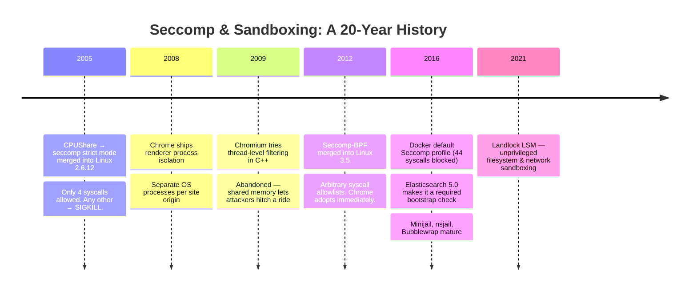
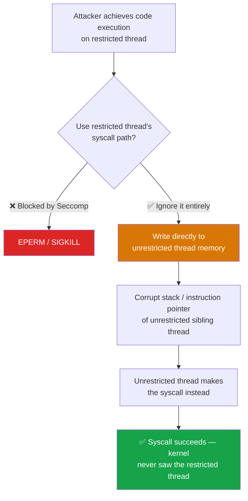

# The History of Linux Trust Issues: From Cpushare to Your Backend

> If you have ever wondered what actually stops an attacker who gets past your application logic, why Chrome spawns a dozen processes just to browse a few tabs while your backend runs everything in one, or what your HTTP handler is actually allowed to do at the kernel level right now — this is for you.

---

## The Software You Trust Is Already Sandboxed. Yours Is Not Sandboxed *Well Enough*.

Open Activity Monitor or `htop` right now. Find Chrome or Firefox. Count their processes.

Even with only a handful of tabs open, you will see a dozen or more separate OS processes: a main browser process, several renderer processes grouping tabs by site origin, a GPU process, a network service process, extension processes. Firefox similarly runs a pool of up to eight content processes shared across all tabs. Neither browser runs one renderer per tab — they use process *pools* — but even so, the count is deliberately much higher than a naive single-process implementation would require.

This is not a bug or a memory leak. It is a deliberate security architecture decision. And behind it sits a Linux kernel feature that has been quietly protecting production systems since 2005.

Your backend service is almost certainly running inside a container with a default Seccomp profile applied by Docker or Podman — a generic allowlist tuned for compatibility, not for what your application specifically does. The mechanisms exist. The question is how coarsely they are applied and who controls them.

---

---

## 2005: The Kernel Gets a Lock

The story starts not with browsers or containers, but with a grid computing company called [CPUShare](https://lwn.net/Articles/120647/). In 2005, Andrea Arcangeli contributed a feature to Linux 2.6.12 called **seccomp** — *secure computing mode* ([LWN: Secure computing mode](https://lwn.net/Articles/120647/)).

The original design was blunt. A process that enabled seccomp strict mode was immediately locked to exactly four system calls: `read`, `write`, `exit`, and `sigreturn`. Nothing else. Any other syscall killed the process instantly with `SIGKILL`. The use case was specific: CPUShare wanted to run untrusted code submitted by strangers on their machines without the code being able to do anything harmful. The kernel enforced it. No bypass was possible.

This original strict mode was useful in narrow contexts but too limiting for general applications — most software needs more than four system calls to function. It saw limited adoption outside specialized compute environments.

The more significant development came a few years later.

---

## 2008–2012: Browsers Define the Problem

When Google shipped Chrome in 2008, they brought a security architecture that was unusual at the time: every renderer process — the component that actually executes web page code — ran in a separate OS process with heavily restricted privileges.

The threat model was clear. A browser renderer executes arbitrary JavaScript from arbitrary websites. If a memory corruption vulnerability in the JavaScript engine gave an attacker code execution, the damage should be contained to that renderer. It should not be able to read files from disk. It should not be able to connect to internal network services. It should not be able to escalate to the rest of the system.

The mechanism was process isolation: separate address spaces, separate privilege levels, and an IPC channel to request privileged operations from the trusted browser process. A compromised renderer was a contained renderer.

This worked well. It still works well. But it was expensive enough that in 2009, the Chromium team tried a cheaper alternative: instead of a separate process for each isolated component, apply syscall restrictions directly to specific threads within the existing process. A restricted thread to handle untrusted content, a trusted sibling thread to relay operations that required privileges. Thread-level filtering rather than process-level isolation.

It worked. It shipped.

And then they hit a wall.

---

## The Wall: Why Thread-Level Filtering Failed in C++

The wall is not an API limitation. It is a property of C++ as an execution environment.

In C++, native code execution means arbitrary memory access. An attacker who achieves code execution on a restricted thread — through a buffer overflow, use-after-free, or type confusion — does not need to make syscalls from that restricted thread. They write to sibling thread memory directly and hitch a ride on an unrestricted one. The Seccomp filter on the restricted thread never sees any of this: it guards the syscall interface of one thread; it cannot guard the shared heap.

Chromium's engineers understood the constraint and tried to work within it anyway, using Linux's original seccomp strict mode. The strict mode was brutal — it locked a thread to exactly four syscalls — so to allow a sandboxed thread to do anything useful, they needed a relay. Markus Gutschke built a **trusted thread** architecture: the sandboxed thread sends an RPC request over a socket pair, the trusted thread validates the request, and the trusted thread makes the syscall on behalf of the sandboxed one.

The problem was that trusted and sandboxed threads shared an address space. A compromised sandboxed thread could corrupt the trusted thread's stack mid-execution. To prevent this, the Chromium team wrote the trusted thread's validation loop in **handcrafted x86/x86_64 assembly**, operating exclusively out of CPU registers — never touching memory for sensitive state ([LWN: Secure computing sandboxes](https://lwn.net/Articles/346902/), [ImperialViolet: Seccomp improvements](https://www.imperialviolet.org/2009/08/26/seccomp.html)).

The assembly made the trusted thread's logic resistant to in-process tampering. But it did not solve the fundamental problem. A C++ attacker with code execution does not need to corrupt the trusted thread's validator. They can write directly to the stack of *any other unrestricted thread* in the process. The trusted thread architecture protected its own logic; it could not protect every other thread from one that had arbitrary memory access.

When Seccomp-BPF arrived in 2012, it solved the expressiveness problem — filters could now express complex allowlists, not just four syscalls — but not the memory-safety problem. Chrome's renderer sandbox moved back to process isolation, reinforced with Seccomp-BPF filters on each *process*. The thread-level approach was abandoned.

> **The key insight:** Seccomp filters guard the syscall *gate* of one thread. In C++, an attacker with code execution never needs to use that gate — they write directly to another thread's memory and exit through an unrestricted path.

---

## 2012: Seccomp Gets a Filter Language

In 2012, Will Drewry at Google contributed **Seccomp-BPF** to Linux 3.5. Instead of the original all-or-nothing strict mode, processes could now install arbitrary BPF programs as syscall filters — allowlists and denylists based on syscall number, arguments, and calling context.

This was a significant step. Seccomp was no longer a blunt instrument. A process could now say: "allow `read`, `write`, `connect`, and `sendmsg`, but block `execve`, `fork`, and `ptrace`" — and the kernel would enforce it on every syscall, for the lifetime of the process, with no way to uninstall the filter once set.

Chrome adopted Seccomp-BPF immediately for its renderer sandbox. The Chromium thread experiment, which had been working around the absence of a proper syscall filter API, was superseded.

Docker launched in 2013 and eventually added Seccomp-BPF support. By 2016 it became a default: every Docker container runs with a Seccomp profile blocking about 44 high-risk syscalls out of roughly 350. Your containers today are almost certainly running with this protection — applied by the container runtime, invisibly.

Alongside Docker, the same kernel primitives powered a generation of lower-level sandboxing tools — each carving out a different point in the security-vs-usability design space:

- **[Minijail](https://chromium.googlesource.com/chromiumos/platform/minijail/)** (Google/ChromeOS, ~2011): A C library and command-line tool that combines Seccomp-BPF filters with Linux namespaces and `pivot_root` in a single call. Its defining characteristic is a **late-jail** model — it drops into the restricted environment only after the process has completed privileged initialization (loading secrets, binding low ports, JIT compilation). Used extensively in ChromeOS for system services and on Android.
- **[nsjail](https://github.com/google/nsjail)** (Google, ~2015): A network-oriented process isolation tool for short-lived untrusted workloads — code execution sandboxes, CTF challenges, interactive computing environments. Focused on namespace isolation (User, PID, Network, Mount) combined with Seccomp-BPF. Its User Namespace mapping is the key design lesson: internal "root" maps to an external "nobody", eliminating an entire class of privilege escalation before a syscall filter even needs to engage.
- **[Bubblewrap](https://github.com/containers/bubblewrap)** (Flatpak project, ~2016): An unprivileged sandboxing tool that won the desktop containerization space precisely because it requires no root and no setuid binary on kernels that support unprivileged user namespaces. It demonstrated that unprivileged access to namespace isolation was the prerequisite for developer adoption — tools requiring `sudo` are abandoned in practice.

These three tools share the same kernel substrate (Seccomp-BPF + Namespaces) but diverge on deployment context, privilege model, and how early or late the sandbox is applied. Their divergent designs reflect real-world constraints that a single universal tool cannot satisfy.

That same year, Elasticsearch 5.0 shipped with process-wide syscall filtering as a **required bootstrap check** on Linux ([Elasticsearch 5.0 Seccomp implementation](https://github.com/elastic/elasticsearch/blob/v5.0.0/core/src/main/java/org/elasticsearch/bootstrap/Seccomp.java)). It refuses to start if the kernel does not support it or if system call filters fail to install. Millions of production clusters have been running with this protection since 2016 — a process-wide Seccomp-BPF policy that blocks `execve`, `fork`, module loading, and other high-risk operations for the entire JVM process. The filter has almost never caused a problem, and it has quietly prevented entire categories of post-exploitation attack from working.

Here is what that means concretely: an attacker who exploits a vulnerability in Elasticsearch — a deserialization gadget, a scripting engine bug, a query parser flaw — achieves remote code execution in the JVM. They then try `execve("/bin/sh")`. The kernel returns `EPERM`. Not Elasticsearch's code rejecting it. The kernel. The reverse shell that would work against almost any unprotected Linux process is dead on arrival.

A fair question at this point: if Docker already applies a Seccomp profile to every container by default, why does Elasticsearch bother with its own? Three reasons. First, Docker's default profile is a generic allowlist designed to work for *any* container — it permits around 311 syscalls. Elasticsearch's own filter is tuned to what a JVM search engine specifically needs: considerably more restrictive. Second, operators routinely run containers with `--security-opt seccomp=unconfined`, particularly in cloud-managed environments, development setups, or when troubleshooting. Elasticsearch's self-applied filter survives that misconfiguration — the application protects itself regardless of what the orchestration layer does. Third, the container runtime's seccomp filter guards the container boundary; the application-level filter guards the process boundary. They are complementary, not redundant.

---

## 2021: The Filesystem Gets the Same Treatment

In 2021, Linux 5.13 introduced **Landlock** — a complement to Seccomp that applies the same principle to filesystem and network access. Where Seccomp filters system call numbers, Landlock enforces path-based rules: a process (or thread) can declare that it should only be able to read from specific directories, write to others, and connect to specific ports. The kernel enforces these rules at the inode level, after path resolution, avoiding time-of-check/time-of-use races.

Like Seccomp, Landlock is *unprivileged*: any application can restrict itself without root access. Like Seccomp, a Landlock ruleset cannot be loosened once installed. The kernel treats it as a one-way lock.

---

## The Gap That Remains

Two decades of production use have established that **process-wide restriction works**. It is proven, cheap, and dramatically underused by application developers — most backend services leave these kernel features entirely to their container runtime, relying on a generic, lowest-common-denominator profile rather than one tuned to what their application actually does.

But process-wide restriction is coarse-grained. Consider a typical backend service with several distinct kinds of work:

- **HTTP handlers** — parse user input, query a database, return JSON
- **Document processors** — read files from disk, convert formats, render output
- **Outbound integrators** — connect to external APIs, send notifications

From the kernel's perspective, every thread in the process is identical. A compromised document processor has the same permission to open network sockets as the outbound integrator. The HTTP handler can attempt to write to arbitrary filesystem paths. Process-wide restriction blocks the worst escalation paths — `execve`, `fork`, module loading — but it cannot express the question: *why should the document processor be allowed to make outbound network connections at all?*

That requires thread-scoped restriction. And we established above that thread-scoped restriction failed in Chromium's C++ context.

---

## When Thread-Level Filtering Is Actually Sound

The Chromium experiment failed because C++ allows arbitrary writes to memory addresses. An attacker with native code execution — through a buffer overflow, use-after-free, or type confusion — can reach any memory location in the process. The Seccomp filter on a restricted thread becomes irrelevant: the attacker never needs to use that thread's syscall path. They corrupt a sibling's stack and hitch a ride.

This is not a flaw unique to C++. Any execution environment that permits arbitrary memory writes has the same property — and any environment that prevents them gets a meaningful security benefit from thread-level filtering. The problem is *manual memory management*, not any particular language.

But memory safety alone is not sufficient. The second requirement is that the work units you want to isolate — the "HTTP handler scope" or the "document processor scope" — must actually correspond to *OS-level threads*, because Seccomp filters operate at the OS thread level. The kernel has no concept of goroutines, fibers, green threads, or event loop tasks.

With both criteria in mind:

| Runtime | Memory Safe | Thread = OS Thread | Process-Wide | Thread-Scoped | Notes |
|---|---|---|---|---|---|
| **JVM (Java/Kotlin/Scala)** | ✅ Bytecode verifier | ✅ 1:1 guaranteed | ✅ | ✅ | Applies to injection, SSRF, deserialization vectors. JNI/FFM vulnerabilities break the guarantee. |
| **.NET (C#/F#)** | ✅ IL verifier | ✅ 1:1 | ✅ | ✅ | Same strong fit as JVM. |
| **Rust (safe code)** | ✅ Ownership system | ✅ 1:1 | ✅ | ⚠️ Conditional | `unsafe` blocks and FFI restore C/C++ risk. Depends on dependency footprint. |
| **Go** | ✅ Memory safe | ❌ M:N goroutines | ✅ | ❌ | Goroutines migrate between OS threads — the kernel cannot see goroutine boundaries. |
| **Node.js** | ✅ (V8 managed) | ❌ Single event loop | ✅ | ⚠️ Workers only | Thread filtering only meaningful if architecture deliberately uses Worker Threads for isolation. |
| **Python** | ✅ Interpreter | ✅ 1:1 | ✅ | ⚠️ Conditional | C extensions bypass memory safety. GIL limits damage surface but free-threaded mode (3.12+) changes this. |
| **C / C++** | ❌ Manual memory | ✅ 1:1 | ✅ | ❌ | The Chromium wall. Code execution → arbitrary memory writes → filter bypass. |

### JVM languages (Java, Kotlin, Scala)

Strong fit on both counts. JVM threads are OS threads — 1:1 mapping guaranteed by the JVM specification. The bytecode verifier prevents raw pointer manipulation in managed code. An attacker exploiting a backend service through injection, SSRF, or deserialization gadgets cannot forge memory addresses. Both process-wide and thread-scoped filtering apply to the correct unit of work.

### C# and F# (.NET / CLR)

Same strong fit as JVM. The CLR's IL verifier enforces managed type safety. .NET threads are OS threads. Both layers apply cleanly.

### Rust

Conditional. Rust threads are OS threads, and Rust's ownership system prevents memory corruption in *safe* code — the cross-thread memory escape the Chromium experiment exposed is not possible in pure safe Rust.

The caveat is real: `unsafe` blocks are common in Rust's ecosystem, and many performance-sensitive libraries use them internally. FFI calls into C also bring C/C++ risk back. The value of thread-level filtering in a Rust service depends on the `unsafe` footprint of the dependency graph.

### C and C++

The Chromium wall, exactly. Manual memory management means native code execution implies arbitrary memory writes. Thread-level filtering is a logical boundary an attacker with code execution can step across. Process-wide restriction still provides meaningful value — blocking `execve`, `fork`, module loading — but thread-scoped profiles do not add the same safety benefit as they do in managed runtimes.

### Go

Process-wide only. This is a thread-model problem, not a memory-safety problem. Go is memory-safe and its type system prevents raw pointer arithmetic in standard code.

But Go's concurrency model is M:N: many goroutines are multiplexed over a smaller pool of OS threads by the Go scheduler. A goroutine can migrate between OS threads at any scheduler preemption point. Installing a Seccomp filter on an OS thread restricts that OS thread — it does not restrict the goroutine abstraction, because the OS does not know goroutines exist. You cannot express "this goroutine may not open network connections" at the kernel level. Process-wide restriction works fine; goroutine-scoped policy is not achievable through OS-level thread filtering.

### Node.js

Complicated, with caveats. Node's primary model is a single-threaded event loop — one OS thread handles all JavaScript I/O and callbacks. Thread-level filtering on a single-threaded event loop adds nothing useful for per-request isolation.

Worker Threads (added in Node 10) are different: each Worker runs in its own V8 isolate with a separate JavaScript heap, on its own OS thread. Workers explicitly cannot share heap objects with the main thread (SharedArrayBuffer aside). For architectures that deliberately separate trust boundaries into distinct Worker Threads, per-thread filtering could apply and the cross-thread memory problem does not arise in the same form. But this requires designing your application around Workers for isolation, which most Node services do not do.

### Python

Not straightforward. Python threads are OS threads, so the kernel plumbing exists. Python's interpreter itself is memory-safe — standard Python code cannot forge raw pointers.

The complications: CPython's Global Interpreter Lock (GIL) means only one thread executes Python bytecode at a time. C extensions run without the GIL and are written in C — a vulnerability in a C extension providing code execution lands you in C/C++ territory regardless of what Python guarantees. Python 3.12+ introduced an experimental free-threaded mode (no GIL), which makes per-thread isolation more interesting conceptually, but also removes the implicit serialization that previously limited concurrent damage.

Process-wide restriction is straightforwardly useful for Python. Thread-scoped filtering is technically possible (threads are OS threads), but its real benefit depends heavily on whether the workload uses native extensions and how much C code is in the picture.

---

## Two Layers. Both Proven. Both Underused.

The practical upshot of this history:

**Process-wide syscall restriction** — available since Linux 3.5 (2012), in production at scale since at least Elasticsearch 5.0 (2016). Any runtime, any language. Applied once at startup. Blocks the most dangerous escalation syscalls globally. Almost free at runtime. This is the bigger, more universal gap: most backend services leave it entirely to their container runtime with a generic lowest-common-denominator profile, or skip it entirely.

**Thread-scoped syscall restriction** — a bonus layer available on top of the process-wide baseline, but only where the runtime makes it sound. As the analysis above shows, that means managed and memory-safe runtimes: JVM, .NET, and safe Rust. For those runtimes, the typical backend attack vectors — injection, SSRF, deserialization gadgets — achieve bytecode-level code execution but cannot forge raw memory addresses. A compromised component becomes a thread that physically cannot open a network socket, regardless of what bytecode it runs. This does not hold if the attacker achieves native code execution through a JNI vulnerability or a JVM bug itself — that is a different, higher-severity threat model where the process-wide baseline matters most. For Go, C++, or single-threaded event loops, the process-wide layer is the right focus regardless.

Neither requires new hardware. Neither requires privileged access — both Seccomp and Landlock can be installed by any unprivileged process after setting `PR_SET_NO_NEW_PRIVS`. The primitives have been in the kernel for over a decade.

What has been missing is the tooling to apply them at the granularity that application architecture actually demands — and the habit of reaching for them at all.

## Where This Is Going

The industry's default posture — apply one generic Seccomp profile to the container, monitor at the cluster level, alert on anomalies — is valuable. But it treats applications as black boxes and relies on catching problems after they occur.

The direction the field is moving is toward **behavioral contracts**: explicit declarations of what each component of a service is expected to do at the syscall level. Not inferred from logs after the fact, but expressed alongside the code and enforced inline by the kernel. An emerging concept called the **Software Bill of Behavior (SBoB)** aims to make these contracts portable and auditable — shipped alongside the application binary and enforceable at every layer of the stack.

The kernel primitives that make this possible have existed since 2005 and 2012. The history is long. The gap between what is technically possible and what most services actually deploy remains wide.

---

The history answers the *how* — what these mechanisms are, which runtimes they actually protect, and why the 2009 Chromium experiment failed where a service running in pure managed JVM or .NET bytecode would not.

The harder question is the *what*: what should your service's behavioral contract look like? Your SBOM tells you which libraries you've deployed. It cannot tell you that one of them opens an outbound socket twice a day — to an address you don't own, for reasons no one on your team chose. To express a Seccomp policy you trust, you first need to know what your service actually does, at the syscall level, across all code paths and all dependency internals.

That gap — between having the kernel primitive and knowing what to put in it — is the subject of the next article. The short version: you almost certainly don't know what your service is actually doing at the syscall level. Neither does your SBOM.
