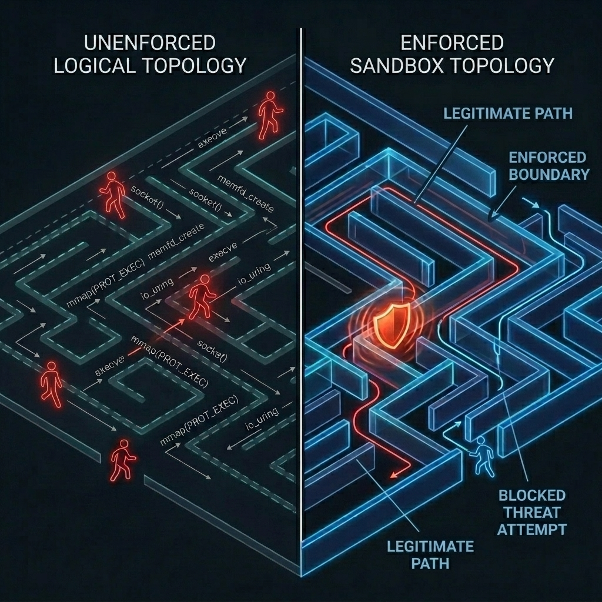
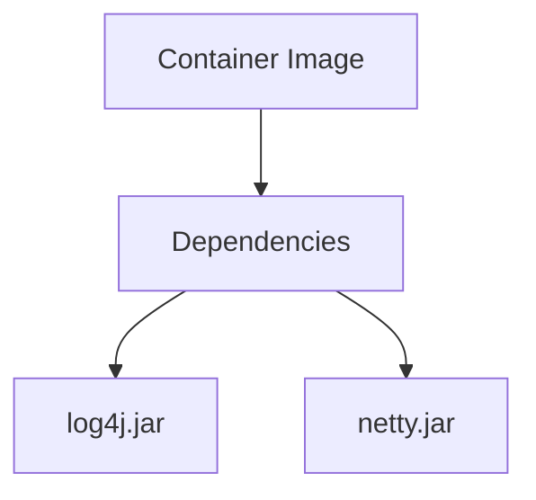
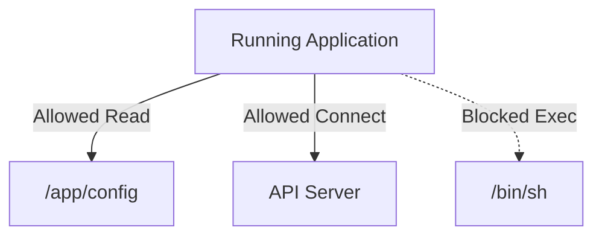
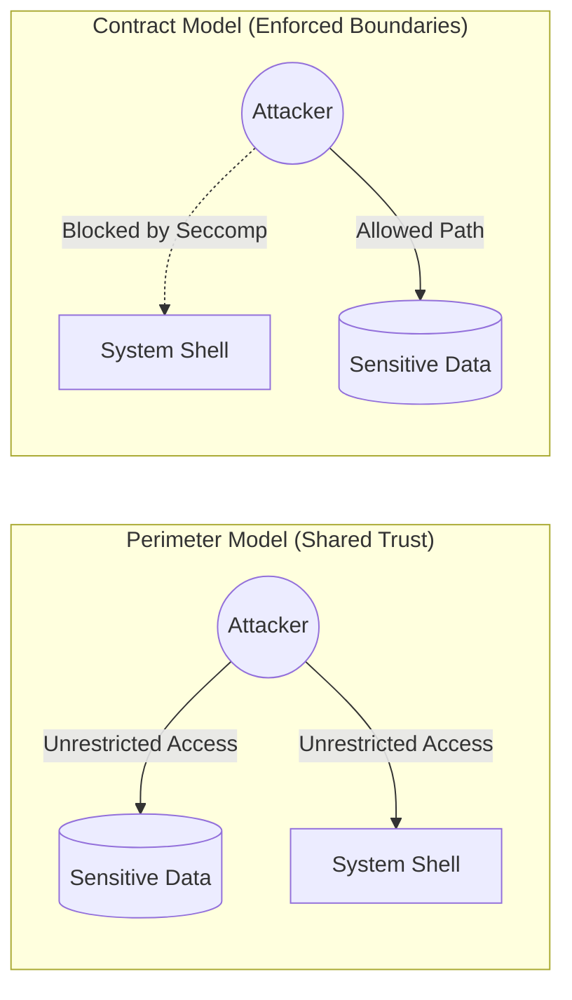
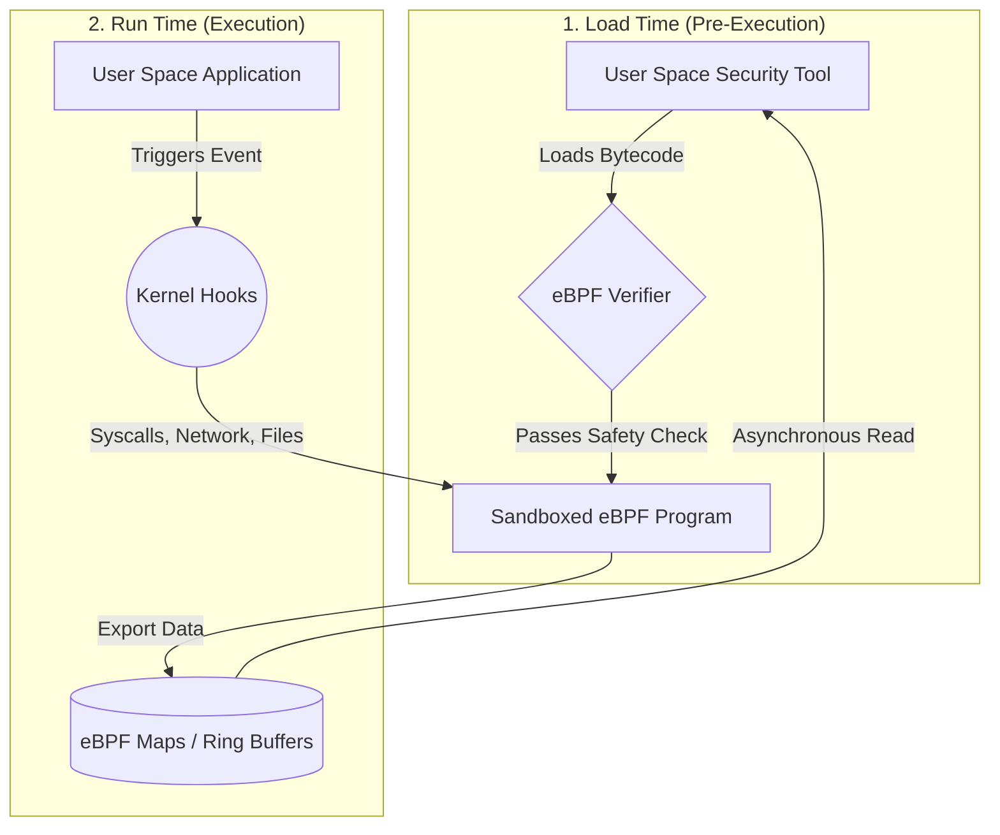
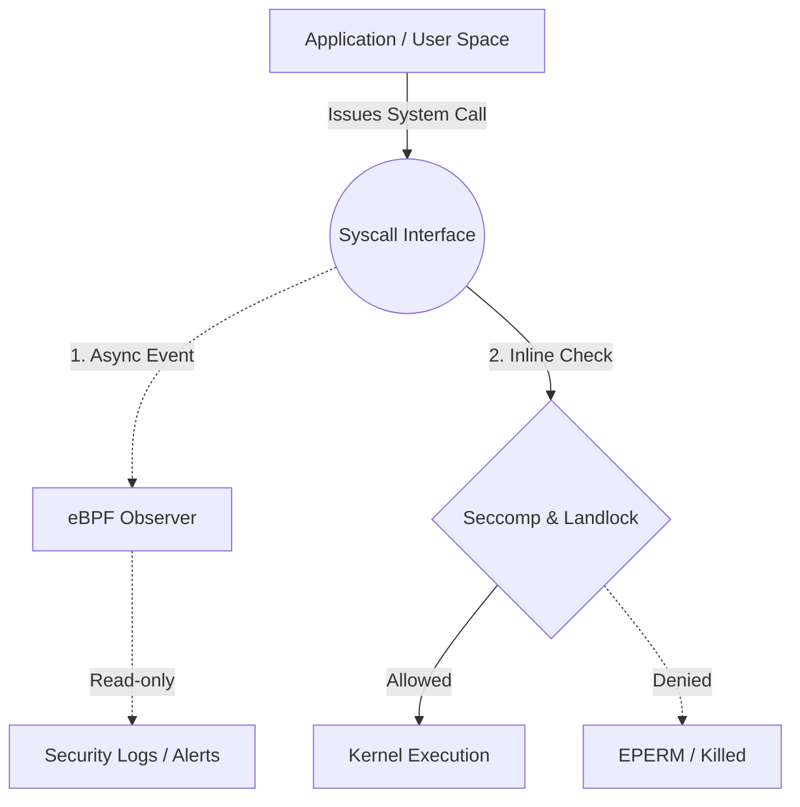
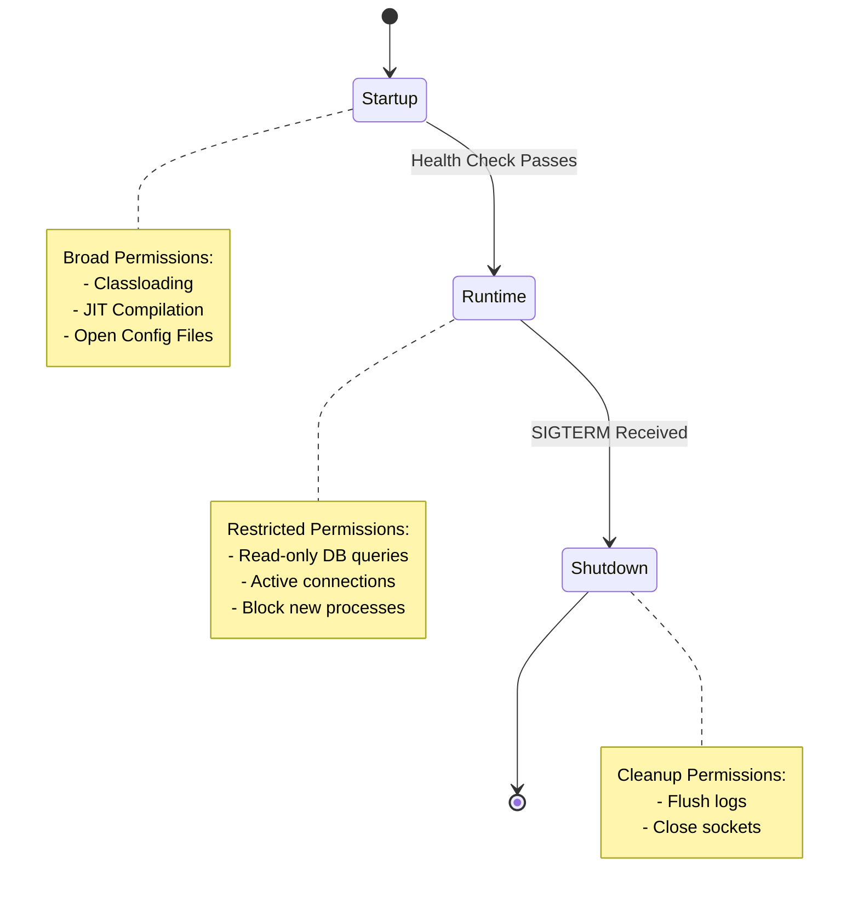

# Do You Really Know What Your App Is Doing at Runtime?

> **Series overview:** This is Part 1 of a 5-part series on behavioral security for cloud-native applications.
 
We have become very good at answering one specific supply-chain question:
 
**What is inside this software?**
 
That is what an [SBOM](https://www.cisa.gov/sbom) (Software Bill of Materials) gives us. It tells us what components, packages, and libraries are packed into an application or container image. That visibility is critical. If a zero-day vulnerability lands in a popular dependency, an SBOM helps us immediately identify our exposure.
 
But the moment software is compromised, composition stops being the most important question. The real question becomes:
 
**What is this software doing right now?**
 
And in many cases, the honest answer is uncomfortable: we don’t really know.
 
An SBOM can tell you that a compression library is present. It cannot tell you that this same library has suddenly started interfering with authentication flows. It can tell you that a logging framework is installed. It cannot tell you that the logger is currently opening outbound network sockets. Composition transparency is valuable, but it is not behavioral transparency.

**1. The Composition View (SBOM)**

**2. The Behavioral View (SBoB)**

That gap is exactly where a new, emerging concept starts to matter: **SBoB—the Software Bill of Behavior.**

## From Boundaries to Contracts

For the last decade, cloud-native security has relied on **boundaries**—wrapping apps in containers and namespaces, applying a global security profile at the outer shell. This typically means setting a one-size-fits-all policy for the entire container, such as Docker's default Seccomp profile, a generic AppArmor configuration, or a Kubernetes Network Policy. These are coarse-grained controls applied uniformly to everything inside the container, regardless of the application's internal architecture. 

But for developers, this boundary model has a fundamental blind spot: it relies on a **perimeter-based model** that assumes any code running inside the container is trusted. The internal "walls" (your code's modules and architecture) are structurally present, but provide zero physical enforcement at the OS level. If an attacker achieves [Arbitrary Code Execution (ACE)](https://en.wikipedia.org/wiki/Arbitrary_code_execution) inside the application, they can move unrestricted within the container to exfiltrate data or execute payload code. 

The shift to **contracts** (SBoB) introduces **internal enforcement boundaries**, where the OS kernel validates every system call against a specific behavioral profile.

Instead of a single perimeter, every system call, filesystem path, or socket access becomes a verified enforcement point. Under this contract:
1. **Behavioral Enforcement:** An attacker who compromises a worker [thread](https://www.baeldung.com/cs/process-vs-thread) is restricted to the specific system calls and files required for that thread's task—they are blocked by the kernel (e.g., via [Seccomp](https://docs.docker.com/engine/security/seccomp/) or [Landlock](https://landlock.io/)).
2. **Kernel-Level Verification:** The kernel actively verifies that execution strictly matches the application's declared behavioral profile.

We move from **coarse-grained perimeter rules** that ask *"Is this container allowed to talk to the internet?"* to **fine-grained behavioral contracts** that ask *"Is this specific library, at this specific millisecond, allowed to perform this specific system call?"*

*(A quick note on scope: SBoB is still emerging, tooling is early, and standards are actively forming. What follows is a picture of where cloud-native security is heading — a direction that is becoming technically feasible and strategically hard to ignore.)*

> **Wait — doesn't Docker already do this?**
>
> Yes, partially — and this is a common and fair question. Docker and Podman use [Namespaces](https://man7.org/linux/man-pages/man7/namespaces.7.html) to isolate process trees, networks, and filesystems between containers; [cgroups v2](https://www.kernel.org/doc/html/latest/admin-guide/cgroup-v2.html) to limit CPU and memory consumption; and a default [Seccomp-BPF](https://docs.docker.com/engine/security/seccomp/) profile to block roughly 44 high-risk syscalls for every process inside the container. That is meaningful protection.
>
> The key word is *every process*. Docker applies **one profile to all code running in the container** — your HTTP handler, your background scheduler, your database migration runner, and any malicious code that has compromised one of them. If the compromised code only needs syscalls that the HTTP handler legitimately uses, Docker's profile will not stop it.
>
> SBoB — and tools like Kubescape and mazewall — ask a harder question: can we enforce a *distinct* contract for each component, where the migration runner cannot touch network sockets and the HTTP handler cannot spawn child processes? The outer container wall remains essential. What is missing is the system of locks on the rooms inside.

## The Catalyst: Practical Runtime Observation with eBPF
 
For a long time, precise runtime behavioral security was too expensive, too invasive, or too brittle to apply at scale. This was due to the fundamental trade-offs in existing technologies:

*   **Performance Overhead (Expensive):** Tools like the **Java Security Manager (JSM)** required a permission check on almost every sensitive operation (like opening a file or a socket). This introduced a significant performance tax that many high-throughput applications couldn't afford.
*   **Operational Fragility (Brittle):** Techniques like **LD_PRELOAD** hooking relied on intercepting standard library calls. This was easily bypassed by statically linked binaries or applications that made direct system calls, and often broke during OS or library updates.
*   **Context Incompatibility (Invasive):** Debugging-based approaches like **ptrace** (used by `strace`) allowed for deep inspection but forced a context switch on every system call, effectively slowing the application to a crawl and making them unusable for production environments.

That changed with [eBPF](https://ebpf.io/what-is-ebpf/). eBPF moves these checks directly into the kernel, allowing for high-performance observation without the overhead of user-space context switching or the fragility of library-level hooking.
 
**eBPF provides the high-performance telemetry** required to generate and verify these behavioral contracts at runtime.
 
At a high level, eBPF gives modern Linux systems a safe, highly performant way to observe and react to what is happening at runtime. Syscalls, process executions, network behaviors, and file accesses become instantly visible and actionable.

eBPF provides a **sandboxed, event-driven execution environment** within the Linux kernel, allowing security tools to attach to system calls, file opens, and network activity without requiring custom kernel modules. 

The critical feature of eBPF is that programs are **statically verified by the kernel before execution** — non-terminating loops and unsafe memory accesses are rejected at load time. This turns the OS from a rigid substrate into something security tools can dynamically extend.

But it is important to distinguish between **observation** and **enforcement**. While eBPF provides the visibility needed to generate and enforce a Bill of Behavior, physical enforcement often relies on a different set of core Linux primitives. This distinction is critical because of a fundamental architectural trade-off: **Privilege.** 

While eBPF-based enforcement (like BPF-LSM) is extremely powerful, it requires high system privileges (`CAP_SYS_ADMIN` or `CAP_BPF`). In contrast, Seccomp and Landlock are designed to be **unprivileged**, allowing a standard application to "self-restrict" its own capabilities (once `PR_SET_NO_NEW_PRIVS` is set) without needing root access or cluster-level agents. This makes them the ideal "fast path" for developer-driven security.

## The Primitives: How SBoB Is Enforced

If SBoB is the declaration of intent, the Linux kernel provides five primary mechanisms to turn that intent into a hard boundary:

| Linux Primitive | Enforcement Scope / Target | Privilege Required | Role in Container / Sandbox Context |
| :--- | :--- | :--- | :--- |
| **Namespaces** | Process trees, Network, Mounts, PID, IPC, UTS, User | Unprivileged (User namespaces) / Privileged (Root creation) | Provides **virtualization** boundaries (isolates what resources a process can *see*). |
| **cgroups v2** | Resource allocations (CPU, Memory, I/O, PIDs) | Privileged (systemd/root configures limits) | Provides **resource limits** (prevents Denial of Service and memory starvation). |
| **Seccomp** | System calls (number and basic register arguments) | Unprivileged (requires `PR_SET_NO_NEW_PRIVS`) | Restricts the **syscall execution surface** (blocks high-risk operations like `execve` / `fork`). |
| **Landlock** | Path-based Filesystem & TCP Ports (bind/connect) | Unprivileged | Surgical **file and directory containment** (prevents path traversal and raw socket binds). |
| **BPF-LSM / LSMs** | Deep, context-aware kernel objects (LSM hooks) | Privileged (`CAP_SYS_ADMIN` / `root`) | Complex, **context-aware security policies** loaded by host-level system agents (e.g., AppArmor, SELinux). |

### 1. Seccomp (Secure Computing)
Seccomp is the industry's "fast path" for blocking system calls. It is fast, unprivileged (via `NoNewPrivileges`), and extremely reliable. While Seccomp-BPF uses strictly constrained **Classic BPF (cBPF)** bytecode rather than the full eBPF instruction set, it remains the most widely deployed syscall filter in the world. However, it is "path-blind"—it sees the system call being made, but it cannot easily inspect the file paths or network addresses involved.
*   **Where you use it today:** You are likely using it right now. Modern web browsers like **Chrome** and **Firefox** use Seccomp to sandbox their renderer processes, ensuring that a compromised tab cannot escape to the rest of your system. Podman/Docker also apply a default Seccomp profile to every container to block high-risk operations.

### 2. Landlock
Landlock is a Linux Security Module designed specifically for unprivileged sandboxing. It provides the path-aware filesystem access control that Seccomp lacks. It operates at the inode level — after the kernel has fully resolved the path — which means it avoids the TOCTOU (time-of-check/time-of-use) race that makes pointer-based path inspection in Seccomp unreliable. An application can declare constraints dynamically (e.g., "This thread can only read from `/app/data`").
*  **Kernel & ABI Version Nuances:** Landlock degrades gracefully based on the kernel's supported ABI level (ABI v1-v3 for filesystem rules, ABI v4 for TCP limits). As of Linux Kernel 6.7, Landlock has begun expanding into networking, allowing threads to restrict themselves to specific **TCP ports** for `bind` and `connect` operations. While it currently lacks the deep IP-level or endpoint visibility of BPF-LSM, it provides a powerful, unprivileged "port-level" restrictor. However, for production systems, you must explicitly account for these kernel dependencies, as older LTS kernels (like 5.15 or 6.1) will silently ignore newer ABI features (like network filtering).

### 3. [Linux Security Modules (LSM)](https://www.redhat.com/en/topics/linux/what-is-selinux)
LSMs like AppArmor, SELinux, and the modern **BPF-LSM** provide the deepest level of security. They hook into the kernel at a very granular level, allowing for complex, context-aware rules.
*   **The Trade-off:** Unlike Seccomp or Landlock, managing LSMs usually requires high privileges (`root` or `CAP_MAC_ADMIN`). This makes them ideal for platform-level security (like Android's application sandbox or Kubernetes Pod Security Standards) but harder for individual developers to use for "self-restriction."

By combining these primitives, we move from blunt "allow/deny" container rules to surgical, intent-based security.

## What SBoB Actually Is (and Why Vendor Authorship Matters)
 
If an SBOM is the bill of materials for software composition, an SBoB (Software Bill of Behavior) is its behavioral companion. In practical terms, an SBoB captures expected runtime boundaries: network communication, file access, process execution, and Linux capabilities.
 
Today, runtime security forces the end user to infer safe behavior after deployment. Platform engineers watch logs, tune detection rules, silence false positives, and slowly assemble a fragile model of what the software seems to be doing.
 
SBoB introduces a different model: the producer of the software should ship the first behavioral contract. 
 
Physically, this contract is not a proprietary security appliance rule. It is an [emerging, machine-readable specification](https://billofbehavior.com/bob/docs/drafts/spec-v0.0.1/). It is designed to be distributed alongside the application, attached to the container image as an [OCI artifact](https://opencontainers.org/) or applied as a Kubernetes Custom Resource.

The vendor is the party that actually knows what the software is intended to do, what the test coverage looks like, and which behaviors are essential. Instead of forcing thousands of customers to reverse-engineer the same runtime policy from scratch, the software producer ships a reviewable baseline. This moves runtime security from a "guess" to a **verifiable attestation of intent.**

## The Concept of Scopes: When is a Behavior Expected?
 
A Software Bill of Behavior (SBoB) isn't just a flat list of syscalls; to be effective, it must be context-aware. This is where the concept of **Scopes** becomes critical. We can categorize these into two main groups: those that are practically achievable today, and those that remain aspirational.
 
### 1. Lifecycle Scopes (The Pragmatic Path)
The most realistic way to implement Scopes is by aligning with the application's natural lifecycle. This approach is currently being implemented in **Kubescape**:
 
*   **Startup Scope:** Broad permissions needed to load configurations, establish connection pools, and initialize the JIT. This scope ends once the application passes its first health check.
*   **Runtime Scope:** A much narrower "steady-state" set of permissions. This is where the majority of an application's life is spent.
*   **Shutdown Scope:** Permissions required for graceful termination, such as flushing logs or closing connections.
 
By using Kubernetes health checks as a trigger, the runtime engine can automatically "rotate" the active security contract. This provides a clear, automated enforcement boundary that matches how developers already think about their apps.

### 2. Granular Scopes (The Experimental Frontier)
Beyond lifecycle phases, we can theoretically define scopes at a much deeper level. While these make for powerful Proofs of Concept (PoC), turning them into stable, production-ready technology faces significant architectural challenges:
 
*   **[Process/Thread](https://www.baeldung.com/cs/process-vs-thread) Scopes:** Restricting behavior based on which specific OS thread is executing.
    > [!WARNING]
    > **The Shared-Memory Trap:** Thread-scoped restrictions alone are **never** a complete security boundary against attackers who gain Arbitrary Code Execution (ACE). Since all JVM threads share the same address space and heap, a native memory corruption exploit (e.g., via buffer overflow or unsafe pointer manipulation) on a restricted thread can modify memory on an unrestricted helper thread to bypass the sandbox. Thread-scoped sandboxing is only secure when stacked on top of a process-wide baseline (such as blocking new process execution globally).
*   **Module/Library Scopes:** Restricting behavior based on which JAR or package is currently on the stack.
*   **Stacktrace Scopes:** Using the calling context to decide if a syscall is valid (e.g., "Allow `socket()` only if called via the AWS SDK").

While these granular scopes represent the "dream" of behavioral security, they often introduce high performance overhead or require deep integration with the language runtime. For now, Lifecycle Scopes remain the most viable path for widespread adoption.

## Mitigating Advanced Evasion Techniques
 
It’s tempting to view SBoB simply as a tool to reduce false positives in anomaly detection. And yes, instead of asking a vague statistical question—*"Is this weird?"*—the runtime can ask a concrete one: *"Is this expected behavior for this specific artifact?"*
 
But SBoB also addresses the reality of modern syscall evasion. 
 
Traditional security often focuses on blocking `execve` (spawning a shell). But sophisticated attackers don't need a shell. They use **fileless malware**—malicious code that lives entirely in RAM, using Linux features like [`memfd_create`](https://sandflysecurity.com/blog/detecting-linux-memfd_create-fileless-malware-with-command-line-forensics/) to execute binaries that never touch the disk. Because there is no file, traditional disk-based scanning is blind.
 
More advanced attackers use [**`io_uring`**](https://unixism.net/loti/), a high-performance asynchronous I/O API. By submitting operations via shared memory rings rather than direct syscalls, they can often "blind" traditional security monitors.
 
An SBoB allows us to express fine-grained intent that stops these techniques: *"This application is strictly forbidden from using `memfd_create`, `io_uring_setup`, or mapping executable memory."*

## Capability-Based Security in Other Domains
 
If declaring upfront capabilities sounds like a radical shift, it isn't. In fact, this approach is already the standard in almost every other area of IT.
 
Think about mobile apps. An Android `AndroidManifest.xml` or an iOS Entitlement explicitly declares what the application is allowed to do (access the camera, read contacts, use the network). Web browsers work the same way, explicitly asking for permission before a script can access your location or clipboard. WebAssembly (Wasm) takes this even further, running in a default-deny sandbox where modules cannot touch the network or file system without explicit host capabilities being granted.
 
In this context, server-side Linux containers are the anomaly. SBoB is simply bringing capability-based security to the cloud-native server side.

## The First Step: [VEX (Vulnerability Exploitability eXchange)](https://cyclonedx.org/capabilities/vex/)
We are already seeing a "SBoB-lite" emerge in the form of **VEX**. While an SBOM tells you a vulnerable library exists on your disk, a VEX document tells you if that library is actually loaded and reachable at runtime. For example, a VEX advisory can formally state that an application is **"not affected"** by a vulnerability because the specific vulnerable function (e.g., a high-risk network appender in a logging library) is never called by the application logic—a justification standardized as [`code_not_reachable`](https://www.cisa.gov/resources-tools/resources/vulnerability-exploitability-exchange-vex). VEX can be generated through multiple means — runtime observation (tools like Kubescape contribute behavioral evidence via eBPF), static analysis, or manual attestation. Regardless of how it is produced, VEX is the industry's first standardized realization that composition is a poor proxy for risk; only behavior matters.

## Practical Value: From "Trust Me" to "Verify Me"

Beyond the technical mechanics of eBPF and Seccomp, the move toward SBoB solves two high-stakes business problems that traditional security cannot address.

### 1. Behavioral Attestation for Regulated Data
In industries like Fintech, Healthcare, and Legal, "trust" is often handled via manual audit. SBoB allows you to move that trust into the Linux kernel.

Consider a thread pool responsible for processing highly sensitive data (PII, payment card data, or privileged documents). By applying a behavioral contract (like `Policy.PURE_COMPUTE` and Landlock path restrictions), you establish a contract that the kernel itself enforces:
- **"No network call was made."** Since `connect` and `sendmsg` are blocked at the syscall level, it is physically impossible for the data to have been exfiltrated during that execution block.
- **"No file was written outside the declared path."** Even if a misconfigured logger or a malicious library attempts to write sensitive data elsewhere, the kernel blocks the operation.
- **"No subprocess was spawned."** The data cannot be passed to an external utility or an in-memory executor.

This is **kernel-enforced attestation, not software-asserted**. The guarantee comes from the OS — not from application-level checks that an attacker could bypass.

### 2. Zero-Trust for Internal Libraries (Blast Radius Control)
Modern applications pull in hundreds of internal and third-party dependencies. You may trust your core team, but do you trust every library used by the "Experimental Feature" team?

By default, every thread in a JVM process shares the same permissions. If a minor utility library has a vulnerability, it has the same network and filesystem access as your most critical core service. SBoB allows for **surgical self-restriction**:
- **The PDF Generator** can read fonts but has no network access.
- **The Image Processor** can read/write to a temp folder but has no exec permissions.
- **The Legacy Integration** is restricted to a single specific IP address.

If any of these libraries are compromised, the "blast radius" is limited to the specific capabilities you explicitly granted them.

## The Runtime Security Stack Is Already Here
 
This is no longer a speculative academic exercise. The building blocks are already in production. What is instructive, though, is that these tools are **not alternatives to each other** — they operate at fundamentally different layers and solve complementary problems. Each has its own perfect fit.

### Three Layers, Three Perfect Fits

| | **Docker / Podman** | **Kubescape** | **mazewall** |
|---|---|---|---|
| **Metaphor** | The city wall | The cluster observatory | The room locks |
| **Core technologies** | Linux Namespaces (pid, net, mnt, uts, ipc), cgroups v2, Seccomp-BPF, Capabilities dropping, AppArmor / SELinux | eBPF (kprobes, tracepoints, ring buffers), future BPF-LSM enforcement, Kubernetes Network Policies | Seccomp-BPF (per-thread via `prctl`), Landlock LSM (filesystem + TCP ports), `PR_SET_NO_NEW_PRIVS`, JDK FFM API |
| **Who authors the policy** | Platform / ops team (or Docker's built-in default) | Auto-generated from live eBPF observation across the cluster | Developer, auto-generated from the application's own observed behavior |
| **Granularity** | All processes in the container share one profile | Per-workload (pod / container), language-agnostic | Dual-Tier: Process-wide baseline + thread-scoped profiles |
| **Enforcement today** | ✅ Active — applied at container start | 🔄 Audit and profiling today; enforcement via generated seccomp / AppArmor profiles on the roadmap | ✅ Active — process baseline at initialization + thread restrictions |
| **SBoB role** | Consumer — can apply a vendor-supplied SBoB profile as a custom seccomp JSON | Generator + future enforcer — observes workloads, produces SBoB-aligned profiles, enforces at cluster level | Generator of both process-wide and thread-scoped behavioral contracts |
| **Privilege required** | Container runtime (rootless possible with Podman) | Privileged cluster-level agent (`CAP_SYS_ADMIN` / `CAP_BPF` for eBPF) | None — standard unprivileged library dependency |
| **Language / runtime scope** | Any process, any language | Any process, any language | JVM 22+ only |
| **Perfect fit** | Baseline outer wall for every container workload | Cluster-wide behavioral visibility, profile generation, and future policy distribution for Kubernetes | In-process, developer-driven dual-tier sandboxing for JVM services |

Notice that Docker and mazewall share the same fundamental primitive — **Seccomp-BPF** — but apply it at completely different scopes. Docker calls `prctl(PR_SET_SECCOMP, ...)` once, process-wide, before your application code ever runs. 

mazewall combines both scopes in a **dual-tier model**:
1. **Tier 1 (Process-Wide Baseline):** It establishes a global, process-wide filter at startup (e.g., restricting process execution `execve` or system capabilities globally). This serves as the absolute backstop because isolating threads alone is vulnerable to shared-memory bypasses (where an attacker compromises a restricted thread and corrupts memory on an unrestricted helper thread).
2. **Tier 2 (Thread-Scoped Profiles):** On top of the process-wide baseline, it applies thread-scoped profiles dynamically using thread-specific filters to restrict network socket creation or filesystem path accesses.

The kernel mechanisms are identical to standard container controls, but the scope, runtime flexibility, and developer authorship are completely different.

Kubescape occupies a different dimension entirely. Where Docker and mazewall enforce locally, Kubescape **observes globally** — watching every workload across the cluster and building a behavioral model that no individual container or library can see on its own. Its SBoB support means those cluster-level observations can eventually be expressed as portable, vendor-reviewable contracts that feed back into container-level enforcement. Enforcement coming to Kubescape will close the loop: observe cluster-wide with eBPF, distribute a verified SBoB profile as an OCI artifact, and enforce it locally at the container wall (Docker/Podman seccomp) and inside the JVM (mazewall).

On the commercial side, companies like **Oligo Security** have proven that library-level and application-level runtime profiling is directly useful for security operations. By observing what libraries do inside running applications, their platform uses behavioral context to detect suspicious activity.

The message is clear: the runtime security stack is already here. These layers are designed to be stacked, not chosen between. What is still missing is a standardized, portable, vendor-supplied way to describe what software is expected to do — so that all three layers can enforce the same contract.

---

### Next Up: Let Your Code Build Its Own Sandbox
 
In Part 2 of this series, we move from theory to practice. We will introduce **mazewall**, a newly developed experimental Proof-of-Concept library designed to translate SBoB concepts into active JVM thread sandboxing, and demonstrate the dynamic profiling workflow that allows the application to automatically trace and define its own required system permissions.
 
**[Read Part 2: Let Your Code Build Its Own Sandbox: Introducing Mazewall](article2-profiler.md)**