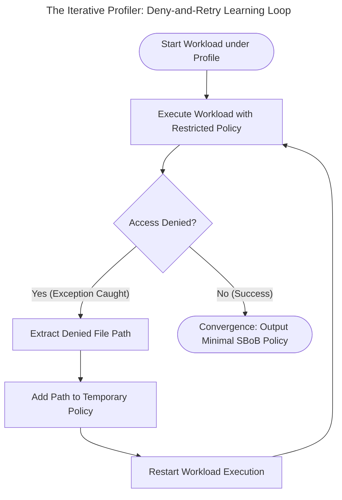

# Dynamic Policy Profiling in mazewall

[](article1-threat-model.md)
[](../../README.md)
[](article3-enforcement.md)

> **Series overview:** This is Part 2 of our series on behavioral security for cloud-native applications. **What this part adds:** a developer-focused walkthrough of **mazewall** — an experimental, research-grade Proof-of-Concept JVM sandboxing library. All code examples are for local exploration only; this is not a production-ready tool.

---

Part 1 established that thread-scoped SBoB enforcement requires first knowing the exact set of system calls and filesystem paths a workload legitimately needs. But **how do you build that contract?**

Manually cataloging every system call and filesystem path an application uses introduces significant engineering friction. Furthermore, predicting required system calls in a complex runtime like the JVM is highly error-prone; under-specifying a policy by blocking a critical runtime operation can result in fatal JVM deadlocks.

**mazewall** is an experimental JVM library that enforces thread-scoped Seccomp-BPF and Landlock boundaries. To mitigate the misconfiguration risks inherent in manual rule declaration, mazewall relies on a **Discovery before Enforcement** model: instead of speculating on required capabilities, the library profiles the active code block under test to capture its observed system call footprint.

---

## The Landscape: Local Tracing vs. Cluster-Wide Observation

Before we look at how mazewall discovers a policy, it is worth comparing this approach to existing behavioral security tools.

In the cloud-native ecosystem, tools like **[Kubescape](https://kubescape.io)** have pioneered dynamic runtime profiling. Using eBPF (Extended Berkeley Packet Filters) at the host kernel level, Kubescape observes a running container in a staging cluster, builds a baseline of its system calls, and detects anomalies. This provides a strong platform-level security control.

However, cluster-wide dynamic profiling has a few critical limitations for application developers:
1. **Lack of Application Context:** A cluster-level eBPF tracer sees the JVM process as a single black box. It cannot easily distinguish between a high-privilege administrative thread, a low-privilege JSON parser thread, or the JIT compiler thread. It profiles the *average process*, not individual logical tasks.
2. **Slow Developer Feedback Loop:** Running a container in a staging cluster, generating traffic, compiling eBPF logs, and generating a security policy is a heavy, slow process. It cannot easily be integrated into a developer's local inner loop or CI pipeline.

**mazewall** takes a different approach: **developer-scoped, thread-level profiling**. It uses two complementary mechanisms:

- **USER_NOTIF-based syscall tracing:** An unprivileged out-of-process daemon intercepts every system call made by the profiled thread. This is transparent for synchronous syscalls but has a structural blind spot: `io_uring`[^iouring] operations are submitted via a shared-memory ring buffer, bypassing the syscall layer entirely, so they are invisible to `USER_NOTIF` tracing without root-level eBPF attachment (which tools like Inspektor Gadget[^inspektor] do with elevated privilege).
- **Iterative Landlock path discovery:** Filesystem path requirements are learned through controlled denial — the workload runs under a restricted policy, each denied path is whitelisted, and the workload retries until it converges.

### Tracing `io_uring`: The Workarounds
Because `io_uring` bypasses the standard syscall boundary for its submissions, unprivileged profiling is constrained. In practice, three approaches can be utilized to resolve this:

| Strategy | Mechanism | Pros | Cons / Limits |
| :--- | :--- | :--- | :--- |
| **Strategy H (Hybrid Shortcut)** | Temporarily disable `io_uring` during integration testing to force a fallback to standard synchronous/epoll I/O. | Easy, unprivileged, profiles paths cleanly. | Requires manually adding `.unblock(Syscall.IO_URING_SETUP)` to the production policy afterward. |
| **Strategy A (Iterative Path)** | Leverage Landlock VFS-level hooks that intercept the asynchronous `io-wq` worker threads. | Unprivileged, catches all path denials during execution. | Cannot discover underlying blocked `io_uring` setup syscalls. |
| **Strategy P (Privileged)** | Utilize root-level eBPF tracepoints (`io_uring_submit_sqe`). | Complete, transparent coverage of paths and setup syscalls. | Requires `CAP_SYS_ADMIN` in the host namespace. |

---

## Dynamic Profiling: The Developer Workflow

The dynamic profiling workflow in mazewall involves wrapping the target workload in a `Profiler.profile` block, executing integration tests, and capturing the resulting contract.

Let's look at a realistic workload. This task reads a local JSON configuration file, connects to a local loopback server to read a greeting, and attempts to initialize a high-performance `io_uring` queue (a modern Linux I/O engine used by frameworks like Netty):

```kotlin
val workload = {
    // 1. Read configuration from disk
    val config = File("/app/config.json").readText()
    
    // 2. Connect to local server and read a greeting
    val clientSocket = Socket("localhost", serverPort)
    val greeting = clientSocket.getInputStream().bufferedReader().readText()
    clientSocket.close()
 
    // 3. Initialize high-performance async io_uring
    val setupNr = Syscall.IO_URING_SETUP.numberFor(Arch.current()).toLong()
    val setupResult = LinuxNative.raw.syscall(setupNr, 32L, 0L)
    
    if (setupResult is LinuxNative.SyscallResult.Success) {
        val ringFd = setupResult.asFd()
        LinuxNative.close(ringFd)
    }
    
    "Workload successfully completed!"
}
```

To profile this workload and generate its SBoB, we wrap it in mazewall's built-in profiler:

```kotlin
import io.mazewall.profiler.Profiler
 
fun main() {
    // Run the workload under the Profiler to audit exact syscalls & path accesses
    val profilingResult = Profiler.profile {
        workload()
    }
 
    // Inspect the return value
    println(profilingResult.value)
}
```

Behind the scenes, the profiler intercepts every system call and filesystem access occurring *only* on the active executing thread. Because the profiler is scoped to this specific thread block, it ignores process-wide background activity like the JIT compiler's compilation threads, garbage collection sweeps, and unrelated JVM thread pools.

However, system call profiling on a live thread is never completely sterile. Developers must account for **transient runtime noise** executed directly by the JVM on the profiled thread:

| Noise Type | Low-Level Indicator | JVM Origin | Mitigation Strategy |
| :--- | :--- | :--- | :--- |
| **Dynamic Classloading** | `openat`, `read` on JARs/classes; `mmap`, `mprotect` | First-time class invocation or lazy library load | Warm up JVM beforehand or utilize GraalVM AOT |
| **DNS & Host Resolution** | `socket`, `connect`, reading `/etc/resolv.conf` | Hostname lookup (e.g., resolving `"localhost"`) | Warm up connection pools; resolve hostnames beforehand |
| **Thread Synchronization** | `futex`, `sched_yield` | Lock contention or thread parking | Ensure these coordination calls are pre-whitelisted |
| **vDSO Fallbacks** | `clock_gettime` system calls | Retrieving system time (`System.currentTimeMillis()`) | Ensure container hosts support vDSO mappings |

This transient noise presents an operational challenge: if a class is warmed up *before* profiling but loaded lazily in production, the production thread will crash due to a missing rule (under-specification). Conversely, whitelisting classloader paths that are only loaded once during test setup violates the principle of least privilege (over-specification).

**Mitigation:** Warm up the JVM thoroughly — trigger all lazy class loads and connection pool initializations — *before* starting the profiling run. Part 5 covers why GraalVM Native Image sidesteps most of this noise by eliminating JIT-internal syscalls and converting class loading to ahead-of-time static linking.

## Policy Output

Once profiling converges, the observations compile into an immutable `Policy` record. The resulting policy for our workload looks like this:

```kotlin
val MyWorkerPolicy = Policy.builder()
    .base(Policy.PURE_COMPUTE_UNSAFE)
    .unblock(Syscall.IO_URING_SETUP)             // Detected: io_uring queue setup
    .unblock(Syscall.SOCKET, Syscall.CONNECT)    // Detected: loopback network call
    .allowFsRead("/app/config.json")             // Detected: config file read
    .build()
```

### The Anatomy of the Policy
This generated policy contains four elements:
1. **`Policy.PURE_COMPUTE_UNSAFE`:** This is a default-deny base policy. It blocks high-risk actions like process execution (`execve`), network socket creation (`socket`), and executable memory allocation.
2. **`unblock(Syscall.IO_URING_SETUP)`:** The profiler detected that the thread requires setting up an `io_uring` queue, and whitelists only this specific system call.
3. **`unblock(Syscall.SOCKET, Syscall.CONNECT)`:** The profiler observed a network call to `localhost`. It whitelists only the two syscalls needed to establish a loopback connection, rather than granting broad network access.
4. **`allowFsRead("/app/config.json")`:** The profiler observed a file read. Instead of granting broad filesystem access, it whitelists only the specific configuration file path that was touched.

---

## Dynamic Filesystem Learning: The Iterative Profiler

Standard system call profiling (such as `USER_NOTIF` or `ptrace`[^strace]) operates at the boundary of thread-issued system calls. However, as noted in the landscape discussion, **`io_uring` introduces a complete blind spot for unprivileged syscall monitors**: because filesystem commands are written directly into a shared-memory ring queue and executed asynchronously by kernel worker threads (`io-wq`), no direct file-open system calls (`openat`, etc.) are issued by the application thread. The `USER_NOTIF` supervisor daemon is completely blind to which paths are being accessed via `io_uring`.

To solve this unprivileged path-blindness, `mazewall` implements the **Iterative Profiler** (`IterativeProfiler.profile`). 

This "deny-and-retry" mechanism was created specifically to discover filesystem requirements for asynchronous `io_uring` workloads without requiring root privileges.



### Overcoming the Landlock "Permissive" Limitation
To understand why this requires a loop-based learning algorithm, we must look at a fundamental kernel constraint: **Landlock does not have a "permissive" or "log-only" mode.** Unlike AppArmor or SELinux, which can "complain" (log but allow), Landlock only logs when it actively **denies** access. This creates a "Catch-22" for profiling `io_uring` paths: to see what paths are accessed, you must block them via Landlock; but the moment you block them, the application crashes, preventing you from discovering any subsequent paths the workload needs.

To resolve this, the Iterative Profiler runs a loop-based learning algorithm:

1. **Deploy in Staging/Test:** The workload is executed under a restricted base policy with filesystem access denied by default.
2. **Catch Violations:** When the JVM attempts to read an unauthorized path (e.g., loading a lazy class or reading a config), the kernel blocks the access, throwing a filesystem `AccessDeniedException`.
3. **Learn and Whitelist:** The Iterative Profiler catches the exception, extracts the denied path, whitelists it in the active ruleset, and immediately retries the execution.
4. **Converge:** The loop runs progressively until the entire code block executes from start to finish without triggering a single filesystem violation.

> [!NOTE]
> **Landlock vs. Seccomp Layering:** Note that while the Seccomp filter must explicitly permit the standard file-opening system calls (`open`, `openat`, `openat2`), the path-level restriction itself is handled by Landlock, which blocks unauthorized path accesses at the Virtual File System (VFS) level and raises the filesystem exceptions intercepted by the profiler.

```kotlin
// Base policy allows standard file/open syscalls, but denies all paths by default
val basePolicy = Policy.builder()
    .unblock(Syscall.OPEN, Syscall.OPENAT, Syscall.OPENAT2)
    .build()
 
val compiledPolicy = IterativeProfiler.profile(basePolicy) {
    // Runs the workload, dynamically learning and whitelisting every required file path
    targetWorkload()
}
```

Upon convergence, the iterative execution yields the minimal set of verified paths (`compiledPolicy.allowedFsReadPaths`) required for successful classloading and execution.
 
> [!CAUTION]  
> **The Idempotency Caveat:** Because the Iterative Profiler restarts the execution block from the beginning upon encountering a path violation, any side-effect-heavy tasks (such as database inserts, outbound message dispatches, or state mutations) will execute multiple times. When using Strategy A profiling, developers must ensure that the target workload is either idempotent or that external systems-level side-effects are mocked out.

---

## The Dynamic Profiling Risk: The Environment Drift

While dynamic profiling automates rule generation, it introduces a systems-level operational risk: **Environment Drift**.

Because the Profiler records the *exact* physical execution of the thread, the accuracy of your generated SBoB relies on a perfect match between your profiling sandbox and your production execution environment. If any of the following variables differ, the actual system calls or filesystem paths required by your application may shift, resulting in immediate production crashes when your policy is enforced:

*   **CPU Architecture:** System call tables differ physically between hardware platforms (e.g., `x86_64` vs. `aarch64`/ARM64). While `mazewall` handles CPU architecture translation for syscall names under the hood, the underlying code paths generated by the JVM or native libraries (like Netty) can vary, executing completely different syscalls on different CPUs.
*   **Operating System & Kernel Version:** System calls change, evolve, or are introduced across Linux kernel versions. Furthermore, Landlock features (like ABI levels) depend directly on the running host kernel. A policy profiled on a cutting-edge local kernel might crash on an older enterprise production kernel.
*   **Java Virtual Machine (JVM) Version & Vendor:** Different JDK releases (e.g., JDK 22 vs. JDK 25) or vendors (e.g., Eclipse Temurin vs. GraalVM) utilize completely different internal systems-level mechanisms for Garbage Collection, JIT compilation stubs, and thread park synchronization. A profile generated under Temurin will likely crash when run under GraalVM due to diverging GC stubs.
*   **System Libraries & Host Configuration:** The local C standard library (e.g., standard `glibc` vs. Alpine's `musl`), JVM flags (like `-XX:+UseG1GC` vs. `-XX:+UseZGC`), and even local hostname configurations can alter which low-level system calls are invoked for basic memory allocation or network lookup operations.

> [!WARNING]
> **Understanding Environment Drift:** It is highly recommended to profile within a container that mirrors your production configuration (matching CPU architecture, host kernel capabilities, base image OS libraries, and JVM flags). Profiling locally on a different architecture or JVM version than your target runtime can lead to missing rules and unexpected production instability.

---

## The Next Step: Enforcement

Once you have generated your `Policy` using the Profiler, enforcing it in production requires wrapping your thread pool with mazewall's decorator:

```kotlin
import io.mazewall.enforcer.ContainedExecutors

// Create a standard Java thread pool
val baseExecutor = Executors.newFixedThreadPool(4)

// Wrap it with mazewall using your compiled policy
val containedExecutor = ContainedExecutors.wrap(baseExecutor, MyWorkerPolicy)

// Submit tasks — execution is constrained by the registered filter
containedExecutor.submit {
    workload()
}
```

Tasks submitted to `containedExecutor` execute on OS threads where the Seccomp/Landlock restrictions are applied. Any attempt to invoke unapproved system calls or access unapproved paths triggers kernel-level rejection.

Enforcing these restrictions raises several systems-level questions: How does a JVM-managed runtime safely apply Seccomp and Landlock filters to individual OS threads? And how do we prevent resource conflicts, deadlocks with the garbage collector, or interference with the JIT compiler?

In **Part 3**, we will look under the hood of mazewall to examine the mechanics of JVM thread containment.

> [!TIP]
> **Try this now:** Run the mazewall profiler demo on the vulnerable-app code under local integration tests to see how the generated policy changes between basic HTTP runs and database-heavy transactions.

---

*Next Up: [Part 3: Thread-Scoped JVM Containment: The Mechanics](article3-enforcement.md)*

[^strace]: strace(1) manual page. https://man7.org/linux/man-pages/man1/strace.1.html
[^inspektor]: Inspektor Gadget: eBPF-based debugging and observability tool. https://www.inspektor-gadget.io/
[^iouring]: io_uring LWN introduction by Jonathan Corbet. https://lwn.net/Articles/776703/

