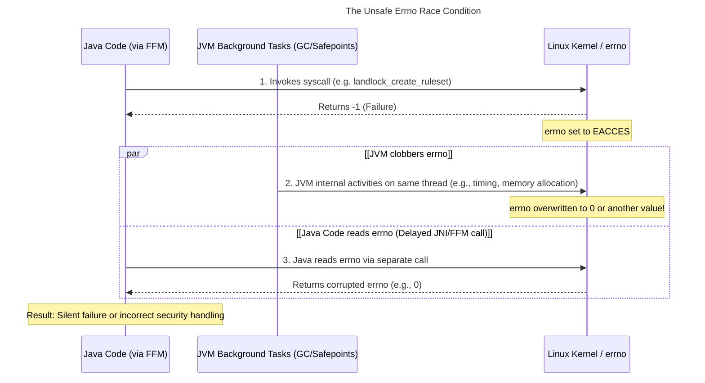
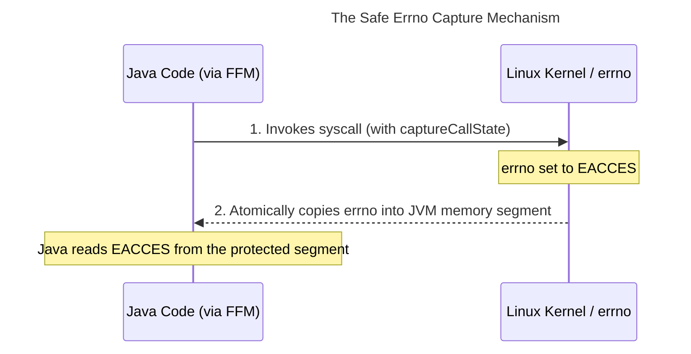
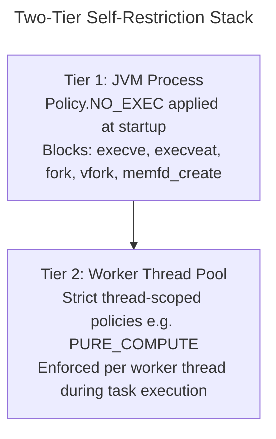
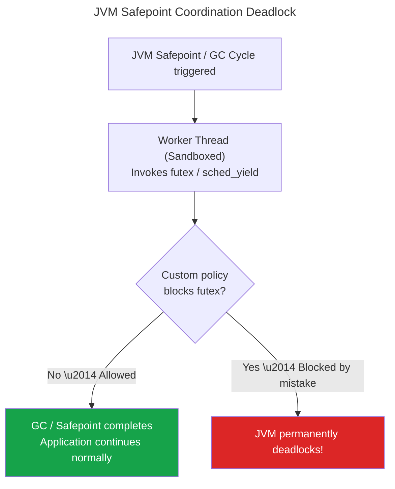

# Thread-Scoped JVM Containment: The Mechanics

[](article2-profiler.md)
[](../../README.md)
[](article4-attacks.md)

> **Series overview:** This is Part 3 of our series on behavioral security for cloud-native applications. **What this part adds:** the mechanics of thread-scoped sandboxing inside a live JVM using **mazewall** — how to restrict threads unprivileged, protect memory without breaking the JIT compiler, and navigate critical JVM safety constraints. All code examples use the mazewall PoC library and are for local exploration only.

**In this article:**
[Why Seccomp and Landlock?](#why-seccomp-and-landlock-and-not-bpf-lsm) · [gVisor, NsJail, Bubblewrap, and Mazewall](#comparing-sandboxing-paradigms-gvisor-nsjail-bubblewrap-and-mazewall) · [The FFM Bridge & Errno Race](#under-the-hood-the-ffm-native-bridge-and-the-errno-race) · [Process-Wide vs. Thread-Scoped](#process-wide-vs-thread-scoped-sandboxing) · [JIT memory safety](#protecting-memory-without-breaking-the-jit) · [Loom Virtual Threads carrier poisoning](#concurrency-pitfalls-loom-carrier-thread-contamination)

---

In Part 2, we profiled a worker thread to generate a `Policy`. Now we look under the hood: how does mazewall actually install Seccomp and Landlock on an individual JVM OS thread, and what constraints does the JVM impose on that process?

---

## Why Seccomp and Landlock? (And Why Not BPF-LSM?)

Before anything else: if you've been following kernel security, your first question is probably *"why Seccomp and Landlock, and not BPF-LSM?"*

BPF-LSM is unambiguously more powerful. While Seccomp sees raw pointer arguments as passed in registers, it cannot safely dereference them. (A separate thread could modify the string a pointer refers to between the moment Seccomp inspects the register and the moment the kernel actually uses the value—the classic TOCTOU [time-of-check/time-of-use] security race). Because of this pointer limitation, Seccomp cannot enforce path-based decisions. BPF-LSM hooks after kernel objects are fully resolved, enabling context-aware, path-based enforcement.

**The architectural blocker is privilege.** Loading a BPF-LSM program requires `CAP_BPF` or `CAP_SYS_ADMIN` (root-level system capabilities). A production JVM running inside a container should never hold these capabilities. Using BPF-LSM for application self-restriction requires deploying a highly privileged node agent (like a Kubernetes DaemonSet) to manage policies on the JVM's behalf.

Seccomp and Landlock are **self-restriction primitives**. Once the `NoNewPrivileges` flag is set on a process or thread, any unprivileged process can unilaterally strip its own capabilities. 

*   **Seccomp**[^seccomp] provides unprivileged system call filtering.
*   **Landlock**[^landlock] provides unprivileged, path-aware filesystem access control (operating at the inode level to avoid TOCTOU pointer races) as well as TCP socket restrictions (governing port binding and connections starting in ABI v4).

`mazewall` requires zero external infrastructure or host agents. That architectural choice has a cost (Seccomp cannot inspect deep pointer contents), but it enables a developer-driven security model with no external infrastructure dependency.

---

## Comparing Sandboxing Paradigms: gVisor, NsJail, Bubblewrap, and Mazewall

When sandboxing Linux processes, developers typically choose from three standard process-wrapping or container-virtualization tools:

1.  **gVisor (Application Kernel):** Written in Go, gVisor virtualizes the Linux system call interface by running a user-space kernel (the **Sentry**) that intercepts syscalls (via `ptrace` or KVM) and handles them in user-space. This provides a strong host-kernel boundary but introduces significant performance overhead, particularly for system-call-heavy workloads like the JVM.
2.  **NsJail (Process Isolation Wrapper):** Developed by Google, NsJail wraps process execution using namespaces (user, mount, network, PID, IPC), cgroups, and classic Seccomp-BPF filters. It is designed to run arbitrary, untrusted command-line binaries securely.
3.  **Bubblewrap (Unprivileged Sandbox Launcher):** A low-level sandbox launcher developed for Flatpak. It uses unprivileged user namespaces to build custom, isolated mount structures (bind mounts) without requiring root privileges.

All three of these tools are **out-of-process, process-wrapping sandboxes**. They isolate the *entire process* from the outside.

### Why Out-of-Process Wrappers fall short for in-process JVM workloads:
*   **Broad Policy Bloat:** If you run the JVM inside an external wrapper like `nsjail`, your sandbox policy must grant permission for every operation the JVM needs—including JIT compilation (`mprotect(PROT_EXEC)`), GC memory allocation, classloading, and VM thread coordination. This makes the overall policy extremely broad.
*   **In-Process Thread Scoping:** A process wrapper cannot distinguish between a thread parsing untrusted XML and a thread performing internal JVM metrics collection or garbage collection.
*   **Namespace Threading Hazards:** Linux namespaces (the core tool of NsJail and Bubblewrap) are generally process-wide. Applying a mount or network namespace thread-locally inside a shared-memory runtime like the JVM is practically impossible or causes severe stability failures (e.g., losing access to loaded classes or classloaders).

**mazewall** solves this by operating **in-process** using **thread-scoped Seccomp-BPF** and **Landlock LSM**. This allows us to apply strict sandboxing policies (like `PURE_COMPUTE`) directly to the application worker threads while letting JVM coordination threads run unconstrained.

---

## Under the Hood: The FFM Native Bridge and the Errno Race

Before we look at the kernel, we must address how a Java library talks to it. Historically, calling Linux system calls from Java required **JNI (Java Native Interface)**.

`mazewall` is built entirely on the modern **Java Foreign Function & Memory (FFM) API**, finalized in Java 22. FFM allows us to invoke native system calls (`prctl`, `seccomp`, `landlock_create_ruleset`) directly from Kotlin/Java with near-native performance and strict type safety, without writing a single line of C.

However, calling native functions from a managed runtime introduces a subtle but critical engineering challenge: **the `errno` race condition.**

In Linux, `errno` is a thread-local variable that stores the error code of the most recent system call. In a standard C program, reading `errno` immediately after a failed call is straightforward. In a JVM, however, the runtime is constantly performing its own native operations (GC write barriers, safepoint polls, JIT bookkeeping) on the same OS thread.

If we make a system call and then attempt to read `errno` via a second FFM call, there is a high probability that the JVM's internal activity will clobber the `errno` value before we can retrieve it.

#### The Unsafe Errno Race Condition (Without Capture)


`mazewall` handles this using the FFM `Linker.Option.captureCallState("errno")` feature. This tells the JVM to generate a specialized native "stub" that atomically captures the `errno` value into a protected memory segment the instant the system call returns, ensuring we see the kernel's true response rather than JVM-internal noise.

#### The Safe Errno Capture Mechanism (With captureCallState)


---

## Process-Wide vs. Thread-Scoped Sandboxing

The standard approach to container sandboxing is a global seccomp profile applied to the entire Linux process (such as the default Podman/Docker seccomp JSON). While this blocks highly dangerous operations like kernel module loading, it is a blunt instrument. Because a host-level Seccomp filter must permit the system calls required by the JVM's runtime infrastructure (such as file reads, network connections, and JIT compilation stubs), every thread within the JVM process shares the same broad system call permission surface. A low-privilege task thread has the exact same kernel-level permissions as the main administrative acceptor thread.

`mazewall` implements a **two-tier** self-restriction architecture to provide more fine-grained security:



### Tier 1: Process-Wide Lockdown
At application startup, a global process-wide restriction (`Policy.NO_EXEC`) must be applied to permanently disable shell spawning and command execution (`execve`, `execveat`, `fork`, `vfork`, `memfd_create`) for every thread. 

In the Java ecosystem, this is pioneered by **Elasticsearch**[^elasticsearch_seccomp] (often referred to as the "Elasticsearch Approach"). Elasticsearch installs a process-wide seccomp filter early in the bootstrap phase to block execution calls globally, ensuring that even if an RCE vulnerability (like Log4Shell) is triggered, the attacker cannot spawn an external shell.

While Elasticsearch implements this *in-app* during initialization, operators can achieve a similar process-wide boundary using **language-agnostic wrapper designs**. Tools like **nsjail** or **bubblewrap** wrap the process execution from the outside, enforcing seccomp and namespace restrictions before the JVM even boots. The benefit of these wrappers is their absolute language-agnosticism; however, the trade-off is they operate completely outside the application domain, meaning they cannot dynamically scale or adjust permissions based on internal application lifecycle hooks or specific JVM threads.

> [!CAUTION]
> **TSYNC fails on standard JVMs and LTS kernels:** 
> 1. **Seccomp TSYNC:** You cannot apply process-wide seccomp isolation by simply calling `ContainedExecutors.installOnProcess()` from Java. The Linux kernel requires that the `no_new_privs` flag be set on *all* threads in the thread group before a seccomp filter can be synchronized process-wide. Because this flag must be set via `prctl` *prior* to thread creation, and because the JVM has already spawned background threads (GC, JIT, VM helpers) before your `main()` method begins execution, calling `TSYNC` in-process fails with `EACCES` (-13).
> 2. **Landlock TSYNC:** Landlock process-wide synchronization (`LANDLOCK_RESTRICT_SELF_TSYNC`) is only available in Landlock ABI v8 (Linux 7.0+). On older LTS kernels (e.g., 5.15, 6.1, 6.6), Landlock rules remain strictly thread-scoped. An in-process call inside `main()` cannot restrict pre-existing sibling helper threads, leaving a critical security gap.
> 
> To properly establish a secure process-wide lockdown (enforcing both Seccomp and Landlock before the JVM is multi-threaded), the sandbox boundaries must be applied *before* the JVM process starts. Operators can achieve this by configuring an **OCI container profile** (with `allowPrivilegeEscalation: false`, which forces `no_new_privs` at the process tree root prior to exec) or using a **native launcher wrapper** (such as **bubblewrap** or **nsjail**) to sandbox the process tree prior to executing the JVM.

<details>
<summary><b>🔍 System Configuration: Nested Seccomp in Container Runtimes</b></summary>

To run `mazewall`'s nested, thread-scoped sandboxing inside containerized environments (like Podman or Docker), you must configure the container runtime's outer seccomp profile.

By default, standard OCI container runtimes (like Docker and Podman) block the `seccomp(2)` system call and restrict the `option` argument of `prctl(2)` (specifically blocking options like `PR_SET_SECCOMP` and `PR_SET_MM`) to prevent containerized processes from altering their security boundaries. When the JVM inside a standard container attempts to apply a nested filter, the host kernel blocks the call, returning `EPERM`.

To enable nested sandboxing without stripping your container's security entirely, you should run your container with a **custom seccomp profile** that whitelists the nested filter installation syscalls:

1. **`seccomp`**: Allowed with zero restrictions.
2. **`prctl`**: Allowed, specifically whitelisting `PR_SET_SECCOMP` (22) and `PR_SET_NO_NEW_PRIVS` (38) in the argument list.

This configuration maintains a robust container-level security floor (blocking access to dangerous host-level calls like `keyctl` or kernel namespace mutations) while empowering the JVM inside the container to dynamically apply its own unprivileged thread-level sandboxes.
</details>

### Tier 2: Surgical Thread Containment
For specific thread pools handling untrusted data (like JSON parsers or image processors), we apply stricter policies (like `Policy.PURE_COMPUTE` or custom Landlock paths). We wrap the target `ExecutorService` using `ContainedExecutors.wrap()`, which automatically binds the compiled policy to each worker thread before it executes its first task.

### The Thread-Scoped ACE Escape Caveat
It is critical to understand the threat model of thread-scoped sandboxing. Because all JVM threads share the same physical address space (the Java heap and class metadata), a thread-scoped sandbox is **not** an absolute barrier against an attacker who achieves Arbitrary Code Execution (ACE) on the sandboxed thread. 

If an attacker achieves full native code execution on a contained thread, they can theoretically bypass the thread-level filter by writing a malicious task directly into the memory of an uncontained global thread pool (like the `ForkJoinPool.commonPool()`). This is why **Tier 1 (Process-wide `NO_EXEC`) is a mandatory architectural dependency for Tier 2.** Tier 2 mitigates data-driven attacks (SSRF, XXE, Path Traversal) surgically, but Tier 1 ensures the attacker can never escalate to executing native shells, regardless of which thread they compromise.

---

### Protecting Memory Without Breaking the JIT

The JVM's Just-In-Time (JIT) compiler is the most obvious obstacle to strict memory sandboxing. The JIT must periodically call `mmap` and `mprotect` with `PROT_EXEC` (executable permissions) to allocate memory segments and write compiled native machine code. A naive Seccomp filter that blocks all executable memory allocations will crash the JVM instantly.

`mazewall` solves this by utilizing **Seccomp argument inspection**. The library compiles a Classic BPF (cBPF) filter that inspects the arguments of `mmap` and `mprotect` bit-by-bit:

1. **Syscall Match:** It tests if the syscall number is `mmap` (9) or `mprotect` (10) on x86_64. If not, it allows unconditionally.
2. **Flag Loading:** It loads the 32-bit `prot` argument (representing the memory protection flags, passed in register `args[2]`).
3. **PROT_EXEC Check:** It tests the `PROT_EXEC` bit (`0x4`). If the bit is set, the filter rejects the call and returns `EPERM`. The memory region remains non-executable (W^X enforced). If the sandboxed thread subsequently attempts to jump to that memory region, the CPU raises `SIGSEGV` (Segmentation Fault), which the JVM surfaces as a fatal internal error on that thread.

The JIT compiler dynamically allocates executable memory *only* on JIT compiler threads, which are separate OS threads that do not run sandboxed tasks. Worker threads processing untrusted data have no legitimate reason to allocate or pivot memory to executable state. The cBPF filter blocks precisely the operation that shellcode requires, while JIT threads on the same JVM continue compiling code completely unimpeded.

---

## The Golden Rule of JVM Safety: Never Block Coordination Syscalls

Managed runtimes are not isolated islands. Periodically, the JVM pauses application threads to perform Garbage Collection, generate thread dumps, or execute optimizations (coordinated via JVM "safepoints"). 

To participate in these operations, application threads must run JVM runtime code, which frequently invokes system calls for thread synchronization, signaling, and resource management.



Because of this, we must establish a **Golden Rule of JVM Safety**: **Never block core thread coordination and scheduling system calls.**

If a custom `mazewall` policy aggressively blocks any of the following system calls, the worker thread will fail to coordinate with the JVM engine, causing the entire JVM to permanently freeze or crash:
*   `futex`[^futex] — required for thread synchronization and lock parking.
*   `sched_yield` — required for relinquishing CPU slices during contention; blocking it causes severe performance degradation or livelock under lock contention.
*   `rt_sigreturn` — required to return from JVM safepoint signal handlers.
*   `rt_sigaction` / `sigaction` — required for JIT signal coordination.
*   `close` — required for native file descriptor cleanup (blocking this leaks fds and destabilizes the runtime).

Blocking `futex` or `rt_sigreturn` will cause the JVM to permanently freeze or crash. The other syscalls above produce severe degradation or instability if blocked.

This is why `mazewall`'s base policies (like `Policy.PURE_COMPUTE`) pre-whitelist these system calls. When writing custom policies, these system calls must remain unblocked.

---

## Concurrency Pitfalls: Loom Carrier Thread Contamination

Modern Java applications increasingly utilize **Virtual Threads** (Project Loom, Java 21+)[^jep444] for massive concurrency. However, Virtual Threads present a major architectural challenge for thread-scoped sandboxing.

Virtual Threads are multiplexed on top of a pool of physical OS **carrier threads** (typically a global `ForkJoinPool`). Seccomp and Landlock boundaries bind permanently to the underlying **Linux OS thread**.

If a virtual thread installs a seccomp filter, it permanently sandboxes the **physical carrier thread**. When the virtual thread completes or yields, the carrier thread remains sandboxed. If the global scheduler subsequently schedules an unrelated, high-privilege virtual thread (such as an administrative task or database writer) onto that "poisoned" carrier thread, the task will inherit the restrictions and immediately crash.

To prevent this carrier contamination, `mazewall` includes dynamic guards:
1. **Loom Prevention:** Every entry point that installs containment checks `Thread.currentThread().isVirtual` and immediately throws an `IllegalStateException` with clear diagnostics if called from a virtual thread.
2. **The Loom Impasse:** While the conceptual solution to secure virtual threads is to pre-sandbox a dedicated carrier pool and schedule virtual threads exclusively onto it, **the standard JDK (as of Java 21 through Java 25) does not expose a public API to configure a custom carrier scheduler for Virtual Threads.** The virtual thread scheduler is hardcoded to a shared, JVM-wide carrier pool. This was an explicit architectural decision — a proposal to expose a configurable carrier scheduler API was considered and ultimately closed.

As a result, **Loom Virtual Threads are fundamentally incompatible with thread-scoped Seccomp/Landlock sandboxing in standard Java today.** Attempting to sandbox a virtual thread would poison a global carrier thread, causing unexpected `EPERM`/`EACCES` failures or catastrophic deadlocks in unrelated, high-privilege virtual threads scheduled on that same carrier.

Because of this standard JDK limitation, developers who require surgical thread-scoped sandbox boundaries must rely on either:
*   **Standard platform threads:** Cleanly isolated within dedicated, bounded executor pools.
*   **Kotlin Coroutines:** Which allow explicit scheduling on isolated dispatchers and custom thread pools.

### Contrast with Kotlin Coroutines
Kotlin Coroutines are in a structurally better position because their runtime scheduler is not hardcoded into the JVM. Developers can easily define a dedicated, isolated thread pool (via a custom Dispatcher like `Executors.newFixedThreadPool(4).asCoroutineDispatcher()`), pre-sandbox those threads on startup, and execute sandboxed coroutines exclusively within that dispatcher:

```kotlin
// Secure Kotlin Coroutine Pattern: Pre-sandbox a dedicated dispatcher
val dispatcher = Executors.newFixedThreadPool(4) { runnable ->
    Thread(runnable).apply {
        // Pre-sandbox the thread during thread creation
        ContainedExecutors.installOnCurrentThread(MyPolicy)
    }
}.asCoroutineDispatcher()

// Coroutines launched on this dispatcher are securely sandboxed
withContext(dispatcher) {
    executeUntrustedTask()
}
``` 

However, because coroutines are still multiplexed, this requires engineering discipline: you must ensure that sandboxed coroutines are restricted *only* to their dedicated dispatchers, and that different security tiers (e.g. a read-only task vs a no-network task) are never allowed to execute on the same dispatcher pool.

---

> [!TIP]
> **Try this now:** Inspect Chrome's sandbox setup by visiting `chrome://sandbox` in your browser to see how client applications use Seccomp and user namespaces in production to isolate untrusted web renderers[^chromesandbox].
>
> **Or check Seccomp status directly:** Query the kernel's active Seccomp state for any running JVM process on your system: `grep Seccomp /proc/$(pgrep -n java)/status`. A value of `2` indicates that the process is actively sandboxed under a custom Seccomp-BPF filter (while `0` means disabled, and `1` means strict mode).

---

Now that we have examined both the developer-focused Profiler and the JVM mechanics of the sandbox, we are ready to see it in action against active exploits.

In **Part 4**, we will run a series of concrete attacks—including shell injection, fileless memory exploits, and asynchronous queue evasions—and watch the kernel block them.

---

*Next Up: [Part 4: Mazewall: The Attacks We Actually Stop](article4-attacks.md)*

[^seccomp]: Linux seccomp(2) manual page. https://man7.org/linux/man-pages/man2/seccomp.2.html
[^landlock]: Landlock: unprivileged access control. https://landlock.io/
[^jep444]: JEP 444: Virtual Threads. https://openjdk.org/jeps/444
[^elasticsearch_seccomp]: Elasticsearch SystemCallFilter.java source. https://github.com/elastic/elasticsearch/blob/master/server/src/main/java/org/elasticsearch/bootstrap/SystemCallFilter.java
[^chromesandbox]: Chromium Sandbox Design. https://chromium.googlesource.com/chromium/src/+/main/docs/design/sandbox.md
[^futex]: Linux futex(2) manual page. https://man7.org/linux/man-pages/man2/futex.2.html

